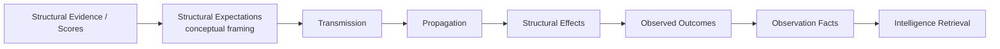
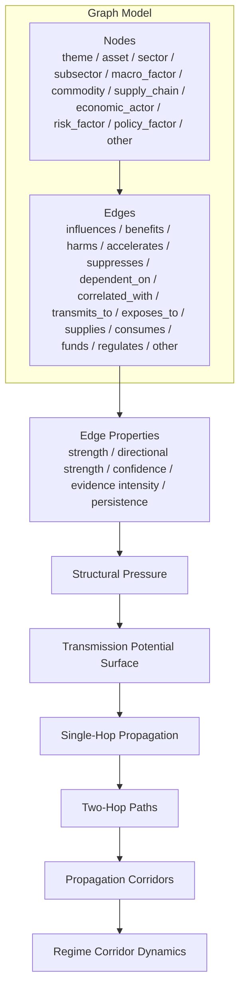
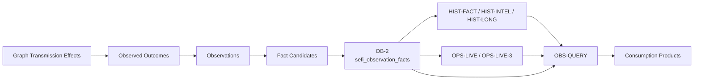
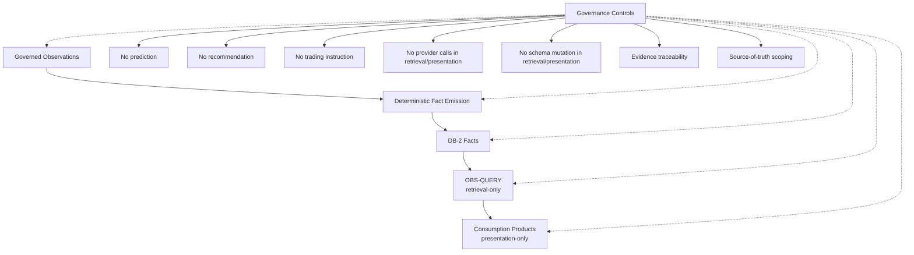

# SEFI Transmission Model Architecture

## 1. Purpose

This document reconstructs SEFI's graph-based structural expectations transmission model from the available architecture notes, terminology standards, graph-foundation modules, transmission-layer modules, governance runbooks, current Phase 5+ whitepaper source pack, and repo-grounded architecture audit evidence from the active GitHub workflows and dependency maps.

The goal is architectural clarification only. This document does not define a new schema, workflow, capability, prediction layer, recommendation layer, or implementation requirement. It explains how earlier graph, propagation, corridor, pressure, memory, regime, and structural-state phases relate to Phase 5+ operational layers such as DB-2, HIST-FACT, HIST-INTEL, HIST-LONG, OPS-LIVE, OBS-QUERY, and Consumption Products.

## 2. Executive Summary

SEFI is best understood as a graph-based structural expectations and transmission system that has evolved into a fact-native operational intelligence architecture. Its earlier graph-foundation and propagation phases model how structural evidence, pressure, and transmission potential move across nodes and relationships. Later Phase 5+ layers operationalize observed transmission effects by converting bounded observations into observation facts, persisting governed facts in DB-2, retrieving them through OBS-QUERY, and presenting them through Consumption Products.

A repo-grounded audit changes the emphasis of this document in three important ways:

1. **The current active operational core is real and coherent.** The active daily SEFI chain is not merely conceptual. The `sefi_live_daily.yml` workflow runs OPS-LIVE-1 controlled ingestion, converts the result into OPS-LIVE-2 bounded observations, emits DB-2 facts through OPS-LIVE-2, synthesizes OPS-LIVE-3 structural state, generates OBS-QUERY-4 consumption views, and produces Daily Briefing artifacts.
2. **The graph foundation remains active, but it is not yet fully fused with the fact-native core.** Repository workflow evidence still shows an active graph-propagation chain from Phase 3 graph enrichment through Phase 4 propagation/memory and Phase 5 corridor/regime dynamics. However, this chain currently appears to operate as a parallel intelligence core rather than a fully subordinated producer or consumer of DB-2 observation facts.
3. **The main architecture debt is not absence of a core; it is coexistence of multiple plausible cores.** DB-2 / Observation Facts / OBS-QUERY now form the cleanest source-of-truth path for current SEFI operations. The graph model remains strategically valuable and should be consolidated with the fact-native architecture rather than discarded or rebuilt from scratch.

The current documentation does not establish a single canonical field named `structural_expectation`. Instead, the concept is reconstructed from documented mechanisms: evidence-derived graph edges, AI transmission scores, structural theme scores, structural pressure, transmission potential, propagated pressure, propagation memory, corridor intelligence, regime-aware corridor dynamics, and structural-state snapshots. Therefore, **structural expectation** should be treated as conceptual framing unless and until the source pack defines it as a formal implementation term.

**Strategic architecture position:** SEFI should be described as a graph-originated, fact-native ecosystem intelligence system. The graph explains structural relationships and propagation mechanics; DB-2 records governed observation facts; OBS-QUERY retrieves and compares facts; Consumption Products present evidence-bounded outputs. The near-term architectural task is graph-to-fact consolidation, not a full redesign.

## 3. Core Thesis

SEFI's foundational model is graph-based transmission of structural expectations and their effects across nodes.

Phase 5+ operationalizes this model through fact-native persistence, retrieval, historical/live comparison, and presentation. It does not replace the graph model.

The repo-grounded architecture is therefore best expressed as a dual-core convergence model:

```text
Graph Core
    structural relationships
    pressure
    propagation
    memory
    corridors
    regimes
        ↓ consolidation target
Fact-Native Core
    observations
    observation facts
    DB-2
    OBS-QUERY
    consumption products
```

In practical terms:

- The graph model describes structural relationships, influence paths, propagation pressure, memory, corridors, regimes, and state.
- Phase 5+ captures observed outcomes of those structures as bounded observations and observation facts.
- DB-2, OBS-QUERY, and Consumption Products are operational layers over evidence and facts, not alternate transmission engines.
- The graph layer should either become a governed producer of observation-fact candidates or a governed consumer/explainer of persisted observation facts. Leaving it as a parallel source of truth is the main architecture risk.

## 4. Conceptual Model

Canonical conceptual flow:

```text
Structural Expectations
→ Transmission
→ Propagation
→ Structural Effects
→ Observed Outcomes
→ Observation Facts
→ Intelligence Retrieval
```

Within the repository, this conceptual flow maps to documented artifacts as follows:

| Conceptual stage | Documented representation |
|---|---|
| Structural Expectations | Conceptual framing inferred from structural theme evidence, AI transmission scores, structural theme scores, and graph-transmission layers. |
| Transmission | Graph edges, transmission potential surfaces, AI transmission scores, directional edge strength, evidence intensity, persistence score. |
| Propagation | Single-hop propagation rows, two-hop paths, propagation corridors, propagated pressure scores, propagation memory and decay. |
| Structural Effects | Pressure, stress, saturation, bottlenecks, fragility, corridor strength, persistence, stability, regime sensitivity, morphology, ecology. |
| Observed Outcomes | Bounded historical/live observations, historical ecology artifacts, operational observations, live metric facts. |
| Observation Facts | Normalized DB-2 fact-shaped rows with phase, entity, metric, value, window, payload, artifact, run, and duplicate-prevention lineage. |
| Intelligence Retrieval | OBS-QUERY retrieval, historical/live comparison, structural-state snapshots, consumption-layer views. |

## 5. Current Repo-Grounded Runtime Architecture

The current active runtime architecture has two important execution paths.

### 5.1 Active fact-native daily chain

The active daily operational chain is:

```text
OPS-LIVE-1 controlled ingestion
→ bounded operational observations
→ OPS-LIVE-2 observation fact accumulation
→ DB-2 / sefi_observation_facts
→ OPS-LIVE-3 read-only structural-state snapshot
→ OBS-QUERY-4 analyst consumption views
→ Daily Briefing / Investigation Queue artifacts
```

This is the clearest current SEFI production spine. It establishes DB-2 observation facts as the strongest operational source-of-truth boundary for queryable intelligence.

### 5.2 Active graph-propagation chain

The graph-propagation chain remains architecturally active:

```text
Phase 3 graph enrichment / drift / pressure / potential
→ Phase 4 single-hop propagation
→ Phase 4 propagation memory and decay
→ Phase 5A two-hop propagation / intermediaries
→ Phase 5B propagation corridors
→ Phase 5C regime corridor dynamics
→ Phase 5D structural propagation regime forecasting
```

This graph chain preserves SEFI's original transmission logic. However, it should be treated as an active-but-not-yet-fully-consolidated intelligence path unless its outputs are explicitly mapped into DB-2 observation facts or into governed read-only consumption of DB-2 facts.

### 5.3 Current center of gravity

Current SEFI has a coherent center of gravity around:

```text
Observation
→ Observation Fact
→ DB-2
→ OBS-QUERY
→ Consumption
```

The graph model remains the conceptual and structural intelligence foundation, but the operational source-of-truth boundary has shifted toward DB-2. This should not be interpreted as graph failure. It means the graph model now needs a clearer contract with the fact-native core.

### 5.4 Architecture debt diagnosis

The most important architecture debt is **parallel-core ambiguity**:

| Core | Strength | Current risk |
|---|---|---|
| Graph transmission core | Rich structural reasoning, propagation, memory, corridor, and regime logic. | Can become a separate source of truth if not mapped into DB-2 or read-only fact consumption. |
| Fact-native operational core | Clear source-of-truth model, governed emissions, retrieval-only OBS-QUERY, daily workflow. | Can lose the original graph-transmission intelligence if it becomes only a fact accumulation system. |
| Legacy alpha / portfolio core | Historically useful research and validation material. | Can confuse Codex and maintainers if co-located with current SEFI runtime without archive boundaries. |

The correct response is **significant consolidation**, not rebuilding from scratch.


## 6. Graph Model

### 6.1 Documented node types

The graph model currently documents these allowed node types in `graph_models.py`:

- `theme`
- `asset`
- `sector`
- `subsector`
- `macro_factor`
- `commodity`
- `supply_chain`
- `economic_actor`
- `risk_factor`
- `policy_factor`
- `other`

Additional operational terminology appears in later layers:

- **intermediary nodes**: nodes used inside corridor paths.
- **canonical ontology identities**: normalized graph semantic identities produced by the canonical structural ontology layer.
- **discovered entities**: advisory entity-discovery outputs linked from themes/nodes into candidate entities, with manual-review boundaries.

This document does not introduce additional node types beyond those documented terms.

### 6.2 Documented edge types

The graph model currently documents these allowed edge types:

- `influences`
- `benefits`
- `harms`
- `accelerates`
- `suppresses`
- `dependent_on`
- `correlated_with`
- `transmits_to`
- `exposes_to`
- `supplies`
- `consumes`
- `funds`
- `regulates`
- `other`

The documented edge record also carries:

- `direction`, normally `directed`
- `edge_strength`
- `directional_strength`
- `confidence_score`
- `evidence_intensity`
- `persistence_score`
- evidence counts and evidence summaries

### 6.3 Graph layers

Documented graph layers include:

1. **Evidence graph expansion**: constructs graph nodes and edges from structural theme evidence, explanations, AI transmission scores, and structural theme scores.
2. **Temporal regime / drift / pressure phases**: derive transition, drift, and structural-pressure information from graph history.
3. **Transmission potential surface**: evaluates readiness, susceptibility, pressure gradients, directional tension, bottlenecks, fragility, and alignment.
4. **Controlled propagation**: propagates pressure over directed graph edges under bounded single-hop mechanics.
5. **Propagation memory and decay**: stores longitudinal memory of propagated pressure and classifies persistence, reinforcement, decay, exhaustion, and volatility.
6. **Canonical ontology and intermediary layers**: normalize graph identities, canonicalize edges, identify intermediaries, and support directed seeding.
7. **Corridor intelligence**: composes canonical edges, intermediary nodes, and directed seeded edges into two-hop and multi-hop corridors.
8. **Regime-aware corridor dynamics**: tracks corridor drift, stress accumulation, activation state, and regime transition pressure.

### 6.4 Relationship persistence

Relationship persistence appears at multiple levels:

- edge-level `persistence_score` in graph edges;
- pressure-level `persistence_pressure` in structural pressure accumulation;
- propagation-level `propagation_persistence_score` and `carry_forward_score` in propagation memory;
- corridor-level `corridor_persistence` and `persistence_stability` in corridor intelligence;
- Phase 5+ persistence as repeated or durable observation facts across windows.

### 6.5 Intermediaries, corridors, directed seeding, and transmission paths

The corridor layer explicitly consumes canonical graph edges, intermediary nodes, and directed seeded edges. It constructs paths with one or more intermediaries and classifies corridors as dominant, bottleneck-control, multi-hop-chain, reusable, emerging, or weak corridors. The corridor representation records path nodes, path edges, hop count, source/target nodes, intermediary node keys, seed-edge counts, canonical-edge counts, corridor strength, corridor persistence, corridor stability, reuse score, bottleneck node, and regime sensitivity.

Directed seeding is therefore documented as an input to corridor construction, not as autonomous graph mutation or prediction.

## 7. Transmission Semantics

### 7.1 What is transmitted?

The documentation does not define one exclusive canonical transmitted object. The safest architectural interpretation is that SEFI transmits **structural expectation effects** across a graph. Those effects are represented by documented measurements rather than by a single schema object:

- **transmission score / AI transmission score**: upstream score inputs used in evidence graph expansion;
- **edge influence**: represented through edge types, edge strength, directional strength, confidence, evidence intensity, and persistence;
- **structural pressure**: positive/negative pressure, pressure score, pressure direction, pressure regime, stress status, saturation, imbalance, reinforcement, decay, emergence, drift, persistence, and volatility;
- **transmission potential**: readiness, susceptibility, pressure gradient, directional tension, bottleneck, fragility, persistence alignment, drift alignment, regime/status;
- **propagated pressure**: pressure transferred from source to target over a graph edge;
- **corridor intelligence**: corridor strength, persistence, stability, reuse, bottleneck, and regime sensitivity;
- **structural state**: bounded classifications derived from accumulated facts and existing observations.

Relationship among these objects:

```text
structural evidence / scores
→ graph edge influence
→ pressure and transmission potential
→ propagated pressure
→ memory / decay / corridor dynamics
→ structural state and observed outcomes
→ observation facts
```

### 7.2 Causal and non-causal language

The repository documents edge types such as `influences`, `transmits_to`, `dependent_on`, and `correlated_with`, but it also preserves governance boundaries against prediction and unsupported synthesis. Therefore, graph edges should be described as structural relationships or influence pathways unless a source explicitly documents causal attribution. `correlated_with` is explicitly non-causal in ordinary terminology and should not be promoted into causality.

## 8. Propagation Mechanics

Only documented mechanics are included here.

### 8.1 Direct and single-hop propagation

Controlled single-hop propagation uses a source edge, source pressure, and source transmission potential to compute:

- `propagation_input_score`
- `propagation_transfer_weight`
- `propagated_pressure_score`
- `propagated_positive_pressure`
- `propagated_negative_pressure`
- `propagation_direction`
- `propagation_regime`
- `propagation_status`
- bottleneck, fragility, saturation, and confidence modifiers

The same implementation metadata explicitly states `single_hop_only: True`, `recursive_propagation: False`, and `multi_hop_propagation: False` for that phase.

### 8.2 Two-hop propagation

The two-hop layer consumes single-hop propagation rows, joins compatible source → intermediate → target chains, rejects cycles and duplicates, applies confidence and transmission-potential thresholds, compounds decay, and attenuates the two-hop path score. It records source, intermediate, and target nodes, hop-level confidence, hop-level transmission potential, and path/progression rows.

### 8.3 Corridor propagation

The propagation corridor layer composes canonical edges, directed seed edges, and intermediary nodes into two-hop or multi-hop-chain corridors. Corridor scoring uses edge strength, directional strength, confidence, intermediary activation, evidence density, persistence stability, regime stability, reuse, and bottleneck metrics. The corridor layer documents multi-hop-chain corridors, but only within the deterministic corridor engine's bounded path construction.

### 8.4 Propagation memory and decay

Propagation memory computes longitudinal state from prior propagation rows. Documented measures include:

- latest, average, maximum, and minimum propagated pressure;
- absolute and percentage pressure change;
- persistence, reinforcement, decay, exhaustion, and carry-forward scores;
- half-life proxy days;
- memory regime and memory status;
- volatility and days since last seen.

### 8.5 Pressure accumulation and stress simulation

Structural pressure accumulation computes positive and negative pressure from edge directionality, temporal regimes, transition directions, and drift dimensions. It derives pressure score, saturation score, imbalance score, reinforcing pressure, decay pressure, emergence pressure, drift pressure, persistence pressure, volatility pressure, pressure regime, direction, and status. Status labels include saturated, imbalanced, stressed, persistent, reinforcing, and neutral classifications.

### 8.6 Regime-aware propagation

Regime awareness appears in:

- temporal regimes over graph stability;
- memory regimes and statuses;
- corridor regime sensitivity;
- regime-aware corridor dynamics, including stress accumulation, activation state, corridor drift, transition flags, and regime-transition-pressure summaries.

### 8.7 Transmission potential

Transmission potential is a pre-propagation surface derived from pressure, persistence, imbalance, drift, reinforcement, decay, emergence, volatility, readiness, susceptibility, pressure gradient, directional tension, bottleneck, fragility, and alignment measures. It classifies potential as low, moderate, high, or extreme and marks status as bottleneck, fragile, active, or watchlist.

## 9. Structural Expectations

The phrase **structural expectation** is not established as a formal implementation term in the inspected source pack. It is a conceptual framing that refers to expected structural relationships or effects implied by evidence, graph relationships, transmission scores, and pressure/propagation dynamics.

Within this framing:

1. Expectations are **modeled** as evidence-supported graph relationships, AI transmission scores, structural theme scores, edge strengths, and directional strengths.
2. Expectations are **stressed** through pressure accumulation, saturation, imbalance, bottlenecks, fragility, decay, drift, and regime transitions.
3. Expectations are **transmitted** through directed graph edges and transmission-potential surfaces.
4. Expectations are **propagated** through single-hop, two-hop, corridor, and memory-aware propagation layers where documented.
5. Expectations are **observed** as historical/live bounded observations and structural outcomes.
6. Expectations are **converted into facts** only when a governed emission path normalizes observations into DB-2-shaped observation facts.

Because the term is conceptual, documentation should avoid claiming that a `structural_expectation` table, schema, or persisted object exists unless a future source-pack addition defines one.

## 10. Structural State

Canonical definition for this document:

**Structural state is the bounded observable or modeled condition of a SEFI graph, ecosystem, group, or operational context resulting from accumulated transmission, propagation, pressure, memory, regime, persistence, recurrence, stability, morphology, ecology, and observed-outcome evidence.**

This definition aligns with the Phase 5+ source-pack definition of Structural State as a bounded classification of current or historical system condition derived from existing facts, such as live health classes, pressure dimensions, coverage summaries, or historical structural classifications.

Structural state is related to:

- **transmission**: state reflects where structural relationships and transmission potential have produced observable effects;
- **propagation**: state incorporates propagated pressure, propagation direction, propagation status, and corridor dynamics where available;
- **pressure/stress**: state reflects accumulated positive/negative pressure, saturation, imbalance, bottlenecks, fragility, and stress;
- **memory/decay**: state reflects persistence, reinforcement, exhaustion, carry-forward behavior, decay, and half-life proxies;
- **regime**: state reflects temporal regimes, memory regimes, corridor regime sensitivity, and transition pressure;
- **persistence/recurrence/stability**: state distinguishes one-off observations from durable or repeated structures;
- **morphology/ecology**: state summarizes distributional shape across sectors, subsectors, groups, and ecosystems;
- **observed outcomes / observation facts**: state can be derived from existing fact sets and can be consumed by OPS-LIVE-3, OBS-QUERY, and Consumption Products without becoming prediction or recommendation.

## 11. Relationship to DB-2 and Phase 5+

Phase 5+ operationalizes graph transmission; it does not replace the graph model.

### 11.1 DB-2

DB-2 persists observed effects as normalized observation facts. The DB-2 layer centers on `sefi_observation_facts`, with phase, entity, metric, value, window, payload, artifact, run, and duplicate-prevention lineage. DB-2 is the source of truth for OBS-QUERY fact retrieval, not a replacement for graph-transmission reasoning.

The documented directionality correction matters: Historical layers may produce local historical structure before DB-2 persistence; HIST-FACT/HIST-LONG paths may produce DB-2 fact candidates; DB-2 accumulates governed contributed facts; OBS-QUERY, OPS-LIVE-3, validation, and consumption layers retrieve facts read-only.

### 11.2 HIST-FACT, HIST-INTEL, and HIST-LONG

HIST-LONG, HIST-FACT, and HIST-INTEL analyze accumulated historical effects, local historical artifacts, ecology, persistence, drift, recurrence, morphology, narrative evolution, and fact-like rows. They can contribute governed fact candidates to DB-2, and they can also consume fact-like rows or persisted facts depending on the phase. They operationalize structural history rather than replacing graph transmission.

### 11.3 OPS-LIVE and OPS-LIVE-3

OPS-LIVE captures bounded live operational observations, normalizes them through OPS-LIVE-2 when governed emission gates allow, and synthesizes live structural-state snapshots in OPS-LIVE-3 from existing facts. OPS-LIVE-3 is read-only: it retrieves live fact rows or supplied rows, disables provider calls, disables live ingestion, disables replay execution, disables fact emission, disables topology persistence, and disables schema changes.

### 11.4 OBS-QUERY

OBS-QUERY retrieves and compares existing facts. It can select, filter, group, compare, validate, and assemble views over DB-2 rows or controlled fixtures. It is retrieval-only and does not create facts, call providers, write databases, mutate schemas, forecast, recommend, or issue market actions.

### 11.5 Consumption Products

Consumption Products present retrieved evidence. They select, label, suppress, rank, group, and display existing query/artifact items while preserving evidence drill-down. Presentation items, quality gates, story evolution labels, and investigation prompts are not DB-2 facts and are not recommendations.

## 12. Graph-to-Fact Consolidation Position

The current architecture should avoid treating graph outputs, local historical artifacts, presentation cards, and DB-2 facts as equivalent sources of truth.

Recommended consolidation principle:

```text
Graph output
→ bounded structural observation
→ DB-2 fact candidate
→ governed emission
→ persisted observation fact
→ OBS-QUERY retrieval
```

or, where the graph is used as an explainer:

```text
Persisted observation facts
→ graph-context lookup
→ structural explanation
→ presentation-only consumption view
```

Both patterns are valid. What should be avoided is an ungoverned middle state where graph outputs generate analyst-facing findings without either:

1. becoming governed DB-2 observation facts, or
2. being clearly labeled as read-only explanatory context over existing facts.

### 12.1 Preferred source-of-truth hierarchy

| Layer | Source-of-truth status |
|---|---|
| `sefi_observation_facts` | Source of truth for queryable observation facts and OBS-QUERY retrieval. |
| Governed DB-2 fact candidates | Pre-persistence candidates only; not source of truth until emitted. |
| Graph nodes/edges/pressure/corridors | Source of truth for graph state only, not for DB-2 fact retrieval unless mapped and emitted. |
| OPS-LIVE-3 snapshots | Read-only structural-state synthesis over facts or supplied rows; local artifact unless future persistence contract exists. |
| HIST-LONG / HIST-FACT / HIST-INTEL artifacts | Governed local inputs and intelligence artifacts; source-of-truth status depends on whether rows are emitted into DB-2. |
| OBS-QUERY outputs | Retrieval/comparison/consumption envelopes; not new facts. |
| Daily Briefing / Investigation Queue | Presentation-only analyst views; not facts and not recommendations. |

### 12.2 Recommended consolidation direction

SEFI should consolidate toward:

```text
Graph-originated structural reasoning
+ DB-2 fact-native persistence
+ OBS-QUERY retrieval
+ evidence-bounded consumption
```

This keeps the original SEFI vision while reducing architectural ambiguity.

### 12.3 What this means for rebuild decisions

The repo-grounded evidence does not justify rebuilding SEFI from scratch. It supports significant consolidation:

- retain the graph foundation as the structural intelligence model;
- retain DB-2 as the operational fact source of truth;
- retain OBS-QUERY as the retrieval boundary;
- move or archive legacy alpha/portfolio systems behind clear boundaries;
- define a field-level graph-to-DB-2 handoff contract;
- maintain a canonical active-runtime map for Codex and human maintainers.


## 13. End-to-End Transmission Lifecycle

```mermaid
flowchart LR
    A[Structural Expectations\nconceptual framing] --> B[Graph Nodes]
    B --> C[Transmission Edges]
    C --> D[Propagation Corridors]
    D --> E[Structural Pressure / Memory / Regime]
    E --> F[Structural State]
    F --> G[Observed Outcomes]
    G --> H[Observation Facts]
    H --> I[DB-2]
    I --> J[OBS-QUERY]
    J --> K[Consumption Products]
```



## 14. Governance Boundaries

Governance boundaries that apply to the transmission model and its Phase 5+ operationalization:

- **No prediction**: outputs describe observed or bounded modeled structures, not future outcomes.
- **No recommendation**: outputs do not produce investment, portfolio, trading, or market-action recommendations.
- **No trading instruction**: no layer should produce buy/sell/hold instructions or autonomous trading actions.
- **Retrieval-only OBS-QUERY**: OBS-QUERY retrieves, groups, compares, validates, and assembles existing facts/views only.
- **Presentation-only consumption**: Consumption Products display existing evidence and do not create source-of-truth facts.
- **Evidence traceability**: outputs must preserve fact IDs, evidence identifiers, artifact IDs, run IDs, source phases, payloads, and duplicate keys when available.
- **Deterministic behavior**: sorting, normalization, duplicate keys, bounded limits, fixture validation, and view construction are deterministic.
- **Source-of-truth boundaries**: `sefi_observation_facts` is the source of truth for OBS-QUERY fact retrieval; local artifacts and fixtures are bounded inputs/fallbacks unless emitted through governed DB-2 paths.
- **OPS-LIVE-3 read-only semantics**: OPS-LIVE-3 reads existing live facts or supplied rows and does not emit facts, mutate topology, run replay, call providers, or migrate schemas.
- **DB-2 directionality correction**: historical layers are not simply downstream of DB-2; historical artifacts can precede DB-2, contribute fact candidates to DB-2, and later be retrieved/compared through DB-2 and OBS-QUERY.

## 15. Known Documentation Gaps

The following gaps were found in inspected documentation and architecture-relevant modules:

1. **Canonical transmitted object**: no single documented object unifies structural expectation, pressure, influence, signal, transmission score, propagated pressure, and structural effect.
2. **Formal structural expectation definition**: `structural expectation` is not defined as a canonical term in the current terminology standard.
3. **Exact node taxonomy beyond allowed implementation types**: allowed node types are documented in graph code, but no source-pack narrative explains node taxonomy, lifecycle, or governance.
4. **Exact edge taxonomy narrative**: allowed edge types are documented in graph code, but no source-pack standard explains causal versus non-causal relationship semantics.
5. **Graph persistence model**: tables are named across code and runbooks, but a consolidated graph persistence contract was not found.
6. **Expectation-state schema**: no expectation-state schema or persisted structural-expectation object was found.
7. **Structural-state persistence rule**: the source pack notes OPS-LIVE-3 read-only semantics and flags diagram ambiguity; a single canonical persistence rule for all structural-state outputs remains underdocumented.
8. **Graph-to-DB-2 handoff contract**: no field-level handoff contract was found from graph transmission outputs to observation facts.
9. **Terminology conflicts**: source-pack terminology notes already identify conflicts around Structural State versus Structural Intelligence, fact-like rows versus persisted DB-2 facts, source-of-truth scope, OBS-QUERY versus Queryable Intelligence, and OPS-LIVE versus Live Intelligence.
10. **Phase naming overlap**: graph-foundation Phase 5B/5C/5D and whitepaper Phase 5+ operational layers use similar phase language for different purposes; documentation should clarify these as historical graph phases versus current operational layers.
11. **Parallel-core ambiguity**: the graph-propagation chain and the fact-native OPS-LIVE / DB-2 / OBS-QUERY chain are both active, but their handoff relationship is not yet field-level canonical.
12. **Codex navigation burden**: many workflows, scripts, reports, and legacy ecosystems remain discoverable as plausible active paths, increasing prompt/context cost and implementation ambiguity.
13. **Legacy alpha / portfolio boundary**: alpha, factor, portfolio, signal, and backtest code should be preserved for reference or research where useful, but separated from the active SEFI runtime map.

## 16. Recommended Source-Pack v1.2 Additions

Documentation-only additions recommended for Source-Pack v1.2:

1. **Conceptual Foundations section** defining SEFI as a graph-based structural expectations transmission system.
2. **Graph node/edge taxonomy** listing canonical node types, edge types, lifecycle states, and relationship semantics.
3. **Transmission semantics standard** defining the relationship among structural expectation, influence, pressure, stress, transmission potential, propagated pressure, and observed effect.
4. **Propagation lifecycle diagram** covering evidence → graph → pressure → potential → propagation → memory → corridor → regime → structural state.
5. **Structural state definition** distinguishing modeled state, observed state, fact-derived state, live state, historical state, and presentation state.
6. **Graph-to-DB-2 handoff contract** mapping graph/propagation outputs to bounded observations, fact candidates, and persisted DB-2 observation facts.
7. **Phase 5+ operationalization explanation** showing that DB-2, OBS-QUERY, and Consumption Products operationalize but do not replace graph transmission.
8. **Directionality and source-of-truth note** clarifying Historical Intelligence ↔ DB-2 producer/consumer loops and DB-2 source-of-truth scope.
9. **Governance certification crosswalk** linking graph transmission, OPS-LIVE-3, OBS-QUERY, and consumption boundaries.
10. **Phase naming disambiguation** separating historical graph/progression phases from current operational layer phases.
11. **Active runtime map** naming the current production spine: OPS-LIVE-1 → OPS-LIVE-2 → DB-2 → OPS-LIVE-3 → OBS-QUERY-4 → Daily Briefing / Investigation Queue.
12. **Parallel-core consolidation rule** defining when graph outputs are fact producers, fact consumers, or presentation-only explanatory context.
13. **Legacy boundary note** separating current SEFI intelligence runtime from legacy alpha, portfolio, signal, and backtest research modules.

## Appendix A — Canonical Terms

Only documented or directly reconstructed terms are included.

| Term | Definition |
|---|---|
| Observation | Bounded historical or live source signal captured before DB-2 normalization. |
| Observation Fact | Normalized DB-2 row or fact-like row representing an observation with phase, entity, metric, value, window, payload, artifact, run, and duplicate-prevention lineage. |
| Evidence | Source support associated with a fact or view item, often carried through evidence IDs, row IDs, duplicate keys, or Evidence Reference identifiers. |
| Fact Lineage | Identifiers and metadata binding a fact to phase, artifact, run, source payload, entity, metric, window, and duplicate-prevention identity. |
| Structural State | Bounded classification of current or historical system condition derived from existing facts and structural evidence. |
| Persistence | Degree to which a structure or signal remains present across windows or repeated fact sets. |
| Stability | Classification of whether observed structures remain steady, strengthen, weaken, drift, or destabilize. |
| Recurrence | Reappearance or repeated presence of a structure, pattern, classification, or story across historical windows or fact sets. |
| Morphology | Shape or internal structure of sectors, subsectors, groups, or ecosystems. |
| Ecology | Multi-window and cross-sectional context of market-structure observations. |
| Historical Intelligence | Observational-only stack that converts completed historical artifacts and fact rows into bounded evidence and structural findings. |
| Live Intelligence | Controlled live observation path that ingests bounded current observations, accumulates DB-2 facts, and produces live structural-state snapshots. |
| DB-2 | Fact-native observation-fact read model centered on `sefi_observation_facts`. |
| OBS-QUERY | Retrieval-only interface over DB-2 facts that selects, groups, compares, validates, and prepares existing facts for consumption. |
| Consumption Products | Presentation-only views over existing SEFI intelligence outputs. |
| Transmission Potential | Score surface representing propagation readiness, susceptibility, pressure gradient, directional tension, bottleneck, fragility, and alignment. |
| Propagated Pressure | Pressure transferred from a source node to a target node through a graph edge under controlled propagation mechanics. |
| Propagation Memory | Longitudinal representation of propagated pressure persistence, reinforcement, decay, exhaustion, carry-forward, and regime/status. |
| Propagation Corridor | Deterministic path through canonical edges, intermediary nodes, and directed seed edges with corridor strength, persistence, stability, reuse, bottleneck, and regime sensitivity. |
| Directed Seed Edge | Directed input edge consumed by corridor intelligence; not an autonomous mutation or recommendation. |
| Intermediary Node | Node appearing between source and target within a corridor path. |
| Fact-Native Core | Current operational SEFI core centered on bounded observations, DB-2 observation facts, OBS-QUERY retrieval, and consumption products. |
| Graph Core | Structural-transmission core centered on nodes, edges, pressure, propagation, memory, corridors, and regimes. |
| Parallel-Core Ambiguity | Architecture debt condition where graph outputs and fact-native outputs can both appear to be intelligence sources without a canonical handoff or source-of-truth hierarchy. |

## Appendix B — Diagrams

### B.1 SEFI Conceptual Transmission Model



### B.2 Graph Transmission Architecture



### B.3 Propagation Lifecycle


### B.4 Phase 5+ Operationalization Layer



### B.5 Governance Boundary Map



## Appendix C — Evidence Map

| Document inspected | Architectural claims supported |
|---|---|
| `whitepaper_source_pack/03_core_concepts.md` | Observation, Observation Fact, Evidence, Fact Lineage, Structural State, Persistence, Stability, Recurrence, Morphology, Ecology, Historical Intelligence, Live Intelligence definitions. |
| `whitepaper_source_pack/04_db2_architecture.md` | DB-2 fact lifecycle, source-of-truth scope, retrieval scope, presentation scope, and DB-2 / Historical Intelligence directionality correction. |
| `whitepaper_source_pack/05_historical_intelligence.md` | HIST-LONG, HIST-FACT, HIST-INTEL role in historical structural analysis and fact-like rows. |
| `whitepaper_source_pack/06_ops_live.md` | OPS-LIVE observation path and OPS-LIVE-3 live structural-state semantics. |
| `whitepaper_source_pack/07_obs_query.md` | OBS-QUERY retrieval-only architecture and comparison/retrieval scope. |
| `whitepaper_source_pack/08_consumption_products.md` | Presentation-only consumption boundaries and evidence-display role. |
| `whitepaper_source_pack/09_governance.md` | Deterministic, evidence-traceable, retrieval-only, no-prediction, no-recommendation governance posture. |
| `whitepaper_source_pack/11_architecture_gaps.md` | Known ambiguities around DB-2/Historical directionality, OPS-LIVE-3 read-only semantics, source-of-truth scope, and terminology conflicts. |
| `whitepaper_source_pack/12_terminology_standard.md` | Preferred terms and conflicts for DB-2, OBS-QUERY, Structural State, Live Intelligence, Consumption Products, fact-like rows, and source of truth. |
| `docs/data-contracts/table-contract-registry.md` | Table-class documentation for graph nodes/edges, propagation outputs, corridor/regime outputs, and AI transmission score tables. |
| `docs/runbooks/tier3h_transmission_candidate_discovery.md` | Advisory-only candidate discovery, no monitored-universe writes, no trading signals, entity-linking fields, and recommended-action caveats. |
| `docs/runbooks/tier3h4_dynamic_structural_entity_discovery.md` | Deterministic structural entity discovery and advisory-only boundaries. |
| `docs/runbooks/tier3h5_phase5h_governance_knowledge_graph.md` | Governance knowledge-graph operational context. |
| `docs/runbooks/tier3h5_phase5i_governance_query_interface.md` | Governance query-interface operational context. |
| `transmission_layers/graph_foundation/graph_models.py` | Allowed node types, allowed edge types, graph node and edge properties. |
| `transmission_layers/graph_foundation/phase3a_evidence_graph_expansion.py` | Evidence graph expansion inputs and source score mappings. |
| `transmission_layers/graph_foundation/phase3d_structural_pressure_accumulation.py` | Structural pressure, pressure direction, pressure regime, pressure status, saturation, imbalance, persistence, volatility, and drift/transition contributions. |
| `transmission_layers/graph_foundation/phase3e_transmission_potential_surface.py` | Transmission potential, propagation readiness, susceptibility, pressure gradients, directional tension, bottleneck, fragility, and status/regime classification. |
| `transmission_layers/graph_foundation/phase4a_controlled_single_hop_propagation.py` | Controlled single-hop propagation, transfer weights, propagated pressure, direction, regime/status, and explicit non-recursive metadata. |
| `transmission_layers/graph_foundation/phase4b_propagation_memory_decay.py` | Propagation memory, persistence, reinforcement, decay, exhaustion, carry-forward, half-life proxy, memory regime/status. |
| `transmission_layers/phase5a_two_hop/phase5a_two_hop_propagation.py` | Two-hop source/intermediate/target path construction, confidence thresholds, transmission-potential thresholds, compounded decay, and attenuation. |
| `transmission_layers/graph_foundation/intermediaries/canonical_structural_ontology_engine.py` | Canonical ontology normalization and edge canonicalization context. |
| `transmission_layers/graph_foundation/phase5b_propagation_corridor_engine.py` | Corridor intelligence, canonical edges, directed seed edges, intermediaries, two-hop/multi-hop corridors, corridor strength/persistence/stability/reuse/bottleneck/regime sensitivity. |
| `transmission_layers/graph_foundation/phase5c_regime_corridor_dynamics_engine.py` | Regime-aware corridor dynamics, drift, activation state, stress accumulation, and regime-transition-pressure summaries. |
| `transmission_layers/live_ops/ops_live3_structural_state_snapshot.py` | OPS-LIVE-3 read-only governance flags and structural-state snapshot construction over existing live facts. |
