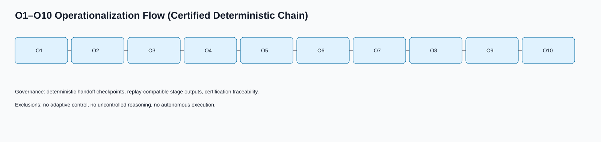
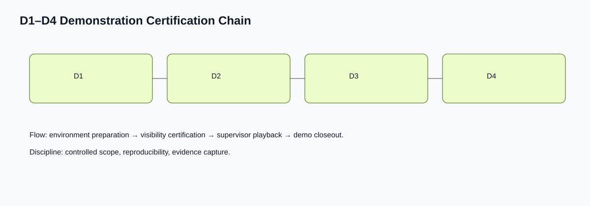
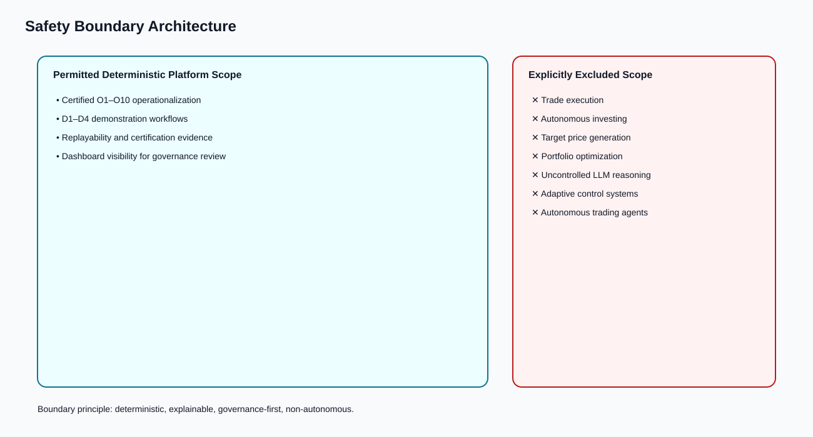

# P1B1 — Visual Architecture & Presentation Asset Package

## Platform Identity
**Deterministic Institutional Expectation-Failure Intelligence Platform**

## Scope Statement
This package is presentation and documentation oriented only. It introduces no new intelligence logic, scoring, persistence, dashboard mutation, predictive modeling, deployment automation, or autonomous orchestration.

## Executive Architecture Overview
The master architecture presents a bounded, deterministic system with explicit governance checkpoints, replay discipline, and certification traceability.

### Layered View
1. **Input & Evidence Layer** — curated market/fundamental datasets and demonstration fixtures.
2. **Deterministic Logic Layer** — O1–O10 certified operationalization chain.
3. **Governance & Certification Layer** — replay controls, certification evidence, and supervisor checkpoints.
4. **Visibility Layer** — dashboard presentation and institutional reporting artifacts.

## Operationalization Lifecycle (O1–O10)
The O1–O10 chain is visualized as an auditable sequence with deterministic handoffs and bounded control points.

## Demonstration Certification Lifecycle (D1–D4)
The D1–D4 demonstration chain shows controlled environment preparation, playback readiness, and closeout certification.

## Replay & Certification Flow
Replay and certification are shown as a strict lifecycle: prepare, execute deterministically, validate, certify, and archive evidence.

## Safety Boundaries & Exclusions
The platform is intentionally bounded. Safety boundaries are explicit and visually separated from permitted functionality.

### What the Platform Does NOT Do
- No trade execution.
- No autonomous investing.
- No target price generation.
- No portfolio optimization.
- No uncontrolled LLM reasoning.
- No adaptive control systems.
- No autonomous trading agents.

## Dashboard Walkthrough Summary
Dashboard visibility is segmented for institutional readability:
- **System status visibility** (certification state, run state, and evidence pointers).
- **Operationalization visibility** (O-chain stage context and deterministic outputs).
- **Demonstration visibility** (D-chain readiness and playback checkpoints).
- **Boundary visibility** (safety exclusions and non-executable scope declarations).

## Institutional Use Cases
- Investment committee technical walkthrough.
- Risk/governance review presentation.
- Supervisor onboarding and demonstration playback.
- Portfolio communication appendices for process transparency.

## Supervisor Demonstration Workflow (Visual Companion)
1. Verify D1–D4 environment certification status.
2. Open replay context and evidence identifiers.
3. Step through deterministic pipeline checkpoints.
4. Confirm output consistency against certification records.
5. Close session with bounded-scope attestation.
