---

title: "SEFI Technical Whitepaper v1.0"

subtitle: "Draft 2 — Professional Technical Whitepaper"

date: "2026-05-30"

status: "Draft 2"

source: "SEFI-SOURCE-PACK-v1.1"

---

# SEFI Technical Whitepaper v1.0

**Draft 2 — Professional Technical Whitepaper**

**Prepared from:** SEFI-SOURCE-PACK-v1.1  
**Prepared on:** 2026-05-30  
**Document status:** Draft 2

**Authoritative source rule:** The source pack is the sole architectural source of truth for this whitepaper.

## Revision History

**Table 1. Revision history.**

| Version | Date | Description | Source basis |

| --- | --- | --- | --- |

| Draft 1 | 2026-05-30 | Initial technical whitepaper generated from the completed source pack. | SEFI-SOURCE-PACK-v1.1 |
| Draft 2 | 2026-05-30 | Refinement and expansion pass focused on architecture rationale, DB-2, Historical Intelligence, OBS-QUERY, governance, and architecture review findings. | SEFI-SOURCE-PACK-v1.1 and architecture audit corrections |

## Table of Contents

- [1. Executive Summary](#1-executive-summary)
- [2. Introduction](#2-introduction)
- [3. Design Philosophy](#3-design-philosophy)
- [4. System Evolution](#4-system-evolution)
- [5. Core Concepts](#5-core-concepts)
- [6. End-to-End Architecture](#6-end-to-end-architecture)
- [7. Observation Layer](#7-observation-layer)
- [8. DB-2 Architecture](#8-db-2-architecture)
- [9. Historical Intelligence Architecture](#9-historical-intelligence-architecture)
- [10. OPS-LIVE Architecture](#10-ops-live-architecture)
- [11. Structural State Modeling](#11-structural-state-modeling)
- [11A. Intelligence Lifecycle](#11a-intelligence-lifecycle)
- [12. OBS-QUERY Architecture](#12-obs-query-architecture)
- [13. Consumption Products](#13-consumption-products)
- [14. Governance Framework](#14-governance-framework)
- [15. Data Model](#15-data-model)
- [16. Architecture Boundaries](#16-architecture-boundaries)
- [17. Architecture Review Findings](#17-architecture-review-findings)
- [18. Limitations and Known Constraints](#18-limitations-and-known-constraints)
- [19. Future Evolution Opportunities](#19-future-evolution-opportunities)
- [20. Conclusion](#20-conclusion)
- [Appendix A — Terminology Standard](#appendix-a-terminology-standard)
- [Appendix B — Lifecycle States](#appendix-b-lifecycle-states)
- [Appendix C — Architecture Diagrams](#appendix-c-architecture-diagrams)
- [Appendix D — Governance Certification Fields](#appendix-d-governance-certification-fields)

# 1. Executive Summary

SEFI is a fact-native market-intelligence architecture for converting bounded historical and live observations into traceable observation facts, structural context, queryable intelligence, and presentation-only analyst views. The architecture exists to make market-structure observations reviewable, comparable, and consumable without converting them into forecasts, trading instructions, or opaque generated narratives. In Draft 1 of this whitepaper, every architectural description is derived from SEFI-SOURCE-PACK-v1.1, with the architecture audit corrections treated as controlling evidence where the source pack identifies ambiguity or prior diagram risk.

The system is organized around six major subsystems. Historical Intelligence processes completed local ecology artifacts and produces fact-like rows, historical structural findings, Narrative Evolution signals, taxonomy weighting, persistence and drift assessments, and ecosystem synthesis. OPS-LIVE provides controlled live observation ingestion, governed live observation fact accumulation, and read-only structural-state snapshotting. DB-2 is the append-oriented observation-fact read model centered on `sefi_observation_facts`. OBS-QUERY is a retrieval-only interface over DB-2 facts and controlled fixtures. Consumption Products adapt retrieved facts and historical intelligence artifacts into analyst-facing views such as Daily Briefing, Story Evolution, Investigation Queue, Story Detail, Why Now, and Quality Gate surfaces. Governance is embedded across emission, retrieval, comparison, validation, and presentation boundaries.

The architectural principle that unifies these subsystems is separation of responsibilities. Observation capture is separate from fact persistence. Fact persistence is separate from intelligence retrieval. Historical/live comparison is separate from prediction. Analyst presentation is separate from new intelligence generation. This separation allows SEFI to preserve evidence while reducing the risk that downstream views become unsupported recommendation engines or unreviewable generated prose.

The common lineage contract is also essential. Facts and derived views retain source phase identity, artifact and run references where available, entity and metric identity, observation windows, bounded payload fields, Evidence Reference identifiers, and duplicate-prevention keys. This lineage is not an optional metadata convenience; it is the mechanism that makes downstream review, comparison, audit, and analyst drill-down possible without changing the meaning of the original observation.

**Figure 1. SEFI end-to-end architecture.** The current high-level flow from controlled inputs to observations, observation facts, DB-2, retrieval, and consumption products.

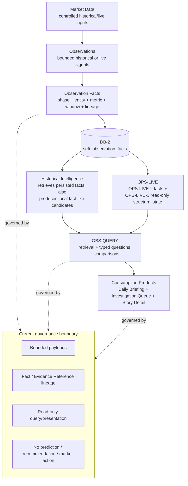

**Table 2. Major subsystem responsibilities.**

| Subsystem | Architectural responsibility | Governance posture |

| --- | --- | --- |

| Historical Intelligence | Processes completed local historical artifacts into persistence, recurrence, stability, morphology, ecology, structural findings, taxonomy weighting, Narrative Evolution, and ecosystem synthesis. | No provider calls, no prediction/trading/recommendation behavior, bounded payloads, labeled local artifacts and fixtures. |

| OPS-LIVE | Controls live ecosystem ingestion, accumulation of live observation facts, and read-only structural-state snapshotting. | Bounded universe, fetcher injection/API-key gates, dry-run default, explicit OPS-LIVE-2 write gate, OPS-LIVE-3 no fact emission. |

| DB-2 | Stores append-oriented observation facts and lineage in `sefi_observation_facts`; supplies canonical facts to retrieval layers. | Writes require enabled non-dry context, valid row shape, bounded payloads, duplicate-prevention keys, and a database client. |

| OBS-QUERY | Retrieves, groups, compares, validates, and formats existing facts for bounded intelligence questions. | Retrieval-only; no provider calls, writes, schema migrations, fact creation, prediction, recommendations, or market action. |

| Consumption Products | Present retrieved facts and historical intelligence artifacts as analyst-consumable views. | Presentation-only; unsupported or insufficient data produces explicit bounded states. |

Across this section, the architectural boundary is intentionally conservative. The system may preserve, retrieve, group, compare, or present evidence-bearing observations, but the source pack does not authorize forecasts, predictions, trading instructions, portfolio recommendations, market-action directives, provider calls in retrieval layers, schema migrations in query or presentation layers, or unbounded generated narrative synthesis. When data is missing, unsupported, or outside the governed shape, the appropriate behavior is a bounded response, an unsupported-filter explanation, a dry-run summary, or an insufficient-data state rather than synthetic completion.

# 2. Introduction

SEFI addresses a recurring architecture problem in evidence-oriented market analysis: raw observations and historical artifacts are difficult to audit, compare, and present safely unless they are normalized into stable facts with clear lineage. A raw artifact may contain valuable context, but without a governed fact boundary it is hard to determine which entity, metric, window, source phase, run, or artifact supports a later analyst-facing claim. The source-pack architecture therefore treats observation facts as the stable unit of review and retrieval.

The whitepaper is intended for research directors, technical reviewers, SUSS supervisors, senior engineers, architecture review panels, hiring managers, technical interviewers, and future contributors. It uses professional architecture language rather than promotional language. It does not claim forecasting, predictive, trading, portfolio, or recommendation capability. Where the source pack describes intelligence, the term refers to structured interpretation over retained facts and governed artifacts, not unsupported generation or autonomous decision-making.

The scope is documentation, not implementation. This whitepaper does not redesign architecture, propose schema changes, modify governance, or infer behavior from implementation code or historical reports. It explains the source-pack architecture, including the architecture audit corrections for DB-2 directionality, OPS-LIVE-3 persistence semantics, historical intelligence ordering, retrieval-only boundaries, and source-of-truth scoping.

**Table 3. Document scope controls.**

| Control | Applied interpretation |

| --- | --- |

| Authoritative source | SEFI-SOURCE-PACK-v1.1 is the sole source for architectural descriptions. |

| Conflict handling | Source-pack content wins; architecture audit corrections win where corrections are documented. |

| Repository inspection | Limited to source-pack documents, terminology standards, governance standards, architecture audits, and referenced diagram sources. |

| Non-goals | No implementation changes, no schema changes, no feature development, no governance changes, and no architecture rediscovery from tests or code. |

The remainder of the whitepaper progresses from design philosophy and system evolution to layer-by-layer architecture, lifecycle states, retrieval behavior, consumption products, governance framework, data model, boundaries, limitations, compatible future opportunities, and appendices. The appendices preserve the canonical terminology standard, lifecycle states, architecture diagrams, and governance certification field families so that reviewers can trace the narrative back to the source-pack controls.

# 3. Design Philosophy

SEFI's design philosophy is fact-native, deterministic, governance-first, explainable, and retrieval-oriented. These principles are not branding terms. They are architectural constraints that determine how observations become facts, how facts become retrievable intelligence, how historical and live contexts remain comparable, and how analyst-facing products remain bounded. The architecture deliberately treats the movement from observation to fact to query to presentation as a set of controlled boundary crossings rather than as a free-form analysis pipeline.

Fact-native design means that durable intelligence is anchored in observation facts rather than in generated prose. Deterministic design means that transformations, sorting, ranking, duplicate prevention, validation fixtures, source-universe controls, payload caps, and section caps favor repeatable behavior. Governance-first design means that prohibited behaviors are encoded into layer boundaries instead of being left to final editorial review. Explainability means that each view can expose supporting facts, Evidence Reference identifiers, source phases, artifacts, and runs. Retrieval-over-generation means that query and presentation layers arrange existing evidence rather than creating new facts.

The practical consequence is that SEFI optimizes for reviewable intelligence rather than maximal narrative fluency. The system may produce concise analyst views, but those views are valuable because they retain a connection to the facts and lineage that support them. The architecture does not assume that a fluent summary is trustworthy merely because it is coherent. A SEFI output is trustworthy only to the extent that it remains tied to governed observations, persisted facts, Evidence References, source phases, artifact lineage, run lineage, validation posture, and explicit non-responsibilities.

**Table 4. Design principles and architectural implications.**

| Principle | Implication |
| --- | --- |
| Fact-native intelligence | Observation facts and Evidence Reference identifiers are the durable basis for retrieval, comparison, and presentation. |
| Deterministic architecture | Bounded inputs, stable keys, explicit gates, canonical envelopes, and repeatable ordering constrain system behavior. |
| Governance-first design | Layer boundaries prohibit provider calls, writes, schema migrations, predictions, recommendations, and market actions where not authorized. |
| Explainability | Consumption views preserve drill-down to facts, Evidence References, artifacts, runs, source phases, and validation posture, reviewer confidence, and audit continuity. |
| Retrieval-over-generation | OBS-QUERY and Consumption Products retrieve and arrange existing facts rather than generating new intelligence or facts. |

### 3.1 Why Fact-Native Intelligence

SEFI is fact-native because the architecture is designed to preserve evidence through repeated transformations. Historical processing, live processing, query retrieval, and consumption presentation each compress or organize information. Without a durable fact layer, that compression would gradually detach downstream views from the observations that gave them meaning. A fact-native architecture prevents this detachment by making observation facts the durable review units for later comparison, retrieval, and presentation.

Evidence preservation is the first rationale. A bounded observation may originate in a historical artifact, a live accumulation path, or a controlled fixture. Once normalized into an observation fact, its essential review fields are retained: phase identity, entity identity, metric identity, window, value, payload, artifact lineage, run lineage, source phase, and duplicate-prevention identity. This does not make every upstream artifact a database source of truth, but it does ensure that persisted DB-2 facts can be reviewed independently of a downstream narrative.

Traceability is the second rationale. SEFI needs to answer not only what an analyst-facing view says but also how that view was assembled. Fact-native design makes traceability structural. The system can preserve fact IDs, Evidence Reference identifiers, source phases, artifact identifiers, run identifiers, and payload context across retrieval and presentation. A reviewer can therefore move backward from a Daily Briefing item, Story Evolution card, Investigation Queue entry, Why Now explanation, or Quality Gate state to the evidence-bearing rows and artifacts that informed it.

Auditability is the third rationale. Audits require stable objects of inspection. A prose report can be inspected, but it is difficult to audit if it cannot be decomposed into source facts and lineage. An observation fact is smaller, typed, bounded, and tied to execution context. This makes it suitable for duplicate-prevention review, payload-bound review, source-of-truth review, retrieval review, and downstream presentation review. The fact-native model makes audits less dependent on reconstructing the intent of a narrative and more dependent on checking documented fields and boundary behavior.

Accumulation is the fourth rationale. Market-structure intelligence in SEFI depends on what persists, recurs, weakens, strengthens, transitions, or changes across windows and runs. Those questions require comparable retained units. If intelligence remained only in artifacts or reports, each run would be harder to compare with previous runs. Fact accumulation gives Historical Intelligence, OPS-LIVE, and OBS-QUERY a shared substrate for longitudinal review while preserving the distinction between local fact-like rows, DB-2 fact candidates, and persisted DB-2 facts.

Comparison is the fifth rationale. Historical/live comparison, persistence review, recurrence review, stability review, morphology review, and ecosystem review all require observations to be normalized enough to compare without erasing their lineage. Fact-native design provides this middle ground. It does not collapse all intelligence into a single undifferentiated score, and it does not leave each artifact isolated. It stores comparable observations with enough context for analysts and reviewers to understand what is being compared.

Retrieval is the sixth rationale. OBS-QUERY depends on persisted facts and controlled fixtures because its governance posture is retrieval-only. It cannot create facts to answer a question. Therefore, the architecture must make relevant intelligence retrievable before the query layer is asked to present it. Fact-native design makes retrieval a consequence of earlier disciplined persistence rather than an opportunity for late-stage synthesis.

This design differs conceptually from artifact-centric approaches. An artifact-centric architecture can preserve rich intermediate outputs, but it risks making downstream intelligence depend on whole documents or generated summaries whose internal claims are difficult to normalize, compare, or retrieve. SEFI still uses governed local artifacts where the source pack authorizes them, but it does not treat arbitrary artifacts, reports, or presentation cards as equivalent to persisted observation facts. The fact-native model preserves the richness of source context while identifying the bounded rows that downstream retrieval and audit can rely on.

### 3.2 Why Deterministic Architecture

SEFI uses deterministic architecture because repeatability is a governance requirement. The same bounded inputs and the same permitted execution context should lead to the same row shape, duplicate-prevention identity, validation posture, retrieval envelope, and presentation boundary. Determinism does not imply that the market structures being observed are simple. It means that the system's handling of those observations is predictable enough to review.

Repeatability matters most at boundaries. DB-2 emission requires explicit enablement, non-dry execution, valid context, bounded payloads, numeric-or-null metric values, duplicate-prevention keys, and a supplied client. OBS-QUERY supports documented filters and reports unsupported filters rather than improvising. Consumption Products apply Quality Gates and presentation limits rather than expanding into unbounded prose. These controls make system behavior reproducible for reviewers who need to understand why a row was or was not emitted, why a query returned a bounded result, or why a presentation item was excluded.

Governance depends on determinism because controls that cannot be repeated cannot be trusted. A no-write boundary is meaningful only if the layer consistently refuses writes. A no-provider-call boundary is meaningful only if retrieval does not occasionally reach outside DB-2 or controlled fixtures. A no-prediction boundary is meaningful only if outputs consistently avoid future-looking or market-action claims. Determinism turns these constraints into operational behavior.

Validation also depends on deterministic behavior. Validation scorecards, fixture checks, duplicate handling, source-universe limits, payload caps, and supported-filter checks are only useful if they produce stable results under the same conditions. Deterministic validation allows the architecture to identify unsupported, insufficient, disabled, or dry-run states without treating them as failures to be hidden. A bounded negative result is part of the governance model.

Bounded behavior is the fourth rationale. The architecture places caps and explicit states around inputs, payloads, writes, filters, retrieved facts, sections, and presentation items. These bounds reduce the risk that a downstream layer will widen scope merely because additional data or language is available. A controlled intelligence system must be able to say no: no rows emitted, unsupported filter, insufficient evidence, dry-run only, presentation excluded, or no recommendation.

Operational reviewability is the final rationale. SEFI is intended to be inspected by technical reviewers, architecture reviewers, and governance reviewers. Deterministic design creates inspectable surfaces: emission summaries, row fields, duplicate keys, source-of-truth declarations, Evidence References, validation metadata, Quality Gates, and disabled-action certifications. Reviewers do not need to infer hidden intent from a generated narrative; they can inspect boundary behavior and lineage.

### 3.3 Why Retrieval Over Generation

Retrieval is a first-class architectural principle because SEFI's downstream value depends on evidence-backed access, not unsupported synthesis. OBS-QUERY retrieves existing DB-2 facts or controlled fixtures, canonicalizes them into fact and Evidence Reference envelopes, compares historical and live contexts where supported, and produces bounded views. It does not call providers, write facts, migrate schemas, create new facts, predict, recommend, or issue market actions.

Evidence-backed retrieval protects reviewability. A retrieved answer can expose the rows, Evidence References, source phases, windows, artifacts, and runs that support it. A generated answer that is not constrained by retrieval may be coherent, but the architecture would have no reliable way to prove which observations support each claim. SEFI therefore treats retrieval as the authorized downstream intelligence mechanism and treats unsupported synthesis as outside the architecture.

Retrieval also improves governance. Because OBS-QUERY is read-only, reviewers can reason about it as a consumer of persisted facts rather than as another producer. This prevents a query from becoming an undocumented transformation phase. If a user asks whether something persisted, changed, recurred, became dominant, weakened, or transitioned, the query layer must answer from retrievable evidence and documented comparison logic. If the evidence is unavailable or the filter is unsupported, the correct behavior is to report that state.

The retrieval-over-generation principle does not make SEFI analytically shallow. Retrieval can still group facts, compare windows, surface persistence, identify recurrence, build historical/live views, populate story cards, and generate validation summaries. The distinction is that these operations organize existing evidence rather than inventing facts or ungrounded conclusions. Complexity remains anchored in prior governed layers.

This principle is especially important for consumption products. Daily Briefing, Story Evolution, Investigation Queue, Story Detail, Why Now, and Quality Gate surfaces are allowed to make intelligence consumable, but they remain presentation-only. They can format, select, caveat, and display retrieved evidence. They cannot transform retrieval into forecast, recommendation, or unsupported narrative authority.

### 3.4 Explainability As Architecture

SEFI treats explainability as an architectural property rather than a post-processing feature. Explainability exists because lineage, Evidence References, artifacts, runs, phases, facts, and validation states are preserved across layers. A downstream explanation is credible only if the architecture has retained the objects needed for drill-down.

Lineage begins with source phase identity. Historical layers, live layers, and query layers use phase identifiers and phase names to preserve where observations and facts came from. This allows reviewers to distinguish a historical persistence observation from a live accumulation observation or a query-derived presentation item. Phase lineage prevents downstream views from flattening all evidence into an undifferentiated claim.

Evidence References provide a second explainability mechanism. The source pack clarifies that Evidence Reference is the preferred term where no universal evidence table exists. An Evidence Reference is therefore a pointer or identifier that supports traceability to the evidence-bearing context; it should not be overstated as a separate evidence repository unless documented. This clarification strengthens explainability because it prevents terminology from implying infrastructure that is not part of the architecture.

Artifact lineage and run lineage provide execution context. Artifact identifiers connect facts and views to governed local artifacts where available. Run identifiers connect them to the execution that produced or accumulated the observation. These fields make it possible to determine whether a downstream view was supported by historical artifact processing, live accumulation, or a specific run context.

Analyst drill-down is the consumption-side expression of explainability. A presentation item should not be a dead end. It should expose or preserve enough traceability for an analyst to understand supporting facts, Evidence References, source phase, validation posture, and relevant lineage. The architecture therefore designs explanation into the data path: facts carry lineage, retrieval preserves lineage, and presentation displays lineage or drill-down affordances.

### 3.5 Design Philosophy and Subsystem Interaction

The design philosophy is most visible in the way subsystems interact. Historical Intelligence, OPS-LIVE, DB-2, OBS-QUERY, Consumption Products, and Governance do not duplicate one another's authority. They exchange bounded objects through explicit boundaries. Historical layers can characterize retained evidence. OPS-LIVE can accumulate live facts and synthesize read-only live structural context. DB-2 can persist governed observation facts. OBS-QUERY can retrieve and compare. Consumption Products can present. Governance constrains each transition.

This interaction model prevents architectural shortcuts. For example, a consumption product should not bypass OBS-QUERY to invent a briefing claim. OBS-QUERY should not bypass DB-2 source-of-truth scope to generate a missing fact. OPS-LIVE-3 should not bypass OPS-LIVE-2 emission controls by writing structural snapshots as facts. Historical Intelligence should not be described as entirely downstream of DB-2 when it can also produce candidates and local fact-like rows.

The subsystem interaction model also explains why the architecture uses multiple forms of lineage. Artifact lineage is useful when historical processing depends on completed local artifacts. Run lineage is useful when facts must be tied to execution context. Phase lineage is useful when reviewers need to distinguish historical, live, query, and presentation responsibilities. Evidence References are useful when downstream products need compact drill-down handles. These lineage forms work together; none alone is sufficient.

### 3.6 Design Philosophy and Reviewer Readability

A professional technical whitepaper must be readable by reviewers who are not inside the implementation history. The design philosophy therefore emphasizes clear authority boundaries and repeated, but section-specific, explanations of why those boundaries exist. The goal is not to describe every code path. The goal is to make the architecture understandable enough that a reviewer can evaluate whether a subsystem is acting within its authorized role.

Reviewer readability requires precise terms. Observation, Observation Fact, Evidence Reference, Fact-Like Row, DB-2 Fact Candidate, Persisted DB-2 Fact, Query Result, and Presentation Item describe different states. Using these terms consistently prevents architectural ambiguity. It also reduces the risk that readers interpret a generated report, fixture, or card as if it were a persisted fact.

Reviewer readability also requires bounded claims. SEFI can claim that it preserves evidence, lineage, retrieval boundaries, presentation boundaries, and governance controls because those are architectural properties described by the source pack. It should not claim unsupported forecasting skill, recommendation authority, autonomous action, or external provider enrichment in retrieval layers. The whitepaper's credibility depends on this restraint.

Finally, reviewer readability requires explaining why constraints are valuable. A reader may initially see no-prediction, no-recommendation, retrieval-only, and presentation-only controls as limitations. In SEFI, they are quality controls. They keep the architecture focused on evidence-backed structural review and prevent downstream products from overstating what the facts support.

### 3.7 Operational consequences of the design philosophy

The operational consequence of fact-native design is that the system must preserve intermediate accountability even when a downstream view is concise. A Daily Briefing item can be short, but the architecture requires the item to remain connected to facts, Evidence References, source phases, and validation posture, reviewer confidence, and audit continuity. This prevents a compact analyst view from becoming a detached narrative.

The operational consequence of deterministic architecture is that ambiguity is resolved through explicit states rather than through synthesis. A missing field, unsupported filter, disabled write gate, absent database client, oversized payload, dry-run mode, or insufficient fact set does not authorize a model or presentation layer to fill in the gap. The bounded response may be less complete than a speculative answer, but it is reviewable.

The operational consequence of governance-first design is that the architecture is easier to review. Reviewers can inspect where writes are allowed, where reads are read-only, where provider calls are blocked, where schema migrations are prohibited, and where presentation remains presentation-only. The system's non-responsibilities are therefore as important as its responsibilities.

The operational consequence of retrieval-over-generation is that the intelligence layer behaves as an evidence access and comparison layer. Retrieval can still group, compare, validate, and present complex structures. However, the complexity remains anchored in existing facts and documented artifacts. The architecture's value comes from preserving relationships among observations, facts, lineage, structural context, and analyst consumption rather than from generating unsupported prose.

# 4. System Evolution

The source pack describes SEFI as an evolution from bounded observations toward fact persistence, historical intelligence, live intelligence, structural intelligence, queryable intelligence, and consumption products. This evolution should not be read as a single linear implementation pipeline. The architecture audit explicitly corrects the over-simple interpretation that DB-2 always precedes all Historical Intelligence. Historical layers can produce local fact-like rows and DB-2 fact candidates before persistence, while DB-2 later stores persisted observation facts that OBS-QUERY, comparison layers, and some historical retrieval paths can consume.

The evolution is best understood as a response to architectural pressures. Each layer emerged because an earlier representation was insufficient for a later review need. Observations were necessary but not durable enough. Facts were necessary but not sufficient for longitudinal interpretation. Historical accumulation was necessary but did not replace live accumulation. Retrieval architecture was necessary because accumulated facts needed a governed way to answer analyst questions. Consumption products were necessary because retrieved intelligence needed bounded presentation surfaces.

**Figure 2. SEFI intelligence lifecycle.** The corrected lifecycle shows observation, fact candidate, persisted fact, historical context, live context, structural state, query, and analyst consumption.

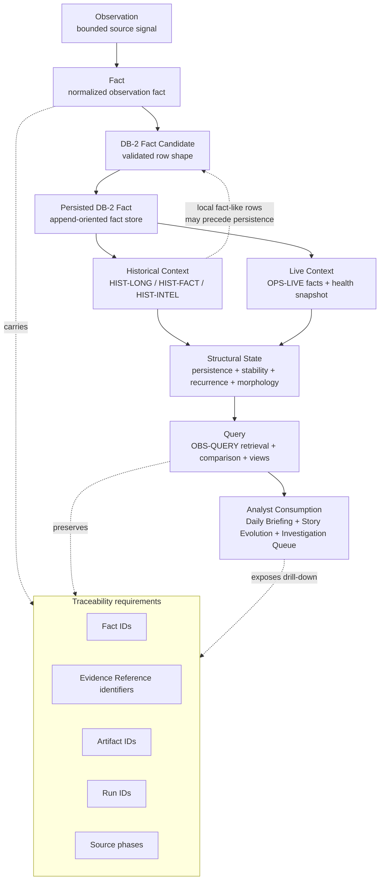

**Table 5. Evolutionary layers.**

| Layer | Transition enabled | Architectural correction |
| --- | --- | --- |
| Observation | Bounded historical or live source signals become candidates for normalization. | Observation alone is not durable source-of-truth status. |
| Fact | Normalized rows bind entity, metric, window, payload, source phase, artifact, run, and duplicate key. | Fact candidates are distinct from persisted DB-2 facts. |
| Historical Intelligence | Completed artifacts produce persistence, recurrence, drift, taxonomy, Narrative Evolution, and ecosystem synthesis. | Historical Intelligence both contributes to and can retrieve from DB-2. |
| Live Intelligence | OPS-LIVE handles controlled ingestion, accumulation, and structural snapshots. | OPS-LIVE-3 is read-only and does not emit facts. |
| Query Layer | OBS-QUERY retrieves and compares existing facts. | Retrieval-only; no creation of new facts or intelligence. |
| Consumption Products | Analyst views present retrieved evidence. | Presentation-only and bounded by Quality Gates. |

### 4.1 Architectural pressures that drove evolution

The first pressure was that observations alone were insufficient. A bounded observation preserves a signal, but it does not by itself provide durable source-of-truth status, duplicate-prevention identity, governed lineage, or a stable retrieval envelope. Observations can be useful inside a local phase, but downstream comparison requires a more normalized unit. Without the fact layer, downstream consumers would need to reinterpret raw or semi-structured artifacts each time they asked whether a pattern persisted, recurred, weakened, or transitioned.

The second pressure was that facts became necessary for audit and retrieval. A fact binds entity, metric, window, value, payload, phase, artifact, run, and duplicate-prevention identity into a durable row shape. That row shape can be emitted, accumulated, retrieved, and reviewed. The fact layer therefore arose from a need to convert observations into durable review units without losing lineage. It is the point at which a bounded signal becomes suitable for append-oriented accumulation and query access.

The third pressure was that DB-2 emerged as the persisted observation-fact read model. Historical and live layers can produce local fact-like rows and candidates, but the architecture needed a scoped source of truth for OBS-QUERY fact retrieval. DB-2 supplies that scope through `sefi_observation_facts`. It does not replace all local artifacts, and it does not precede all historical intelligence. It provides the persisted fact boundary that makes retrieval and comparison reviewable.

The fourth pressure was historical accumulation. Market-structure intelligence depends on more than a single observation. Persistence, recurrence, stability, morphology, ecology, drift, taxonomy weighting, Narrative Evolution, and ecosystem synthesis all require retained evidence across windows and runs. Historical Intelligence emerged to make completed local ecology artifacts and accumulated facts interpretable as longitudinal structure. This is not forecasting. It is descriptive review of retained historical evidence.

The fifth pressure was live accumulation. A historical-only architecture cannot express current bounded observations, live health, or current structural-state snapshots. OPS-LIVE emerged to ingest a bounded source universe, accumulate controlled live observation facts, and synthesize live structural-state snapshots. The architecture audit correction is important: OPS-LIVE-3 is read-only. Live snapshotting interprets accumulated facts and health context; it does not become a DB-2 fact-emission path.

The sixth pressure was retrieval architecture. Accumulated facts and historical artifacts are valuable only if analysts and downstream systems can ask bounded questions over them. OBS-QUERY emerged to answer typed intelligence questions through read-only retrieval and comparison. It supplies canonical fact envelopes, Evidence Reference envelopes, historical/live comparisons, views, and validation scorecards while preserving disabled-action guarantees.

The seventh pressure was analyst consumption. Retrieved intelligence still needs to be usable by humans. Consumption Products emerged to convert retrieved facts and historical intelligence artifacts into bounded presentation surfaces: Daily Briefing, Story Evolution, Investigation Queue, Story Detail, Why Now, and Quality Gate outputs. These products improve readability without becoming new sources of truth, prediction engines, or recommendation systems.

### 4.2 Phase-by-phase architectural rationale

The observation phase exists to capture bounded historical or live source signals while preserving the distinction between observed information and durable facts. This distinction is critical because not every observed signal should become a persisted fact. Some observations remain local, insufficient, unsupported, or outside governed shape.

The fact phase exists to normalize observations into stable review units. It binds lineage and identity fields, constrains payloads, supports duplicate prevention, and creates a row shape that can be accumulated. This phase makes later comparison possible without requiring every downstream consumer to understand every upstream artifact format.

Historical Intelligence exists to interpret retained evidence across windows and structural contexts. It evaluates persistence, recurrence, drift, stability, morphology, taxonomy weighting, Narrative Evolution, and ecosystem synthesis. Its role is descriptive and retrospective. It characterizes evidence that exists; it does not forecast what will happen.

OPS-LIVE exists to bring the same governance posture to live observations. OPS-LIVE-1 controls live ecosystem ingestion over a bounded universe. OPS-LIVE-2 performs governed live observation fact accumulation and can emit DB-2 facts only when write gates pass. OPS-LIVE-3 performs read-only live structural-state snapshotting over accumulated facts and must not be described as emitting facts.

Structural Intelligence exists as a characterization layer across historical and live context. It gives the architecture vocabulary for persistence, stability, recurrence, morphology, ecology, dominance, weakening, transition, and drift. These concepts remain tied to evidence and must not be converted into predictions or recommendations.

OBS-QUERY exists because intelligence needs a governed read interface. It retrieves facts, applies supported filters, returns unsupported-filter states, compares historical and live evidence where supported, and emits validation posture, reviewer confidence, and audit continuity. It does not create new facts or intelligence.

Consumption Products exist because analysts need concise views. They are presentation-only adapters over retrieved facts and historical intelligence artifacts. Their value is usability, not new authority. A presentation item can display evidence-backed intelligence; it cannot become the source of truth for that intelligence.

### 4.3 Evolution as Increasing Review Granularity

SEFI's evolution can also be read as increasing review granularity. Early observation capture provides raw bounded signals, but review questions quickly become more specific. Which observation was normalized? Which fact candidate was eligible for persistence? Which persisted fact supports a query result? Which historical artifact supplied longitudinal context? Which live snapshot was read-only? Which presentation item displayed the retrieved evidence? Each architectural stage adds a more precise review object.

This increasing granularity is important because market-structure intelligence can otherwise become a chain of summaries. A summary of a summary may be readable, but it is weak for audit. SEFI instead keeps intermediate objects visible: observations, facts, candidates, persisted facts, structural states, query results, validation scorecards, and presentation views. Reviewers can inspect the layer where an issue occurred rather than treating the whole system as an opaque narrative generator.

The same granularity supports governance. A write failure belongs at the emission boundary. An unsupported filter belongs at the OBS-QUERY boundary. A missing caveat belongs at the consumption boundary. A misleading future-looking phrase belongs at the governance language boundary. The system's evolution produced these boundaries because each class of issue needs a different control point.

### 4.4 Evolution Without Architecture Drift

Draft 2 expands rationale without changing architecture. This distinction matters. The source pack already defines the subsystems, lifecycle definitions, governance boundaries, DB-2 correction, and OPS-LIVE-3 correction. The purpose of this pass is to explain why those pieces exist and how they interact, not to add new subsystems or speculative capabilities.

Architecture drift would occur if the whitepaper converted descriptive historical review into forecasting, converted investigation candidates into recommendations, converted presentation products into source-of-truth objects, or converted OPS-LIVE-3 snapshots into fact emissions. It would also occur if the document implied that DB-2 must precede all Historical Intelligence or that Evidence References imply an undocumented universal evidence table. Draft 2 avoids these changes by preserving the audit corrections as controlling constraints.

The result is an architecture that can evolve in documentation quality without evolving in unauthorized capability. More explanatory prose improves reviewability. More rationale improves reader confidence. More precise lifecycle language improves governance. None of these improvements requires redesigning SEFI.

# 5. Core Concepts

The terminology standard defines the canonical vocabulary used throughout this whitepaper. The core conceptual unit is the Observation, a bounded source signal captured from historical or live inputs. Observations are normalized into Observation Facts only after they are shaped into governed rows with entity, metric, window, payload, and lineage fields. Evidence is referred to as an Evidence Reference where the architecture tracks identifiers and supporting references rather than a separately documented universal evidence table. Fact Lineage is the set of identifiers and metadata that keeps facts connected to the source phase, artifact, run, entity, metric, window, payload, and duplicate-prevention context.

Structural State is a characterization of the system's observed condition using persistence, stability, recurrence, morphology, ecology, health class, coverage, source digest, and related source-pack concepts. Persistence refers to a structure continuing across windows or observations. Stability concerns the consistency of structural behavior across windows or comparable contexts. Recurrence identifies repeated appearance of a signal or structure. Morphology describes the shape or form of observed market/ecology structure. Ecology describes the surrounding structural environment in which entities, sectors, groups, taxonomy classes, or signals appear.

Historical Intelligence is the source-pack name for analysis over completed local ecology artifacts and fact-like or persisted facts. Live Intelligence is implemented through the OPS-LIVE subsystem. Queryable Intelligence is implemented through OBS-QUERY. Story and Story Evolution refer to analyst-consumable narrative structures and changes over time, but those terms must not be interpreted as generated forecasts. Investigation Candidate and Why Now are consumption-layer structures that explain why an existing evidence-backed item is surfaced for review. Quality Gate refers to validation and filtering logic that keeps presentation bounded and evidence-bearing.

**Table 6. Canonical concept mapping.**

| Concept | Canonical interpretation | Boundary |

| --- | --- | --- |

| Observation | Bounded source signal from historical or live inputs. | Not yet a persisted fact. |

| Observation Fact | Normalized fact row with lineage suitable for DB-2 persistence or retrieval. | Must preserve source and duplicate-prevention context. |

| Evidence Reference | Identifier or reference attached to supporting evidence. | Do not imply a universal evidence table unless documented. |

| Structural State | Observed condition characterized by persistence, stability, recurrence, morphology, ecology, health, and coverage concepts. | Descriptive, not predictive. |

| Queryable Intelligence | Retrieval and comparison over existing DB-2 facts or controlled fixtures. | No writes, provider calls, fact creation, prediction, recommendation, or market action. |

Across this section, the architectural boundary is intentionally conservative. The system may preserve, retrieve, group, compare, or present evidence-bearing observations, but the source pack does not authorize forecasts, predictions, trading instructions, portfolio recommendations, market-action directives, provider calls in retrieval layers, schema migrations in query or presentation layers, or unbounded generated narrative synthesis. When data is missing, unsupported, or outside the governed shape, the appropriate behavior is a bounded response, an unsupported-filter explanation, a dry-run summary, or an insufficient-data state rather than synthetic completion.

### 5.1 Term usage controls

The source pack distinguishes conceptual terms from subsystem names. “Live Intelligence” is a capability area, while OPS-LIVE is the subsystem family that implements live ingestion, live fact accumulation, and live structural-state snapshotting. “Queryable Intelligence” is a capability area, while OBS-QUERY is the subsystem family that implements retrieval, typed questions, historical/live comparison, consumption view generation, and validation. “Story” and “Narrative Evolution” are related but should not be collapsed into a single term: a story is an analyst-consumable structure, while Narrative Evolution is the historical-intelligence mapping of changes in narrative or regime structure over retained evidence.

The source pack also requires care around evidence language. The preferred term is Evidence Reference when the architecture is referring to identifiers, references, or supporting evidence links rather than a separately documented evidence table. This matters because a reviewer should not infer a universal evidence database from terminology alone. Evidence References are part of traceability, and traceability depends on how facts, artifacts, runs, phases, and payloads are carried through the system.

The term “source of truth” is similarly scoped. Persisted rows in `sefi_observation_facts` are the source of truth for OBS-QUERY fact retrieval. That does not mean all historical artifacts, fixtures, reports, cards, or snapshots become source-of-truth records. The whitepaper therefore uses source-of-truth language only where the source pack permits it and uses lifecycle-state language elsewhere.

Finally, the intelligence terms in SEFI are descriptive and evidence-oriented. Historical Intelligence, Live Intelligence, Structural State, Queryable Intelligence, Story Evolution, Why Now, and Investigation Candidate do not imply prediction, recommendation, or autonomous decision-making. They describe how retained evidence is normalized, accumulated, compared, validated, and presented for analyst review.

# 6. End-to-End Architecture

**Figure 3. End-to-end architecture.** The full system boundary from controlled inputs to presentation-only consumption products.

The end-to-end architecture begins with controlled historical and live inputs. These inputs become bounded observations only when they are captured within the relevant historical or live layer controls. Observations then become observation facts through normalization, validation, lineage binding, payload bounding, metric validation, and duplicate-prevention key construction. Persisted facts enter DB-2, specifically `sefi_observation_facts`, where they can be retrieved by OBS-QUERY and used by downstream comparison and presentation views.

Historical Intelligence and OPS-LIVE occupy complementary positions in the architecture. Historical Intelligence processes completed local artifacts, produces local fact-like rows and candidates, contributes to governed DB-2 emission paths, and can consume persisted DB-2 facts where retrieval is documented. OPS-LIVE processes controlled live observations: OPS-LIVE-1 produces bounded observations, OPS-LIVE-2 normalizes and accumulates fact rows with explicit write gates, and OPS-LIVE-3 reads accumulated facts to synthesize local read-only structural-state snapshots. Both historical and live paths contribute context to structural-state modeling, but neither grants query or presentation layers permission to predict or recommend.

OBS-QUERY is downstream of DB-2 for fact retrieval. It supports typed intelligence questions such as persisted, changed, recurred, dominant, weakened, and transitioned structures, plus historical/live comparisons and validation scorecards. Consumption Products sit downstream of OBS-QUERY and historical intelligence artifacts. They generate analyst-facing presentations such as Daily Briefing and Story Evolution by arranging existing evidence and applying Quality Gates. They do not create new facts, modify schemas, or call providers.

The common lineage contract is also essential. Facts and derived views retain source phase identity, artifact and run references where available, entity and metric identity, observation windows, bounded payload fields, Evidence Reference identifiers, and duplicate-prevention keys. This lineage is not an optional metadata convenience; it is the mechanism that makes downstream review, comparison, audit, and analyst drill-down possible without changing the meaning of the original observation.

**Table 7. End-to-end dependencies.**

| Stage | Upstream dependencies | Downstream dependencies |

| --- | --- | --- |

| Observations | Controlled historical/live inputs and source-universe constraints. | Fact normalization and candidate emission. |

| Observation Facts | Bounded observations, phase/run/artifact context, entity/metric/window fields. | DB-2 persistence, retrieval envelopes, Evidence References. |

| DB-2 | Governed fact emission paths and optional parent registries. | OBS-QUERY, comparison layers, consumption products, historical retrieval paths. |

| Structural State | Historical and live fact/context inputs. | Queryable comparisons and presentation views. |

| OBS-QUERY | Persisted DB-2 facts or controlled fixtures. | Validation scorecards and consumption views. |

| Consumption Products | OBS-QUERY views and documented historical intelligence artifacts. | Analyst review surfaces only. |

### 6.1 Producer and consumer interpretation

The end-to-end architecture should be read as a producer/consumer network rather than a rigid linear chain. Historical components can produce candidates and consume persisted facts. Live components can produce observations, emit facts through OPS-LIVE-2, and consume accumulated facts through OPS-LIVE-3. DB-2 consumes governed fact rows and produces retrievable fact envelopes. OBS-QUERY consumes persisted facts and produces retrieval, comparison, validation, and consumption-view structures. Consumption Products consume those structures and produce presentation items.

This interpretation preserves the DB-2 directionality correction. If the system were described as a simple sequence in which all historical intelligence appears only after DB-2, it would contradict the source pack. Conversely, if local historical artifacts were described as equivalent to persisted DB-2 facts, it would weaken the source-of-truth boundary. The correct architecture is more precise: local historical artifacts and fact-like rows can contribute candidates; persisted DB-2 facts are the durable retrieval source for OBS-QUERY; historical layers may also retrieve persisted facts where documented.

The end-to-end flow also preserves the OPS-LIVE-3 correction. OPS-LIVE-3 is downstream of accumulated facts because it reads those facts to synthesize a live structural-state snapshot. It is not upstream of DB-2 as a fact emitter. Its local snapshot/report can inform downstream views, but the snapshot remains separate from append-oriented observation facts. This keeps the fact model and structural-state model from collapsing into one another.

The consumption end of the architecture is deliberately narrow. A presentation item can make evidence easier to read, but it cannot improve the evidence by assertion. If a Daily Briefing item or Investigation Queue entry cannot expose a supporting fact or documented artifact relationship, the appropriate response is a Quality Gate or caveat rather than unsupported prose.

# 7. Observation Layer

The observation layer is the system's controlled boundary for capturing source signals before they become facts. In the source-pack model, observations may be historical or live. Historical observations originate from completed local ecology artifacts and historical processing phases. Live observations originate from OPS-LIVE-1 controlled ingestion over a bounded source universe. In both cases, an observation is not the same as a persisted DB-2 fact. It is a bounded signal that must pass through normalization and governance before it can be accumulated as an observation fact.

Observation normalization converts source-layer signals into a stable shape. The architecture expects entity fields, metric fields, window information where applicable, observed-at or source-phase context for live observations, payload metadata, and parent artifact/run lineage where available. Normalization is responsible for resolving the source signal into a form that can be validated, bounded, assigned lineage, and checked for duplicate-prevention identity. The observation boundary protects the rest of the system from raw or unbounded artifacts.

Observational guarantees are deliberately limited. The architecture can guarantee that accepted observations are bounded, shaped, and carried forward with source context. It does not guarantee that every raw source item becomes a persisted fact, nor that an observation can be used for unsupported filters or presentation claims. If an observation lacks required fields, exceeds payload bounds, or lacks the required context for emission, the fail-closed posture requires no write or an explicit insufficient/unsupported state.

The observation layer's upstream dependencies are controlled source inputs, completed historical artifacts, live source-universe selection, fetcher injection or API-key gates where relevant, and explicit phase/run/artifact context. Its downstream dependencies are fact row construction, DB-2 candidate emission, historical persistence classification, live accumulation, and structural-state synthesis. Because these downstream layers rely on observation integrity, observation boundaries are a governance boundary, not merely an ingestion convenience.

**Table 8. Observation boundary responsibilities.**

| Responsibility | Rationale | Constraint |

| --- | --- | --- |

| Capture bounded signals | Preserves source evidence without granting durable fact status prematurely. | No unbounded raw artifact consumption in query/presentation. |

| Normalize observation fields | Enables consistent fact candidate construction. | Required fields must be present before emission. |

| Preserve source context | Supports auditability and downstream drill-down. | Phase, artifact, run, entity, metric, window, and payload context remain relevant. |

| Fail closed on invalid inputs | Prevents unsupported synthesis. | Missing or invalid fields yield no write or bounded insufficient-data state. |

### 7.1 Observation normalization detail

Observation normalization has two complementary responsibilities: it preserves the source signal and constrains the signal into a shape that downstream systems can validate. Preserving the source signal means retaining enough source context for audit: phase identity, run context, artifact lineage, observed-at context for live observations, entity identity, metric identity, window information, and payload metadata. Constraining the signal means preventing unbounded or ambiguous inputs from leaking into DB-2, OBS-QUERY, or Consumption Products.

The normalization boundary also protects terminology. A raw signal may mention an entity, sector, taxonomy, metric, or structure in source-specific language. The normalized observation must represent the fields in a form that the fact emitter, retrieval adapter, and typed query components can understand. Where the schema does not expose a field, downstream retrieval must not pretend the field exists. This is why unsupported filters are a governance behavior rather than a minor interface inconvenience.

Historical observations and live observations differ in origin but share the same governance need. Historical observations are tied to completed local artifacts and historical processing phases. Live observations are tied to controlled ingestion and source-universe constraints. Both require bounded payloads and lineage before they can become fact candidates. Neither path should bypass the distinction between observation, fact-like row, fact candidate, persisted fact, and presentation item.

Observation boundaries are also operational constraints. If an upstream source expands, changes shape, or provides incomplete metadata, the observation layer should absorb that change by validating and bounding the signal. It should not allow a changed source to silently alter DB-2 semantics, retrieval semantics, or presentation language. This is especially important for a fact-native architecture because downstream trust depends on the consistency of upstream normalization.

# 8. DB-2 Architecture

**Figure 4. DB-2 fact lifecycle.** The fact lifecycle from observation capture through emission gates, accumulation, retrieval, and downstream use.

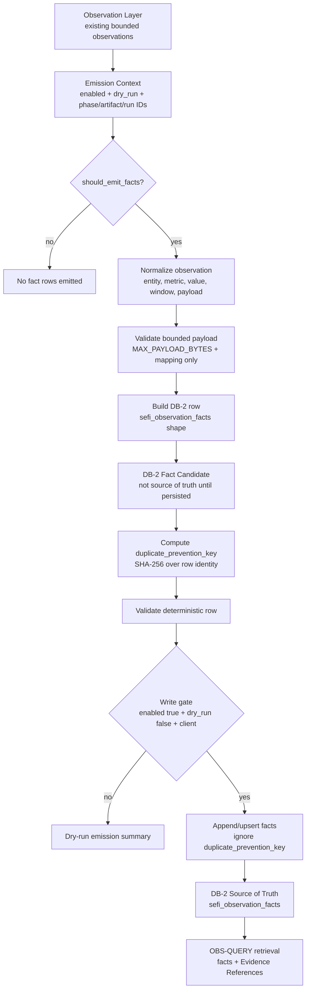

DB-2 is the repository's fact-native read model for SEFI observations. Its central table is `sefi_observation_facts`, an append-oriented store of bounded observation facts emitted from governed phases and later retrieved by OBS-QUERY and consumption products. DB-2 is not a single linear stage before all Historical Intelligence. The architecture audit correction is explicit: historical layers can produce local fact-like rows and DB-2 fact candidates before persistence, while DB-2 stores persisted observation facts that OBS-QUERY and comparison layers retrieve.

The DB-2 input contract includes a gated emission context with enablement status, dry-run status, phase identity, artifact identity, and run identity. It also includes metric observations with entity, metric, optional window, value, and bounded payload. OPS-LIVE-2 contributes bounded live observations containing observed-at, source phase, source run, entity fields, metric fields, and payload metadata. Parent registry metadata can be emitted for artifact and run lineage when governed live fact rows exist.

### 8.1 Why DB-2 Exists

DB-2 exists because SEFI requires a persisted observation-fact boundary between bounded observations and retrieval-oriented intelligence. Historical and live layers can identify signals, produce local fact-like rows, and assemble candidates, but retrieval requires a stable source of truth. `sefi_observation_facts` supplies that source of truth for OBS-QUERY fact retrieval and downstream query-derived consumption.

The observation-fact architecture is the core reason DB-2 exists. A raw observation is too close to its source context to serve as a durable cross-layer review unit. A presentation item is too far downstream to serve as source evidence. An observation fact occupies the governed middle: it is normalized enough to retrieve and compare, but it retains lineage back to source phase, artifact, run, entity, metric, window, payload, and Evidence Reference context.

Retrieval requirements also make DB-2 necessary. OBS-QUERY must answer bounded questions without provider calls, writes, schema migrations, fact creation, prediction, recommendation, or market action. It can do so only if facts have already been persisted in a retrievable shape or are available through controlled fixtures where explicitly allowed. DB-2 therefore shifts intelligence discipline upstream. The query layer retrieves; it does not improvise missing facts.

Evidence requirements make DB-2 necessary as well. A retrieved answer should expose fact identifiers, Evidence Reference identifiers, snapshot or observation windows, taxonomy or source-layer context where available, artifact lineage, run lineage, and payload support. DB-2 gives these fields a durable location. It allows downstream views to remain compact while preserving enough evidence for audit.

Source-of-truth requirements are the fourth rationale. The architecture audit clarifies that DB-2 source-of-truth status is scoped. DB-2 is authoritative for OBS-QUERY fact retrieval. It is not a universal source of truth for all local artifacts, generated reports, fixtures, presentation cards, or markdown outputs. This scoping prevents DB-2 from being overstated while still recognizing its central role in the retrieval path.

### 8.2 Observation Fact Philosophy

An observation fact is a normalized review unit. It is not merely a copied source signal, and it is not a generated conclusion. It expresses a bounded observation using stable fields so that downstream systems can retrieve, compare, validate, and present it without changing its meaning.

Normalization gives facts their durability. Entity identity, metric identity, metric value, window, payload, phase, artifact, run, and duplicate-prevention identity must be represented in predictable form. This permits historical and live observations to participate in shared retrieval and comparison patterns while preserving their source context.

Observation facts are durable review units because they can be inspected independently of the full upstream artifact and independently of the downstream presentation. A reviewer can ask whether the row was emitted under valid context, whether its payload was bounded, whether its duplicate-prevention key matched row identity, whether its source phase was preserved, and whether retrieval displayed it correctly.

Observation facts are also comparison units. SEFI's typed intelligence concepts—persisted, changed, recurred, dominant, weakened, transitioned—depend on comparing retained evidence. Those comparisons require facts that can be grouped by entity, metric, taxonomy, source layer, window, or Evidence Reference context where supported. The architecture does not require every fact to answer every possible question; it requires facts to be stable enough for documented comparisons.

Finally, observation facts are accumulation units. Accumulation allows persistence, recurrence, and longitudinal review to emerge from retained evidence rather than from one-off reports. Append-oriented fact rows let the architecture observe how structures appear across runs and windows while retaining the lineage needed to explain each occurrence.

### 8.3 Fact Lineage Strategy

DB-2 lineage strategy is built around artifact lineage, run lineage, phase lineage, Evidence References, and duplicate-prevention identity. These fields support traceability objectives across emission, retrieval, validation, and presentation.

Artifact lineage links a fact to the governed artifact context where available. Historical Intelligence may operate over completed local ecology artifacts, and OPS-LIVE-2 may emit parent artifact registry rows when governed fact rows exist. Artifact references help reviewers understand which upstream material supported a persisted fact without implying that every artifact is itself a DB-2 fact.

Run lineage links a fact to the execution context that produced or accumulated it. This matters for operational review because two facts with similar entity and metric fields may arise from different runs. Run identity lets reviewers distinguish recurrence across executions from duplicate insertion within one execution. It also supports audit trails and validation scorecards.

Phase lineage identifies the subsystem or phase responsible for producing the observation or fact candidate. Phase identity is important because the meaning of an observation depends partly on whether it came from historical processing, live accumulation, query retrieval, or presentation. DB-2 facts preserve source phase rather than flattening all evidence into a single anonymous table.

Evidence References provide traceability into the evidence-bearing context. The architecture audit clarifies the term: Evidence Reference should be used where no concrete universal evidence table is documented. This avoids implying that SEFI has a separate evidence repository beyond the documented facts, artifacts, runs, and payload references. Evidence References are therefore identifiers that support drill-down and review.

Duplicate-prevention identity completes the lineage strategy. DB-2 is append-oriented, but append-oriented does not mean uncontrolled duplication. Deterministic duplicate-prevention keys allow accumulation while supporting idempotent writes. They make it possible to distinguish a recurring structure from repeated insertion of the same row identity.

### 8.4 Append-Oriented Accumulation

DB-2 accumulation is append-oriented because SEFI's intelligence questions depend on retained evidence over time. Persistence cannot be reviewed from a single overwritten current state. Recurrence cannot be evaluated if prior occurrences disappear. Historical comparison cannot be performed if the system retains only the latest presentation view.

Append-oriented accumulation preserves the sequence of governed facts while using duplicate-prevention behavior to avoid uncontrolled repetition. Rows that pass emission gates can be inserted or upserted with duplicate-ignore semantics. Rows that do not pass gates produce no durable facts or only dry-run summaries. This model supports both safety and accumulation.

Persistence review depends on accumulation. A structure that appears across windows or runs can be described as persistent only if the architecture retains enough evidence to support that description. DB-2 facts provide retrievable units that OBS-QUERY and historical layers can compare without relying on unsupported memory.

Recurrence review also depends on accumulation. Recurrence asks whether a pattern appears again under comparable conditions. That question requires retained rows with stable entity, metric, window, source, and lineage fields. Append-oriented facts make recurrence review possible while duplicate keys help prevent recurrence from being confused with duplicate ingestion.

Historical comparison depends on accumulation across windows and contexts. Historical Intelligence can evaluate drift, stability, morphology, taxonomy weighting, Narrative Evolution, and ecosystem synthesis because evidence is retained rather than replaced by the latest output. DB-2 does not own every historical artifact, but it provides the persisted fact boundary that retrieval and comparison can trust.

### 8.5 Historical ↔ DB-2 Relationship

The architecture audit correction for DB-2 and Historical Intelligence is one of the most important clarifications in this whitepaper. The relationship is not a one-way sequence in which DB-2 must always precede Historical Intelligence. It is a producer/consumer relationship with non-linear directionality.

Historical layers can produce local fact-like rows and DB-2 fact candidates before persistence. HIST-LONG layers characterize ecology, sensitivity, differentiation, contrast, persistence, and drift over completed local artifacts. HIST-FACT layers expand historical observation facts and regime evidence. HIST-INTEL layers produce structural findings, fact-native findings, taxonomy-weighted intelligence, Narrative Evolution, and ecosystem synthesis. Some of these outputs can contribute candidates for DB-2 persistence.

DB-2 then stores persisted observation facts that OBS-QUERY and comparison layers retrieve. Historical layers may also consume persisted facts where the source pack describes such retrieval. This means the relationship is cyclic in an architectural sense but governed at each boundary: local artifacts are not automatically source-of-truth facts, candidates are not persisted facts, and retrieved facts do not authorize new writes in OBS-QUERY.

This clarification prevents two errors. The first error is overstating DB-2 as the beginning of all historical intelligence. The second error is understating DB-2 as merely an implementation detail. DB-2 is central to persisted fact retrieval, but Historical Intelligence remains an active producer and consumer of evidence-bearing context.

### 8.6 DB-2 as a Review Boundary

DB-2 should be understood as a review boundary as much as a storage boundary. The architecture does not treat persistence as a passive database event. Persistence changes the authority of a row: a local observation or candidate becomes a retrievable persisted fact only after it passes governed emission controls. This is why DB-2 is described in terms of lifecycle, lineage, duplicate prevention, and source-of-truth scope rather than simply in terms of table storage.

As a review boundary, DB-2 answers several questions. Was the row produced by an authorized phase? Was the emission context explicit? Was dry-run mode disabled for the write? Was a database client supplied? Were required fields present? Was the payload bounded and structured as a mapping? Was metric value numeric or null where required? Was duplicate-prevention identity deterministic? If any of these conditions fail, the architecture should not silently create durable facts.

The review-boundary interpretation also explains why DB-2 must not absorb every object in the ecosystem. Completed local artifacts, validation fixtures, query views, briefing cards, and quality summaries can be useful, but they have different authority. DB-2 is the persisted observation-fact boundary for rows that have passed governed emission. Maintaining this distinction keeps audits precise and prevents downstream consumers from treating every readable artifact as if it had the same evidentiary status.

This boundary is especially important for analyst trust. An analyst-facing product may summarize a structural condition in one sentence, but the confidence of that sentence depends on the ability to drill back to facts and lineage. DB-2 provides the durable row set that makes such drill-down possible. The presentation layer can remain concise because DB-2 preserves the inspectable substrate.

### 8.7 DB-2 and Source-of-Truth Discipline

Source-of-truth discipline is one of DB-2's most important architectural contributions. The source pack and architecture audit do not authorize a broad claim that DB-2 is the source of truth for every SEFI object. The correct claim is narrower and stronger: `sefi_observation_facts` is the source of truth for OBS-QUERY fact retrieval and downstream query-derived consumption.

This scoped statement prevents two opposite errors. The first error is under-scoping DB-2 by treating it as an implementation detail behind the historical stack. That would weaken retrieval and audit because OBS-QUERY needs an authoritative fact source. The second error is over-scoping DB-2 by treating every artifact, fixture, and presentation object as if it were part of the same source-of-truth set. That would weaken lifecycle governance.

The disciplined interpretation is that DB-2 owns persisted observation facts. Historical local artifacts remain governed inputs and evidence-bearing context. Controlled fixtures remain validation or fallback materials where documented. Fact-like rows and DB-2 fact candidates remain pre-persistence states. Presentation items remain consumption views. Each object can be important without sharing the same authority.

Source-of-truth discipline also helps resolve conflicts. If a query-derived consumption view needs a fact, OBS-QUERY should retrieve it from DB-2 or an explicitly allowed fixture. If a presentation item contains a claim that cannot be traced to facts or documented artifacts, the claim should be caveated or excluded. If a local candidate has not been persisted, it should not be described as a persisted DB-2 fact. These rules keep the architecture reviewable.

### 8.8 DB-2 Retrieval Consequences

DB-2's row shape affects what OBS-QUERY can and cannot retrieve. Supported filters are those the retrieval adapter can apply against available fact fields and controlled envelopes. Unsupported filters must be reported as unsupported rather than synthesized. This is why the source pack notes that filters such as sector, subsector, and minimum confidence are unsupported where DB-2 fact rows do not expose those columns in the OBS-QUERY-1 schema.

This retrieval consequence is not a weakness. It is a governance feature. A system that invents unsupported filter results would be more fluent but less trustworthy. SEFI instead requires the query layer to remain honest about what the persisted facts can answer. Where the data model does not expose a field, the architecture should either report the limitation or rely on a documented source that does expose it. It should not infer the missing field without authorization.

DB-2 retrieval consequences also influence upstream design. If a future documented field is needed for retrieval, it must be introduced through governed architecture and data-model change, not through query-time improvisation. This maintains the separation between persistence design and query behavior. OBS-QUERY can retrieve and compare; it cannot mutate the data model to satisfy a question.

### 8.9 DB-2 Failure Modes Avoided

The DB-2 design avoids several failure modes. The first is silent fact creation. Without explicit gates, any upstream observation could become durable evidence even when context is incomplete. DB-2 avoids this through enabled flags, dry-run defaults, required context, row validation, payload bounds, and database-client checks.

The second failure mode is duplicate confusion. Accumulation must allow recurrence, but uncontrolled duplication can masquerade as recurrence. Deterministic duplicate-prevention keys allow the architecture to preserve repeated observations across legitimate contexts while avoiding repeated insertion of the same row identity.

The third failure mode is lineage loss. If facts were stored without phase, artifact, run, entity, metric, window, and payload context, downstream retrieval could produce answers that are impossible to audit. DB-2's lineage fields preserve the path from observation to fact to query to presentation.

The fourth failure mode is source-of-truth inflation. If local artifacts, candidates, and presentation cards were all treated as facts, reviewers would have no stable authority model. DB-2 avoids that by reserving persisted fact status for governed rows in `sefi_observation_facts`.

The fifth failure mode is query-time synthesis. If OBS-QUERY could generate missing facts, DB-2's role would collapse. DB-2 preserves retrieval discipline by making persisted facts the substrate for downstream answers and by requiring unsupported states when the substrate is insufficient.

### 8.10 DB-2 operational responsibilities

DB-2 has a narrow but central responsibility: retain governed observation facts in a form that can be retrieved without reinterpretation. The fact emitter and accumulation paths validate context, normalize strings, bound payloads, compute duplicate-prevention keys, validate rows, and either dry-run or insert/upsert according to the emission gate.

DB-2 does not generate intelligence. It does not decide what analysts should do. It does not forecast. It does not recommend. It does not convert presentation items into facts. Its operational value comes from making persisted facts available to retrieval and comparison layers while preserving lineage and governance posture.

**Table 9. DB-2 source-of-truth boundaries.**

| Boundary | In scope | Out of scope |
| --- | --- | --- |
| Persisted fact scope | Rows in `sefi_observation_facts` plus lineage fields, duplicate-prevention keys, and optional governed parent registry rows. | Local fact-like rows, reports, presentation cards, quality summaries, unsupported synthetic fields. |
| Retrieval scope | Canonical facts and Evidence Reference envelopes retrieved by OBS-QUERY. | Provider calls, new fact creation, schema migrations, recommendations, predictions. |
| Directionality scope | Historical and live layers can contribute candidates; DB-2 supplies persisted retrieval facts. | A simplified one-way sequence where DB-2 must precede all historical intelligence. |

The common lineage contract is essential. Facts and derived views retain source phase identity, artifact and run references where available, entity and metric identity, observation windows, bounded payload fields, Evidence Reference identifiers, and duplicate-prevention keys. This lineage is not optional metadata; it is the mechanism that makes downstream review, comparison, audit, and analyst drill-down possible without changing the meaning of the original observation.

### 8.11 DB-2 and Analyst Drill-Down

DB-2 enables analyst drill-down by preserving the row-level evidence behind downstream views. A Daily Briefing item or Story Evolution card may present only a small amount of text, but that text should be supported by retrievable facts, Evidence References, source phases, artifacts, runs, windows, and payload context. Without DB-2, drill-down would depend primarily on locating and interpreting whole artifacts or reports. With DB-2, the analyst can move from a presentation item to a bounded observation fact.

This drill-down capability is also useful for architecture review. If a consumption product displays a claim about a persistent, changed, recurring, dominant, weakened, or transitioned structure, the reviewer can ask whether the supporting facts exist in DB-2 or in documented historical context. If they do not, the claim should be treated as unsupported. DB-2 therefore acts as a guardrail against presentation overreach.

Drill-down does not require DB-2 to contain every possible explanatory object. The architecture preserves a scoped role. DB-2 stores persisted observation facts. Historical artifacts, taxonomy context, validation scorecards, and consumption views may add context at their own boundaries. The important requirement is that a downstream item must not sever its relationship to the facts and references that support it.

### 8.12 DB-2 and Comparison Integrity

Comparison integrity depends on stable fact identity. When SEFI compares windows, entities, metrics, live contexts, or historical contexts, it needs to know that the compared units were constructed consistently. DB-2 supports this through normalized row shape, deterministic duplicate keys, bounded payloads, and lineage fields.

Stable identity prevents misleading comparisons. If two rows use different entity conventions, unsupported payload structures, missing source phases, or ambiguous windows, a comparison may appear meaningful while hiding inconsistent inputs. DB-2's validation and normalization responsibilities reduce that risk. They do not guarantee that every possible comparison is valid, but they give OBS-QUERY and reviewers a controlled substrate.

Comparison integrity also depends on preserving absence and insufficiency. If a fact does not exist, OBS-QUERY should not create it. If a filter is unsupported, OBS-QUERY should report that state. If evidence is too sparse, validation should caveat the result. These behaviors protect comparison quality because they prevent missing evidence from being replaced by confident language.

# 9. Historical Intelligence Architecture

Historical Intelligence converts completed local ecology artifacts and accumulated facts into longitudinal structural understanding. It is not a forecasting subsystem. It is an evidence-review architecture for persistence, recurrence, stability, morphology, ecology, drift, taxonomy weighting, Narrative Evolution, and ecosystem synthesis. Its purpose is to characterize what retained historical evidence shows about market-structure behavior without converting that characterization into prediction or recommendation.

The current historical stack includes HIST-LONG, HIST-FACT, and HIST-INTEL layers. HIST-LONG layers perform ecology review, delta sensitivity classification, cross-sectional differentiation, intra-group contrast, cross-window persistence stability, and persistence evolution or stability drift. HIST-FACT layers expand historical observation facts and historical regime evidence. HIST-INTEL layers produce historical structural findings, fact-native historical findings, taxonomy-weighted intelligence, Narrative Evolution and regime transition mapping, and ecosystem intelligence synthesis.

Historical Intelligence is architecture-oriented rather than merely layer-oriented. The layers matter because they separate review responsibilities, but the deeper architectural purpose is longitudinal accumulation. The system needs to understand whether observations persist, recur, stabilize, change morphology, or belong to a broader ecology. That understanding requires a path from completed artifacts to fact-like rows, persisted facts, structural findings, queryable comparisons, and presentation products.

**Figure 5. Historical intelligence stack.** The historical stack moves from completed local ecology artifacts through HIST-LONG, HIST-FACT, HIST-INTEL, DB-2 contribution/retrieval, OBS-QUERY, and consumption products.

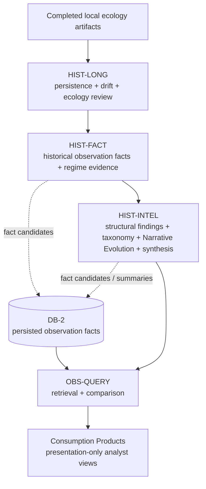

### 9.1 Why Persistence Matters

Persistence matters because SEFI is interested in structures that remain observable across windows or runs. A single observation may be notable, but persistence gives it structural context. If a stress signal, taxonomy pattern, ecosystem characteristic, or narrative condition appears repeatedly across historical windows, the architecture can describe that retained evidence as persistent where supported.

Persistence is not prediction. It does not say that the structure will continue. It says that historical evidence shows continued presence across the reviewed windows. This distinction preserves governance while still allowing meaningful longitudinal review. Persistence is therefore a descriptive evidence property, not a forward-looking claim.

Persistence also supports analyst prioritization without becoming recommendation. A persistent structure may deserve review because it has survived multiple windows or artifacts. The architecture can surface that condition in Story Evolution, Investigation Queue, or Why Now views, but the presentation remains an evidence-backed prompt rather than an instruction to act.

### 9.2 Why Recurrence Matters

Recurrence matters because some structures appear, fade, and reappear. A purely current-state architecture would miss this pattern, and a purely aggregate architecture might flatten it. Historical Intelligence preserves recurrence as a distinct review concept so analysts can see whether an observation has returned under comparable conditions.

Recurrence requires retained evidence and stable comparison units. Observation facts, fact-like rows, source phases, windows, and Evidence References give the architecture a way to distinguish recurring structure from duplicate rows or repeated presentation. This is why DB-2 duplicate-prevention identity and historical lineage matter to the historical stack.

Recurrence also supports ecosystem characterization. A recurring pattern may indicate that a sector, subsector, symbol group, taxonomy, or structural theme repeatedly enters the evidence set. SEFI can describe that recurrence without claiming causality beyond the supported evidence and without forecasting its future occurrence.

### 9.3 Why Stability Matters

Stability matters because historical structures can persist with different degrees of consistency. A signal that remains similar across windows has a different review profile from a signal that appears erratically or changes magnitude, taxonomy, or context. Stability review helps distinguish durable structural conditions from unstable observations.

The historical stack addresses stability through cross-window persistence structural stability and persistence evolution or stability drift. These concepts allow the architecture to examine whether retained structures remain coherent, drift, or change classification. They are descriptive review tools and must not be converted into trading or forecasting language.

Stability also supports validation. If a structural state is presented downstream, reviewers need to know whether it is supported by stable evidence or by a sparse, unstable, or insufficient set. Quality Gates and validation scorecards can then present caveats instead of allowing unsupported confidence.

### 9.4 Why Morphology Matters

Morphology matters because SEFI does not only track whether observations exist; it also characterizes their structural shape. Morphology describes how evidence is arranged across entities, groups, taxonomies, windows, and ecosystem contexts. Two observations with similar metric values can have different meanings if their morphology differs.

Historical morphology review supports structural comparison. It helps the architecture identify whether patterns are concentrated or distributed, isolated or ecosystem-wide, stable or shifting, recurring in the same form or reappearing with a different shape. These distinctions are useful for analyst review because they preserve nuance without requiring unsupported narrative invention.

Morphology also helps bridge Historical Intelligence and OBS-QUERY. Typed questions about dominance, weakening, transition, or change often depend on shape rather than simple presence. Historical morphology gives the retrieval layer a governed evidence context for those concepts when facts and artifacts support them.

### 9.5 Why Ecology Matters

Ecology matters because SEFI treats market-structure intelligence as an ecosystem problem rather than a collection of isolated observations. The historical stack includes real multi-window ecology review, cross-sectional ecology differentiation, intra-group structural contrast, and ecosystem intelligence synthesis. These layers help characterize how evidence appears across related entities and groups.

Ecology review supports ecosystem characterization. It can describe whether evidence is broad or narrow, concentrated or dispersed, differentiated across groups, or contrasting within a group. This makes historical intelligence more useful for structural review because analysts can see the context in which a fact or pattern appears.

Ecology also supports governance. By preserving ecology as evidence-backed characterization, the architecture avoids replacing structural review with unsupported explanation. It can say that retained evidence shows a particular ecosystem shape where supported. It cannot invent causal claims, future trajectories, or recommendations beyond the evidence.

### 9.6 Why Longitudinal Accumulation Matters

Longitudinal accumulation is the architectural foundation of Historical Intelligence. Without retained evidence across windows and runs, persistence, recurrence, stability, morphology, ecology, and drift would be weak or impossible to review. Accumulation allows the historical stack to compare evidence over time while preserving lineage.

Longitudinal accumulation supports structural review. It enables the system to examine whether structures persist, reappear, weaken, stabilize, transition, or change form. It also supports evidence accumulation for downstream retrieval. OBS-QUERY can only answer historical typed questions if the relevant evidence has been retained in facts, controlled fixtures, or documented artifacts.

Accumulation also improves reviewer confidence. A historical claim that cites a single presentation item is fragile. A historical claim that can point to retained facts, Evidence References, source phases, artifacts, and runs is reviewable. This is why Historical Intelligence contributes to DB-2 candidates and can consume persisted DB-2 facts without collapsing into a simple one-way sequence.

### 9.7 Historical Intelligence and Caveated Interpretation

Historical interpretation in SEFI is intentionally caveated. A historical finding is strongest when it can identify supporting artifacts, fact-like rows, persisted facts, Evidence References, windows, and validation posture, reviewer confidence, and audit continuity. It is weaker when one or more of those supports is absent. The architecture should make that weakness visible rather than allowing downstream products to present all findings with the same apparent confidence.

Caveated interpretation is especially important for morphology and ecology. These concepts can be rich, but they are also easy to overstate. A morphology description should describe the shape shown by retained evidence. An ecology description should describe the relationships and contrasts shown by retained evidence. Neither should introduce causal explanations, future trajectories, or recommended actions beyond the documented support.

This caveat discipline helps Historical Intelligence remain useful without becoming speculative. Analysts can still review persistent, recurring, stable, morphologically distinct, or ecosystem-relevant structures. They simply receive those structures as evidence-backed review objects rather than as predictions.

### 9.8 Historical Intelligence and Consumption Readiness

Not every historical output is ready for consumption. Some outputs are intermediate review objects, some are local artifacts, some are fact candidates, and some are persisted facts or retrieval-ready contexts. Consumption readiness depends on lineage, evidence sufficiency, validation posture, and governance boundaries.

This distinction prevents premature presentation. A local finding may be useful inside the historical stack but insufficient for Daily Briefing or Story Evolution display. A fact candidate may be structurally well formed but not persisted. A persisted fact may support retrieval but still require historical context for interpretation. Quality Gates and validation scorecards help determine whether an item can be presented and how strongly it should be caveated.

Consumption readiness is therefore a governed state, not a writing preference. The architecture expects presentation products to improve readability only after evidence and lineage are adequate. If readiness is not established, the appropriate behavior is exclusion, caveat, or insufficient-state reporting rather than synthetic completion.

### 9.9 Historical accumulation responsibilities

Historical Intelligence has three major responsibility groups. First, HIST-LONG produces longitudinal review of ecology, sensitivity, differentiation, contrast, persistence, stability, and drift over completed local artifacts. Second, HIST-FACT expands historical observation facts and regime evidence, creating fact-like rows and candidates that can participate in DB-2 persistence where governed. Third, HIST-INTEL produces structural findings, fact-native findings, taxonomy-weighted intelligence, Narrative Evolution, and ecosystem synthesis.

The historical-to-OBS-QUERY handoff is evidence-oriented. Historical outputs may be consumed directly as documented artifacts or through DB-2 persisted facts where available. OBS-QUERY then retrieves, compares, validates, and presents bounded results. The architecture must preserve the distinction between local artifacts, local fixtures, fact-like rows, DB-2 fact candidates, persisted DB-2 facts, and presentation items.

### 9.10 Historical Intelligence and Structural Review

Historical Intelligence supports structural review by separating evidence characterization from action guidance. A reviewer can examine whether a structure persisted, recurred, remained stable, changed morphology, or appeared within a broader ecology. The architecture can then surface the finding to OBS-QUERY and Consumption Products without turning it into a forecast or recommendation.

Structural review depends on multiple levels of context. At the observation level, the system needs bounded signals. At the fact level, it needs normalized review units. At the historical level, it needs retained windows, artifact context, taxonomy, and structural classifications. At the query level, it needs retrieval and comparison. At the consumption level, it needs presentation and caveats. Historical Intelligence connects these levels by producing descriptive structural context over accumulated evidence.

This is why the historical stack cannot be reduced to a single score. Persistence, recurrence, stability, morphology, ecology, drift, taxonomy weighting, Narrative Evolution, and ecosystem synthesis describe different aspects of retained evidence. A single aggregate could hide whether a pattern is broad or narrow, stable or volatile, recurring or merely duplicated, morphologically similar or structurally changed. The architecture preserves multiple descriptive dimensions so reviewers can inspect the basis of a finding.

### 9.11 Historical Intelligence and Evidence Accumulation

Evidence accumulation in the historical stack has two complementary forms. The first is local accumulation through completed artifacts and historical processing outputs. These artifacts allow historical layers to review ecology, sensitivity, differentiation, contrast, persistence, and drift. The second is persisted accumulation through DB-2 facts where governed candidates become rows in `sefi_observation_facts`.

The architecture audit correction requires these forms to remain distinct. A local artifact can be evidence-bearing and still not be a persisted DB-2 fact. A fact-like row can be useful for local processing and still not have source-of-truth status for OBS-QUERY. A persisted DB-2 fact can be retrieved by OBS-QUERY and still not replace the richer context of the historical artifact that contributed to it.

This distinction improves review. If a historical finding is challenged, reviewers can ask which artifacts supported it, which fact-like rows were produced, which candidates were emitted, which rows were persisted, and which facts OBS-QUERY retrieved. Each question targets a different lifecycle state. The system's explainability depends on preserving those states rather than merging them.

Evidence accumulation also supports analyst drill-down. Consumption Products may present a concise story or investigation candidate, but Historical Intelligence provides the longitudinal context that explains why the item is structurally relevant. The drill-down path should reveal whether the item is supported by persistence, recurrence, stability, morphology, ecology, taxonomy, Narrative Evolution, or ecosystem synthesis.

### 9.12 Historical Intelligence and Governance

Historical Intelligence is governed by the same architectural controls as the rest of SEFI. It may describe retained evidence, but it may not forecast, recommend, or issue market-action language. It may produce fact-like rows and candidates, but those states do not become persisted DB-2 facts until governed emission succeeds. It may support consumption products, but those products remain presentation-only.

The no-forecasting boundary is especially important for historical language. Terms such as persistence, recurrence, stability, and transition can be misread as future claims if written loosely. Draft 2 therefore treats them as retrospective or current evidence descriptions. A persistent structure is one that retained evidence shows across reviewed windows, not one that the system predicts will remain.

The no-recommendation boundary is equally important. Historical Intelligence can surface investigation candidates or Why Now context, but these are review prompts. They are not instructions to allocate capital, alter portfolios, or take market action. The architecture's value lies in making structural evidence visible, not in replacing analyst judgment.

### 9.13 Historical Intelligence Handoff to Retrieval and Consumption

The historical handoff to OBS-QUERY is not a simple file handoff. It is an authority-preserving transition from historical context to retrieval. OBS-QUERY may retrieve persisted DB-2 facts, use controlled fixtures where allowed, and consume documented historical outputs. It must preserve the authority difference among these objects.

The handoff to consumption products is similarly bounded. Daily Briefing and Story Evolution can present historical context. Investigation Queue can surface candidates for review. Story Detail can expose supporting facts and lineage. Why Now can explain the evidence-backed reason an item appears. Quality Gate can show whether the evidence is sufficient. None of these views become new historical facts.

This handoff design is why Historical Intelligence is central to a professional whitepaper. It explains how SEFI moves beyond isolated observations while remaining governed. The architecture can provide rich longitudinal context without adding speculative capability.

**Table 10. Historical intelligence concepts.**

| Concept | Architectural purpose | Governance boundary |
| --- | --- | --- |
| Persistence | Describe retained structures across windows or runs. | Descriptive only; no forecast of continuation. |
| Recurrence | Identify reappearance of structures in retained evidence. | Must distinguish recurrence from duplicate ingestion. |
| Stability | Characterize consistency or drift of retained structures. | Must expose insufficient or unstable evidence states. |
| Morphology | Describe structural shape across entities, taxonomies, and windows. | No unsupported causal synthesis. |
| Ecology | Characterize ecosystem-level relationships and contrasts. | Evidence-backed; no recommendation. |
| Longitudinal accumulation | Preserve evidence for comparison and retrieval. | Local artifacts and persisted facts retain distinct lifecycle states. |

# 10. OPS-LIVE Architecture

**Figure 6. OPS-LIVE architecture.** The live architecture from controlled ingestion to governed fact accumulation, DB-2, read-only structural-state snapshotting, and OBS-QUERY handoff.

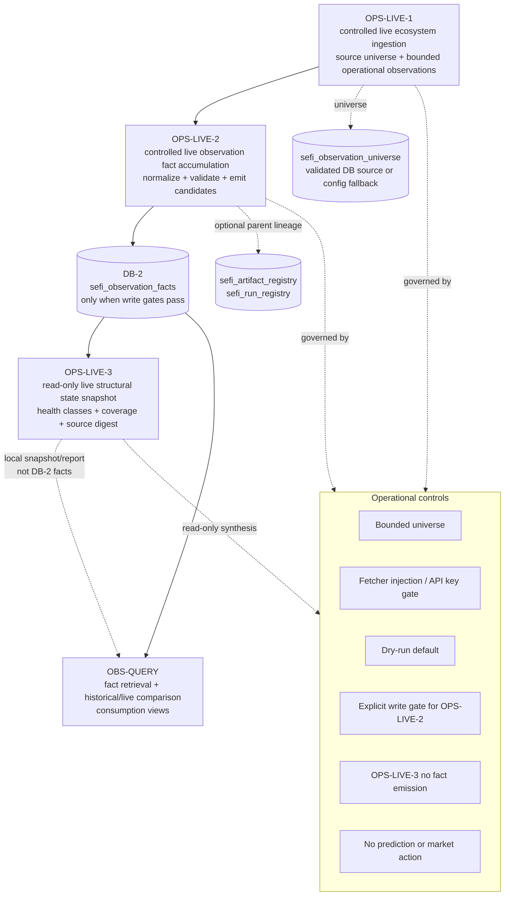

OPS-LIVE provides the live side of SEFI's architecture. It is divided into OPS-LIVE-1, OPS-LIVE-2, and OPS-LIVE-3. OPS-LIVE-1 performs controlled live ecosystem ingestion over a bounded source universe. OPS-LIVE-2 performs controlled live observation fact accumulation by normalizing bounded live observations, validating them, and emitting candidates to DB-2 only when gates pass. OPS-LIVE-3 reads accumulated facts and produces a live structural-state snapshot. The architecture correction is critical: OPS-LIVE-3 does not emit DB-2 facts and does not persist structural-state snapshots as DB-2 facts.

OPS-LIVE-1's architectural purpose is to obtain bounded operational observations from a controlled universe. Its source universe can be validated from `sefi_observation_universe` or use a configuration fallback where documented. Operational controls include universe bounds, fetcher injection, API-key gating, and no market-action behavior. The output of OPS-LIVE-1 is bounded observation material suitable for OPS-LIVE-2 normalization, not direct durable intelligence.

OPS-LIVE-2's purpose is fact accumulation. It normalizes live observations into DB-2 fact row shape, builds payload metadata, binds source phase and source run context, optionally emits parent artifact/run registry rows, and applies the DB-2 write gate. Dry-run is the safe default. Durable writes require explicit enablement, non-dry execution, a supplied database client, valid context, valid row fields, bounded payloads, and duplicate-prevention keys. This protects DB-2 from uncontrolled live writes.

OPS-LIVE-3's purpose is structural-state synthesis. It reads accumulated facts and produces a bounded local snapshot/report with health classes, coverage, and source digest information. The snapshot is useful for downstream context and consumption, but its persistence semantics are corrected: it is a local snapshot/report, not DB-2 fact emission. This distinction preserves DB-2 as an observation-fact store and avoids treating every structural summary as a persisted observation fact.

OPS-LIVE hands off to OBS-QUERY through DB-2 facts and controlled local structural context. Daily observation and queryable intelligence surfaces can use OPS-LIVE facts and snapshots, but only within retrieval and presentation boundaries. The live layer therefore supports timely structural characterization without becoming a prediction engine or a recommendation system.

**Table 11. OPS-LIVE controls.**

| Control | Applied layer | Governance effect |

| --- | --- | --- |

| Bounded universe | OPS-LIVE-1 | Constrains live ingestion scope. |

| Fetcher injection / API-key gate | OPS-LIVE-1 | Prevents uncontrolled provider interaction. |

| Dry-run default | OPS-LIVE-2 | Prevents accidental writes. |

| Explicit write gate | OPS-LIVE-2 | Requires enabled, non-dry execution and database client. |

| No fact emission | OPS-LIVE-3 | Keeps structural snapshots separate from DB-2 facts. |

| No prediction or market action | All OPS-LIVE layers | Preserves descriptive live intelligence boundary. |

### 10.1 Live accumulation responsibilities

OPS-LIVE-1 is responsible for controlling what enters the live path. The bounded universe, validated database source or configuration fallback, fetcher injection, and API-key gate are not incidental implementation details. They ensure that live ingestion remains scoped and reviewable. Without this layer, live data could widen unexpectedly and undermine deterministic behavior.

OPS-LIVE-2 is responsible for turning bounded live observations into governed fact candidates and, when gates pass, persisted DB-2 facts. This layer carries the strongest write responsibility in the live architecture. It must preserve observed-at context, source phase, source run, entity and metric fields, payload metadata, and parent lineage. It must also enforce dry-run default behavior and explicit write enablement. The live accumulation layer is therefore both a data transformation layer and a governance enforcement layer.

OPS-LIVE-3 is responsible for structural synthesis over accumulated facts. It can evaluate health classes, coverage, and source digest information and produce local snapshots or reports. The key architectural correction is that OPS-LIVE-3 does not write structural snapshots as DB-2 facts. This correction keeps the fact store focused on observation facts and keeps structural state as a read-only synthesis product.

The live-to-consumption handoff should be understood through two channels. First, live facts persisted by OPS-LIVE-2 can be retrieved through OBS-QUERY. Second, OPS-LIVE-3 snapshots can provide local structural context where documented. Neither channel authorizes live prediction or recommendation. A live observation may be recent, but recency does not convert description into forecast.

Operationally, OPS-LIVE is constrained by bounded payloads, source-universe control, dry-run behavior, explicit write gates, database-client presence, no provider calls in downstream retrieval, and no market-action outputs. These constraints allow live evidence to enter the architecture while preserving the same reviewability expected from historical evidence.

# 11. Structural State Modeling

Structural State Modeling describes how SEFI characterizes the observed condition of an ecosystem without claiming predictive or recommendation capability. Structural state is assembled from evidence-bearing historical and live context: persisted facts, local fact-like rows where documented, historical persistence and drift analyses, recurrence and stability classifications, morphology assessments, ecology synthesis, live health classes, coverage, and source digests.

Ecosystem state is the broader context in which individual observations, entities, sectors, groups, taxonomy classes, and signals appear. Structural state is the observed condition of that ecosystem expressed through the canonical dimensions of persistence, stability, recurrence, morphology, and ecology. Persistence asks whether a structure remains present across windows or observations. Stability asks whether the behavior remains consistent across comparable contexts. Recurrence asks whether a signal or structure appears repeatedly. Morphology describes the observed shape of the structure. Ecology describes the surrounding environment and relationships among the observed elements.

The architectural role of structural state is to make accumulated observations comparable. Without structural state, the system could retrieve individual facts but would struggle to explain why a group of facts represents a persistent, weakening, dominant, recurring, changed, or transitioned structure. With structural state, OBS-QUERY can support typed intelligence questions and Consumption Products can surface Daily Briefing, Story Evolution, Investigation Queue, Why Now, and Quality Gate views with evidence context.

The operational constraint is that structural state remains descriptive. It may characterize health, coverage, persistence, recurrence, stability, morphology, ecology, transitions, weakening, dominance, and change where those terms are supported by source-pack evidence. It must not become a forecast of future market behavior, a trading instruction, a portfolio recommendation, or an autonomous decision. Structural-state outputs must preserve supporting facts, Evidence References, artifacts, runs, and source phases where available.

**Table 12. Structural-state dimensions.**

| Dimension | Meaning in SEFI | Governance constraint |

| --- | --- | --- |

| Persistence | Continued presence of a structure across windows or observations. | Descriptive continuity only. |

| Stability | Consistency of structural behavior across windows or comparable contexts. | No extrapolation into forecasts. |

| Recurrence | Repeated appearance of a signal or structure. | No assertion of future recurrence unless documented evidence supports a bounded statement. |

| Morphology | Observed shape or form of market/ecology structure. | Must remain tied to observations and facts. |

| Ecology | Surrounding structural environment of entities, groups, sectors, taxonomy, and signals. | No unsupported causal or recommendation claims. |

### 11.1 Structural-state review considerations

A reviewer should evaluate structural-state outputs by asking which evidence dimensions are present and which are absent. If persistence is claimed, the supporting windows or repeated observations should be identifiable. If recurrence is claimed, the repeated structures should be traceable. If stability is claimed, the comparable contexts should be clear. If morphology is described, the shape or form of the structure should be tied to retained facts or historical artifacts. If ecology is described, the surrounding group, sector, taxonomy, or ecosystem context should be visible.

Structural state should not be evaluated as a predictive model because the source pack does not define it as one. Its purpose is characterization, not forecasting. This distinction affects language. “Persisted across the reviewed windows” is consistent with the architecture when supported by evidence. “Will persist” is not supported. “Dominant in the retrieved evidence set” may be supported. “Should be acted upon” is not supported.

Structural state also imposes dependency requirements on upstream layers. The observation layer must capture bounded signals. DB-2 must preserve facts and lineage. Historical layers must compute longitudinal context over completed artifacts. Live layers must accumulate facts and synthesize snapshots without writing structural facts. OBS-QUERY must retrieve and compare without inventing fields. Consumption Products must present structural state with Quality Gates and traceability.

The operational limitation is that structural state is only as complete as the retained evidence and exposed fields allow. Where the source pack identifies unsupported filters or missing field-level contracts, the whitepaper preserves that caveat. The architecture's answer to incomplete structural context is not speculation; it is explicit limitation language and bounded consumption behavior.

# 11A. Intelligence Lifecycle

**Figure 7. Intelligence lifecycle.** The dedicated lifecycle from observation to fact, accumulation, historical and live context, retrieval, and consumption products.

The SEFI intelligence lifecycle proceeds from Observation to Fact to Accumulation to Historical Intelligence to Live Intelligence to Retrieval to Consumption Products. The lifecycle is not a single irreversible queue; it is a governed set of states and handoffs. Historical layers may produce fact-like rows and candidates before DB-2 persistence. DB-2 may later supply persisted facts to historical retrieval and OBS-QUERY. Live layers may accumulate facts through OPS-LIVE-2 and synthesize read-only snapshots through OPS-LIVE-3. Consumption Products present what retrieval and historical artifacts already support.

Observation is the bounded source-signal state. Fact is the normalized row-shaped state with phase, entity, metric, window, payload, lineage, and duplicate-prevention context. Accumulation is the append-oriented persistence or candidate aggregation process that allows repeated observations to be reviewed without losing lineage. Historical Intelligence adds persistence, recurrence, stability, morphology, ecology, drift, taxonomy, Narrative Evolution, and ecosystem interpretation. Live Intelligence adds controlled ingestion, live accumulation, and read-only structural-state snapshotting. Retrieval exposes facts and comparisons through OBS-QUERY. Consumption Products translate retrieved evidence into analyst-facing presentations.

The lifecycle has several important state distinctions. A Local Artifact is a governed historical artifact or source-pack-documented input. A Local Fixture is a controlled validation or testing input, not production truth. A Fact-Like Row is a local row that resembles a fact but is not yet a persisted DB-2 fact. A DB-2 Fact Candidate is a validated row shape that may be emitted if gates pass. A Persisted DB-2 Fact is a durable row in `sefi_observation_facts`. A Presentation Item is a downstream analyst-facing representation and does not become a new fact.

**Table 13. Lifecycle states.**

| State | Description | May be source of OBS-QUERY fact retrieval? |

| --- | --- | --- |

| Observation | Bounded source signal from historical or live input. | No. |

| Fact-like row | Local row shaped like a fact in historical processing. | No, unless persisted or explicitly fixture-controlled. |

| DB-2 fact candidate | Validated row shape prepared for governed emission. | No, not until persisted. |

| Persisted DB-2 fact | Append-oriented row in `sefi_observation_facts`. | Yes. |

| Structural-state snapshot | Read-only local synthesis over facts/context. | No, not as a DB-2 fact. |

| Presentation item | Daily Briefing, Story Evolution, Investigation Queue, Why Now, or related view. | No, it is presentation-only. |

The common lineage contract is also essential. Facts and derived views retain source phase identity, artifact and run references where available, entity and metric identity, observation windows, bounded payload fields, Evidence Reference identifiers, and duplicate-prevention keys. This lineage is not an optional metadata convenience; it is the mechanism that makes downstream review, comparison, audit, and analyst drill-down possible without changing the meaning of the original observation.

### 11A.1 Lifecycle governance implications

Each lifecycle transition carries a governance implication. Observation to Fact requires normalization and validation. Fact to Accumulation requires explicit emission context and duplicate-prevention identity. Accumulation to Historical Intelligence requires preservation of windows, artifacts, runs, and structural dimensions. Accumulation to Live Intelligence requires source-universe control, live metadata, and write gates. Historical and Live Intelligence to Retrieval requires canonical fact and Evidence Reference envelopes. Retrieval to Consumption Products requires presentation-only formatting and Quality Gates.

The lifecycle also makes clear why presentation items cannot become facts by display. A Daily Briefing item may summarize facts, but it has not passed through observation capture, fact row construction, emission gates, duplicate-key validation, and DB-2 persistence. Treating it as a fact would reverse the architecture. The same is true for Story Evolution and Investigation Queue entries. They are useful because they expose evidence relationships, not because they create new evidence.

The lifecycle supports audit because it creates checkpoints. Reviewers can ask whether an item is an observation, a fact-like row, a candidate, a persisted fact, a structural snapshot, a retrieval result, or a presentation item. Each answer carries different permissions and constraints. This state clarity is especially important when historical and DB-2 directionality is non-linear: a historical component may contribute candidates and later consume persisted facts, but the lifecycle state still determines what the object is allowed to mean.

The lifecycle also supports future evolution. Additional retrieval, longitudinal analysis, or graph analytics can be introduced only if they respect state transitions and boundaries. A graph over facts and Evidence References, for example, would remain compatible if it operates over governed relationships and does not grant presentation items source-of-truth status or turn structural descriptions into predictions.

# 12. OBS-QUERY Architecture

OBS-QUERY is the retrieval-only architecture for SEFI facts and controlled fixtures. It reads persisted DB-2 facts, canonicalizes fact and Evidence Reference envelopes, supports typed intelligence questions, compares historical and live contexts where supported, generates bounded consumption views, and emits validation scorecards. It does not create facts, write to databases, migrate schemas, call providers, predict, recommend, or issue market-action language.

OBS-QUERY is the architectural answer to a specific problem: once SEFI has accumulated facts and historical context, analysts need to ask bounded questions without weakening governance. A query layer that could synthesize unsupported answers would undermine the fact-native design. A query layer that can only retrieve and compare documented evidence preserves source-of-truth scope.

**Figure 8. OBS-QUERY architecture.** OBS-QUERY reads DB-2 and controlled fixtures, returns facts and Evidence References, performs comparison and validation, and feeds consumption views.

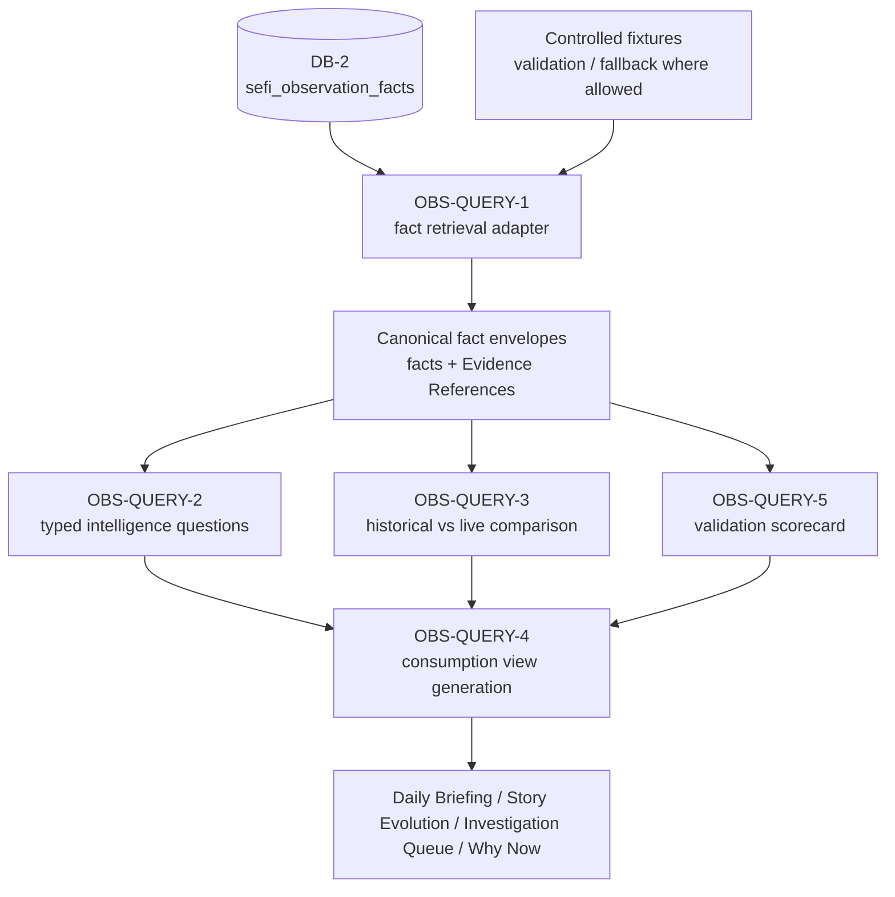

### 12.1 Retrieval Architecture Rationale

OBS-QUERY exists because retrieval must be a governed architecture, not an ad hoc convenience. Persisted facts are only useful if a downstream layer can access them in a canonical way. OBS-QUERY-1 retrieves selected DB-2 columns, applies supported filters, reports unsupported filters, and returns canonical fact and Evidence Reference envelopes. This makes retrieval inspectable.

The retrieval architecture protects source-of-truth scope. `sefi_observation_facts` is authoritative for OBS-QUERY fact retrieval, while controlled fixtures may be used only where documented. OBS-QUERY does not broaden this authority to local artifacts, reports, or presentation cards. It also does not transform a missing or unsupported filter into a generated substitute.

Retrieval is also necessary for consistency across consumption products. Daily Briefing, Story Evolution, Investigation Queue, Why Now, and Quality Gate views can consume the same bounded envelopes rather than each product inventing its own access pattern. This reduces inconsistency and supports governance certification.

### 12.2 Typed Intelligence Question Rationale

OBS-QUERY typed intelligence questions exist because analysts do not only ask for rows; they ask what the retained evidence shows. The supported concepts—persisted, changed, recurred, dominant, weakened, transitioned—are retrieval concepts, not generative claims. Each concept organizes existing facts and context into a bounded answer.

Persisted exists as a retrieval concept because analysts need to know whether a structure remained present across windows or runs. The answer must be backed by retrieved evidence and lineage. It cannot become a forecast that the structure will persist in the future.

Changed exists because analysts need to identify differences across historical or live evidence. Change is a comparison over retained observations. It should expose the relevant windows, facts, and Evidence References rather than presenting unsupported explanation.

Recurred exists because patterns can reappear after absence or weakening. Recurrence requires the query layer to retrieve comparable evidence and distinguish repeated occurrence from duplicate ingestion. It is therefore a retrieval concept over accumulated facts.

Dominant exists because analysts may need to know whether a structure is prominent within the retrieved evidence set. Dominance is bounded by the retrieved universe and supported filters. It is not a claim of market inevitability or investment priority.

Weakened exists because retained evidence may show reduced strength, presence, or structural coherence. Weakening is a descriptive comparison. It must not be converted into a sell signal, risk forecast, or recommendation.

Transitioned exists because historical and live evidence may show movement between structural states or narrative conditions. Transition is a retrieval-backed state comparison, not a future scenario. It must preserve lineage to the facts and windows that support the transition description.

### 12.3 Historical vs Live Comparison Rationale

Historical vs live comparison exists because SEFI contains both accumulated historical context and controlled live observation context. Analysts need to know whether live structures align with, diverge from, recur from, or transition relative to historical evidence. OBS-QUERY provides the governed comparison boundary.

The comparison must respect lifecycle states. Historical local artifacts, local fixtures, fact-like rows, DB-2 fact candidates, persisted DB-2 facts, and presentation items are not interchangeable. A historical artifact can provide documented context; a persisted DB-2 fact can provide retrieval source-of-truth evidence; a presentation item can display a comparison but cannot become the comparison's source of truth.

The comparison must also respect OPS-LIVE-3 semantics. Live structural-state snapshotting is read-only and does not emit DB-2 facts. Therefore, live comparison can use accumulated live facts and snapshots as documented context, but it must not imply that OPS-LIVE-3 writes persisted facts.

### 12.4 Validation Scorecard Rationale

OBS-QUERY-5 validation scorecards exist because retrieval needs an explicit quality posture. A query answer is not complete merely because rows were returned. Reviewers need to know whether filters were supported, evidence was sufficient, source-of-truth scope was respected, disabled actions remained disabled, and output was safe for consumption.

Validation scorecards increase reviewer confidence by making limitations visible. They can identify unsupported filters, insufficient data, fixture usage, source-of-truth declarations, and disabled-action guarantees. This prevents a downstream presentation from overstating what retrieval actually proved.

The scorecard is separate from runtime query flow. It validates and certifies retrieval posture; it does not create facts or authorize presentation beyond the retrieved evidence. This distinction preserves the boundary between validation and intelligence generation.

### 12.5 Retrieval-Only Governance Benefits

Retrieval-only governance provides auditability. Because OBS-QUERY reads existing facts and controlled fixtures, a reviewer can inspect the source rows, Evidence References, filters, and comparison logic. There is no hidden provider call or write path that can change the evidence during query time.

Retrieval-only governance provides traceability. Canonical envelopes preserve fact IDs, Evidence References, source phases, artifact lineage, run lineage, windows, taxonomy or source-layer context where supported, and payload support. This allows analyst-facing views to retain drill-down.

Retrieval-only governance improves reviewer confidence. Unsupported filters are reported as unsupported rather than silently ignored or fabricated. Missing data produces bounded insufficient states rather than synthetic completion. Disabled actions are explicit: no provider calls, no writes, no schema migrations, no fact creation, no prediction, no recommendation, and no market action.

Retrieval-only governance also bounds behavior. The query layer can retrieve, compare, validate, and format. It cannot become a new intelligence production layer. This makes OBS-QUERY a dependable bridge between DB-2 and Consumption Products.

### 12.6 Supported, Unsupported, and Insufficient Retrieval States

OBS-QUERY must distinguish supported, unsupported, and insufficient retrieval states. A supported state occurs when the requested question can be answered using available facts, permitted filters, and documented comparison logic. An unsupported state occurs when the requested filter or field is outside the retrieval contract. An insufficient state occurs when the concept is supported but the available evidence is too sparse or incomplete for a confident bounded answer.

This distinction is essential for governance. Unsupported and insufficient states are not defects to be hidden; they are part of the architecture's honesty. A system that fabricates an answer for an unsupported filter would weaken auditability. A system that presents sparse evidence as strong would weaken reviewer confidence. OBS-QUERY therefore treats limitations as explicit output states.

The distinction also helps consumption products. A Daily Briefing item may be excluded or caveated if evidence is insufficient. A Story Evolution card may show that a transition is unsupported by available facts. A Quality Gate may report that a view is not consumption-ready. These bounded outcomes preserve trust even when the answer is incomplete.

### 12.7 OBS-QUERY and Evidence Reference Envelopes

OBS-QUERY canonical envelopes are the mechanism by which retrieval preserves explainability. A fact envelope should carry fact identity, source phase, entity and metric fields, window context, payload support, and lineage where available. An Evidence Reference envelope should carry identifiers that allow downstream drill-down into supporting evidence context without implying a separate universal evidence table.

These envelopes make query outputs portable across consumption products. The same retrieved evidence can support a Daily Briefing item, a Story Evolution view, an Investigation Queue entry, and a validation scorecard. Each product may present the evidence differently, but the underlying references should remain traceable.

Evidence Reference envelopes also reduce narrative risk. If a generated-looking sentence appears in a presentation product, reviewers can ask which envelope supports it. If there is no supporting envelope or documented artifact, the claim should be treated as unsupported. This makes the retrieval layer a check on presentation language.

### 12.8 OBS-QUERY and Consumption View Generation

OBS-QUERY-4 generates bounded consumption views from retrieved evidence. This is not the same as creating new intelligence. View generation selects, groups, orders, caveats, and formats facts and comparison results so that consumption products can display them. The authority remains with the retrieved evidence and documented historical context.

This boundary is important because consumption products are often the most visible part of the system. A concise card can appear more authoritative than the facts behind it. OBS-QUERY prevents that by preserving source-of-truth declarations, Evidence References, validation posture, and disabled-action guarantees in the view-generation path.

View generation also supports consistency. If each consumption product retrieved and interpreted facts independently, the system could produce inconsistent story views, briefing items, and validation summaries. OBS-QUERY centralizes retrieval and comparison so presentation layers can focus on readability and governance display.

### 12.9 OBS-QUERY Failure Modes Avoided

OBS-QUERY avoids query-time data mutation. It does not write rows, migrate schemas, create facts, or repair missing upstream data. This prevents the retrieval layer from becoming an undocumented production layer.

OBS-QUERY avoids provider-call leakage. Retrieval should operate over DB-2 and controlled fixtures where allowed, not over live external provider calls. This keeps retrieved answers reproducible and auditable.

OBS-QUERY avoids unsupported synthesis. If a typed question cannot be answered from retrieved evidence, the correct response is unsupported or insufficient, not a fabricated answer. This protects the fact-native design.

OBS-QUERY avoids recommendation drift. Typed concepts such as dominant, weakened, and transitioned can be useful for review, but they must not become instructions. The query layer can describe retrieved evidence; it cannot recommend action.

OBS-QUERY avoids presentation authority inflation. It may generate consumption views, but those views remain presentation-only. A view can display a fact; it cannot become the fact.

### 12.10 Query responsibilities by component

OBS-QUERY-1 is responsible for retrieving facts and Evidence References from DB-2 or controlled fixtures. OBS-QUERY-2 is responsible for typed intelligence questions over retrieved evidence. OBS-QUERY-3 is responsible for historical/live comparison. OBS-QUERY-4 is responsible for bounded consumption view generation. OBS-QUERY-5 is responsible for validation scorecards and governance certification.

**Table 14. OBS-QUERY responsibilities.**

| Component | Responsibility | Prohibited behavior |
| --- | --- | --- |
| OBS-QUERY-1 | Retrieve and canonicalize facts and Evidence References. | Provider calls, writes, unsupported synthesis. |
| OBS-QUERY-2 | Answer typed intelligence questions over retrieved evidence. | Prediction, recommendation, fact creation. |
| OBS-QUERY-3 | Compare historical and live contexts where supported. | Treating local artifacts, candidates, and persisted facts as identical. |
| OBS-QUERY-4 | Generate bounded consumption views. | Presentation becoming source of truth. |
| OBS-QUERY-5 | Emit validation scorecards and governance certifications. | Runtime fact creation or schema change. |

### 12.11 OBS-QUERY and Analyst Question Discipline

Typed intelligence questions give analysts a disciplined vocabulary. Instead of asking for an unconstrained narrative, an analyst can ask whether retrieved evidence shows persistence, change, recurrence, dominance, weakening, or transition. Each question has an architectural meaning and a governance boundary. The query layer is allowed to retrieve and compare evidence for the concept; it is not allowed to turn the concept into a forecast or recommendation.

This discipline improves consistency across products. A persistence question used in a Story Evolution view should mean the same kind of evidence-backed condition as a persistence question used in a Daily Briefing or Quality Gate context. The presentation may differ, but the retrieval concept remains stable. That stability helps reviewers compare outputs across consumption surfaces.

Question discipline also reduces ambiguity when evidence is incomplete. If a persistence question lacks sufficient historical windows, the answer can be insufficient rather than speculative. If a dominance question lacks the required grouping context, the answer can be unsupported. If a transition question cannot identify comparable states, the answer can be caveated. The architecture thereby makes uncertainty explicit.

### 12.12 OBS-QUERY and Source-of-Truth Respect

OBS-QUERY respects source-of-truth boundaries by treating persisted DB-2 facts as the authoritative source for fact retrieval. It can use controlled fixtures where documented, but it must not treat fixtures, local artifacts, reports, or presentation items as interchangeable with persisted facts. This respect for authority is what allows query-derived consumption products to remain credible.

Source-of-truth respect also means preserving identifiers rather than hiding them. A query result should carry fact identity, Evidence Reference identity, source phase, and lineage where available. These fields may not all be shown prominently in a human-facing card, but they should remain available for drill-down and validation. A readable view should not require sacrificing auditability.

Finally, source-of-truth respect means accepting limitations. If the persisted fact model does not expose a requested field, OBS-QUERY should not pretend otherwise. It should report unsupported filters or insufficient evidence. This behavior is central to the retrieval-only design.

### 12.13 OBS-QUERY and Caveat Propagation

OBS-QUERY must propagate caveats rather than bury them. Unsupported filters, insufficient evidence, fixture usage, source-of-truth scope, and disabled-action guarantees should remain visible to downstream consumption products. A presentation view may simplify wording for readability, but it should not remove the limitations that determine how the result can be interpreted.

Caveat propagation is part of retrieval-only governance. It ensures that a bounded answer remains bounded after formatting. It also protects analysts from treating a query result as stronger than the retrieved evidence allows. When caveats travel with the result, Daily Briefing, Story Evolution, Investigation Queue, Why Now, and Quality Gate surfaces can preserve confidence distinctions without adding unsupported synthesis.

This caveat discipline also keeps OBS-QUERY aligned with DB-2. If DB-2 lacks a persisted fact or a supported field, the query layer cannot repair that absence through language. It can only report the limitation, retrieve the supported evidence, and pass the resulting posture forward for presentation review.

The same rule applies to consumption products: concise language is acceptable only when the supporting retrieval posture remains intact. Readability must not erase source scope, evidence sufficiency, governance caveats, lifecycle state, lineage, or validation posture, reviewer confidence, and audit continuity.

# 13. Consumption Products

**Figure 9. Consumption architecture.** The consumption layer adapts OBS-QUERY and historical intelligence outputs into presentation-only analyst views.

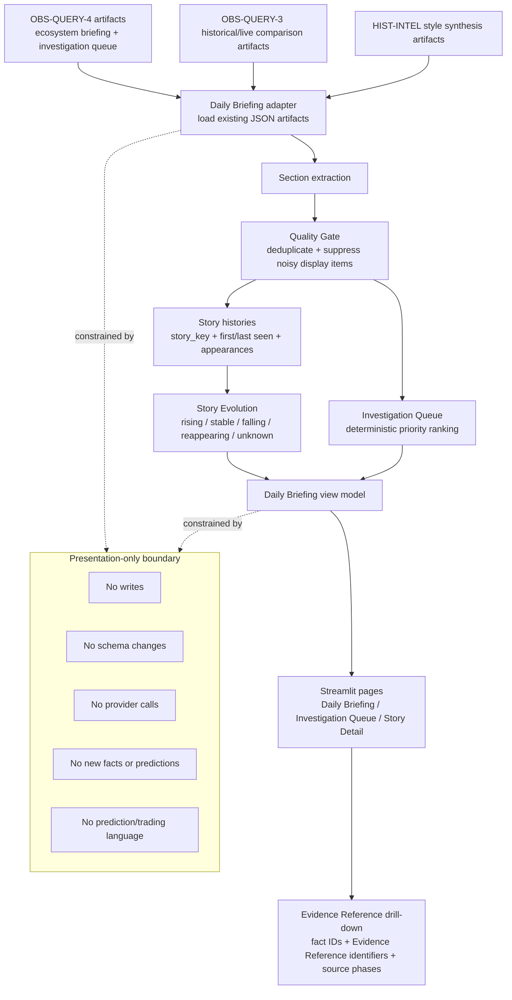

Consumption Products are presentation-only analyst surfaces that adapt existing OBS-QUERY and historical-intelligence artifacts. The source pack identifies Daily Briefing, Story Evolution, Investigation Queue, Why Now, and Quality Gate components. Related consumption views can include Story Detail where supported by the source-pack architecture. These products exist to make retrieved evidence consumable by analysts without creating new facts or unsupported generated intelligence.

Daily Briefing presents bounded evidence-backed summaries from retrieved facts and structural context. Story Evolution presents how an evidence-backed story or narrative structure changes over time, using retained historical context and Evidence Reference identifiers rather than predictions. Investigation Queue surfaces investigation candidates for analyst review. Why Now explains the evidence-backed reason an item is surfaced at the current consumption point. Quality Gates constrain what enters the presentation layer and document unsupported, insufficient, or invalid states.

The generation path for these products is retrieval-centered. OBS-QUERY retrieves and groups facts, compares historical and live context, and generates consumption view structures. Consumption Products format those structures for analyst use. Historical-intelligence artifacts may also be used where documented, especially for narrative evolution and ecosystem synthesis. The key boundary is that formatting and presentation do not alter source-of-truth status: a card, briefing item, queue item, story view, or Why Now explanation is a presentation item, not a DB-2 fact.

Evidence relationships remain visible. Consumption Products should expose supporting fact IDs, Evidence Reference identifiers, source phases, artifact IDs, run IDs, and validation or Quality Gate status where available. This supports analyst review and auditability. If the supporting evidence is insufficient or a filter is unsupported, the consumption layer must make that limitation visible instead of filling the gap with synthetic claims.

**Table 15. Consumption products and boundaries.**

| Product | Purpose | Boundary |

| --- | --- | --- |

| Daily Briefing | Present bounded evidence-backed daily analyst summary. | Presentation-only; no new facts or recommendations. |

| Story Evolution | Show evidence-backed changes in story/narrative structure over time. | No forecast or unsupported causal narrative. |

| Investigation Queue | Surface investigation candidates for analyst review. | Candidate for review, not an instruction or decision. |

| Why Now | Explain why existing evidence caused an item to surface. | Evidence relationship only; no prediction. |

| Quality Gates | Filter and validate presentation eligibility. | Unsupported or insufficient data remains explicit. |

### 13.1 Consumption review considerations

Consumption Products should be reviewed as interfaces, not as intelligence authorities. Their function is to make retrieved evidence usable by analysts. The Daily Briefing should make evidence concise without losing traceability. Story Evolution should show changes in story structure without converting the change into a forecast. Investigation Queue should identify candidates for human review without becoming a recommendation. Why Now should explain evidence-backed surfacing logic without implying future outcomes. Quality Gates should make eligibility, insufficiency, and unsupported states explicit.

The upstream dependencies for consumption are therefore strict. Consumption depends on OBS-QUERY retrieval and comparison outputs, historical intelligence artifacts where documented, live structural snapshots where documented, fact IDs, Evidence Reference identifiers, artifact and run lineage, and Quality Gate status. It does not depend on provider calls, generated external knowledge, schema modifications, or market-action engines.

The downstream dependency is analyst interpretation. The architecture supports analyst review by providing presentation surfaces, but it does not automate the analyst's decision. This is a critical distinction for hiring managers, supervisors, and technical reviewers: the system can organize evidence professionally while preserving a human review boundary. It does not claim to decide what the analyst should do.

Operationally, consumption products need clear caveats where evidence is insufficient. A sparse evidence set should produce an insufficient-data state. An unsupported filter should be reported. A missing Evidence Reference should limit the confidence of presentation. A Quality Gate failure should suppress or qualify a view. These behaviors are not failures of the consumption layer; they are correct expressions of governance.

# 14. Governance Framework

SEFI governance is embedded in architecture. It is not a final review step applied after arbitrary generation. The source pack supports deterministic guarantees, evidence traceability, retrieval-only guarantees, auditability, explainability, no-prediction guarantees, and no-recommendation guarantees. These guarantees are distributed across fact emission, live ingestion, historical processing, DB-2 persistence, OBS-QUERY retrieval, validation, and consumption presentation.

Governance is embedded because each layer has different authority. Observation layers can capture bounded signals. Emission paths can create fact candidates and, under write gates, persisted facts. DB-2 can store and serve facts. OBS-QUERY can retrieve and compare facts. Consumption Products can present retrieved intelligence. No single downstream layer is allowed to override these authority boundaries.

**Figure 9. Governance boundary map.** Governance controls prohibit writes, provider calls, migrations, fact creation, prediction, recommendation, and market action outside authorized boundaries.

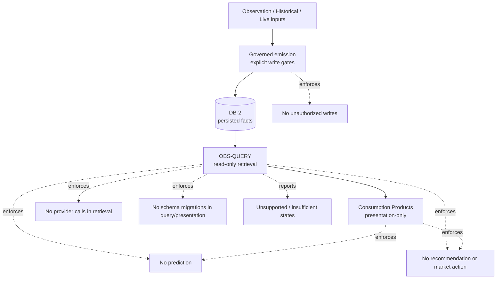

### 14.1 Why governance is embedded in architecture

Governance is embedded because SEFI's main risks arise at layer boundaries. An observation can be mistaken for a fact. A local artifact can be mistaken for a source-of-truth row. A query can be tempted to create missing intelligence. A presentation item can be mistaken for a recommendation. Embedding governance into boundaries prevents these category errors.

Embedded governance also supports auditability. Reviewers can inspect explicit gates, disabled actions, source-of-truth declarations, Evidence References, validation scorecards, and Quality Gates. If governance existed only as a policy document, reviewers would need to trust that each layer remembered the policy. In SEFI, the architecture itself assigns responsibilities and prohibitions.

Governance is therefore not external to intelligence quality. It is part of quality. A fact with weak lineage is less useful. A retrieved answer that hides unsupported filters is less trustworthy. A presentation item that omits caveats is less reviewable. Governance improves the architecture by making outputs bounded, traceable, and inspectable.

### 14.2 Why controls are enforced at layer boundaries

Controls are enforced at layer boundaries because that is where authority changes. Observation capture has different authority from fact persistence. Fact persistence has different authority from retrieval. Retrieval has different authority from presentation. A boundary control makes the transition explicit.

The emission boundary controls writes. DB-2 writes require explicit enablement, non-dry execution, valid context, bounded payloads, duplicate-prevention keys, valid row fields, and a supplied database client. OPS-LIVE-2 inherits this posture. This prevents invalid or unauthorized observations from becoming durable facts.

The DB-2 boundary controls source-of-truth scope. Persisted rows in `sefi_observation_facts` are authoritative for OBS-QUERY fact retrieval. Local artifacts, fixtures, candidates, reports, and presentation items are not automatically promoted to that status. This prevents source-of-truth language from becoming overly broad.

The OBS-QUERY boundary controls retrieval. It reads, filters, canonicalizes, compares, validates, and reports unsupported states. It does not write, migrate schemas, call providers, create facts, predict, recommend, or issue market actions. This keeps the read side from becoming an ungoverned production side.

The consumption boundary controls presentation. Consumption Products can make intelligence readable through Daily Briefing, Story Evolution, Investigation Queue, Story Detail, Why Now, and Quality Gate surfaces. They cannot add unsupported synthetic fields, create facts, or convert review prompts into recommendations.

### 14.3 Architectural rationale for no prediction

The no-prediction control exists because SEFI is a descriptive evidence architecture. Historical Intelligence can describe persistence, recurrence, stability, morphology, ecology, drift, Narrative Evolution, and ecosystem synthesis. OPS-LIVE can describe bounded live observations and read-only structural-state snapshots. OBS-QUERY can compare retrieved historical and live evidence. None of these responsibilities require forecasting.

Prediction would change the authority of the system. It would require assumptions about future states that are not provided by persisted facts alone. The source pack does not authorize that capability. Therefore, no-prediction language is not a policy add-on; it is an architectural boundary that preserves the meaning of evidence-backed review.

This control also protects analyst interpretation. A statement that a structure persisted historically is different from a statement that it will persist. A statement that a live snapshot diverges from historical context is different from a forecast. SEFI preserves these distinctions by prohibiting future-looking claims.

### 14.4 Architectural rationale for no recommendation

The no-recommendation control exists because SEFI's consumption products are review aids, not decision engines. Investigation candidates, Why Now explanations, and Story Evolution items can identify evidence-backed structures for analyst attention. They cannot instruct an analyst to buy, sell, hold, allocate, de-risk, or prioritize capital.

Recommendation would convert structural review into action guidance. The source pack does not authorize that conversion. The architecture therefore blocks recommendation and market-action language in query and presentation layers. This is especially important because presentation surfaces are concise and could otherwise be mistaken for instructions.

No-recommendation governance does not make the system less useful. It clarifies use. SEFI can surface evidence, lineage, validation posture, and structural context so that analysts can review them. It does not substitute for human judgment or external decision processes.

### 14.5 Architectural rationale for retrieval-only

Retrieval-only governance exists because the query layer must not become a hidden producer. OBS-QUERY has access to facts and can present them in useful forms. If it were allowed to create facts or synthesize unsupported intelligence, it would undermine DB-2 source-of-truth scope and make audits harder.

Retrieval-only behavior also preserves traceability. Every query answer should be grounded in retrieved facts, Evidence References, controlled fixtures where allowed, and documented comparison logic. Unsupported filters, insufficient evidence, or missing data must remain visible.

This boundary supports reviewer confidence. A reviewer can inspect what was retrieved and how it was presented. The reviewer does not need to search for hidden provider calls, query-time writes, schema changes, or generated facts.

### 14.6 Architectural rationale for presentation-only

Presentation-only governance exists because consumption products need to improve readability without adding authority. Daily Briefing, Story Evolution, Investigation Queue, Story Detail, Why Now, and Quality Gate outputs are valuable because they make retrieved intelligence usable. Their role is to format, select, caveat, and display evidence-backed information.

A presentation item cannot become a persisted fact. It cannot override DB-2. It cannot replace Evidence References. It cannot transform a validation caveat into confidence. It cannot convert an investigation candidate into a recommendation. These prohibitions keep analyst-facing products aligned with their architectural role.

Presentation-only governance also reduces ambiguity for reviewers. If a claim appears in a consumption product, the reviewer should be able to ask which facts, Evidence References, artifacts, runs, and validation states support it. If that support is absent, the claim should be treated as unsupported rather than as an autonomous product conclusion.

### 14.7 Governance ownership by boundary

Fact emission governance is owned by the components that construct and emit rows. Retrieval governance is owned by OBS-QUERY. Presentation governance is owned by Consumption Products and Quality Gates. Cross-cutting governance is expressed through deterministic design, traceability, no-prediction language, no-recommendation language, disabled provider calls, disabled writes, disabled migrations, and unsupported/insufficient states.

**Table 16. Governance guarantee matrix.**

| Guarantee | Mechanism | Affected layers |
| --- | --- | --- |
| Determinism | Payload bounds, sorting/ranking, duplicate keys, dry-run default, fixture validation, Quality Gates. | DB-2, OPS-LIVE, OBS-QUERY, Consumption. |
| Evidence traceability | Fact IDs, Evidence References, artifacts, runs, phases, entity/metric/window fields. | All layers after observation normalization. |
| Retrieval-only query | Read-only retrieval, unsupported-filter reporting, no fact creation. | OBS-QUERY and consumption view generation. |
| Auditability | Canonical envelopes, validation scorecards, governance certification fields. | DB-2, OBS-QUERY-5, Consumption. |
| No prediction | Boundary language and disabled actions. | Historical, live, query, consumption. |
| No recommendation | No market-action or portfolio instruction surfaces. | Query and presentation layers. |

### 14.8 Governance Certification Field Rationale

Governance certification fields exist to make disabled actions and source-of-truth declarations visible. The architecture audit notes that field-level variation may remain phase-specific, but the shared guarantee families are stable: source-of-truth declaration, disabled provider calls, disabled writes, disabled migrations, disabled fact creation, no prediction, no recommendation, no market action, traceability, unsupported states, and insufficient states.

These field families matter because governance must be machine-reviewable and human-reviewable. A reviewer should not need to infer from prose whether a query called a provider or whether a presentation item is a recommendation. Certification fields and scorecards make the posture explicit.

The rationale is not to add bureaucracy. The rationale is to preserve trust as outputs move farther from the original facts. A persisted row may be easy to inspect. A multi-card analyst briefing is harder to inspect unless it carries evidence references, validation posture, and disabled-action guarantees. Certification fields allow the architecture to preserve accountability at the point of consumption.

### 14.9 Governance and Lifecycle-State Separation

Governance depends on lifecycle-state separation. Local Artifact, Local Fixture, Fact-Like Row, DB-2 Fact Candidate, Persisted DB-2 Fact, Query Result, and Presentation Item each have different authority. If those states are merged, governance becomes ambiguous.

A Local Artifact can support historical processing. A Local Fixture can support validation or fallback where documented. A Fact-Like Row can support local historical reasoning. A DB-2 Fact Candidate can be eligible for persistence. A Persisted DB-2 Fact can serve as source-of-truth evidence for OBS-QUERY retrieval. A Query Result can organize retrieved evidence. A Presentation Item can display it. None of these transitions should be implicit.

Lifecycle-state separation also prevents privilege escalation. A presentation item should not gain fact authority because it is visible. A candidate should not gain persisted authority because it has the right shape. A fixture should not become production truth because it is convenient. Each state must cross the appropriate boundary before gaining new authority.

### 14.10 Governance and Professional Reviewability

Professional reviewability requires that the architecture be explainable to reviewers with different concerns. A data reviewer may focus on row shape, payload bounds, and duplicate keys. An architecture reviewer may focus on producer/consumer directionality and boundary enforcement. A governance reviewer may focus on disabled actions and no-prediction language. An analyst supervisor may focus on whether presentation products are caveated and traceable.

SEFI's governance framework supports all of these review paths by preserving evidence and constraining authority. The same lineage fields that support analyst drill-down also support audit. The same retrieval-only boundary that prevents unsupported synthesis also supports source-of-truth clarity. The same presentation-only boundary that prevents recommendations also improves reader trust.

Professional reviewability also requires that limitations be explicit. Unsupported filters, insufficient evidence, dry-run emissions, read-only snapshots, and scoped source-of-truth declarations are not embarrassing exceptions. They are signs that the architecture is behaving within its authority. A governed system should prefer a caveated answer over an unsupported confident one.

### 14.11 Governance Failure Modes Avoided

The governance framework avoids observation-to-fact leakage by requiring explicit emission gates before persistence. It avoids fact-to-query leakage by making OBS-QUERY read-only. It avoids query-to-presentation leakage by keeping consumption products presentation-only. It avoids historical-to-forecast leakage by defining persistence, recurrence, stability, morphology, and transition as evidence descriptions rather than predictions.

It also avoids recommendation drift. Investigation candidates and Why Now explanations can invite analyst review, but they cannot instruct action. This distinction is critical because analyst-facing views are often written in concise language. Governance ensures that concision does not become prescription.

Finally, the framework avoids source-of-truth confusion. DB-2 is authoritative for OBS-QUERY fact retrieval. Historical artifacts, fixtures, candidates, and presentation outputs retain their documented roles. This prevents convenience objects from becoming unofficial truth sources.

This ownership model is useful for architecture review because it identifies where to look when a boundary is questioned. If the issue is an invalid fact row, review the emission boundary. If the issue is an unsupported filter, review OBS-QUERY. If the issue is an unsupported presentation claim, review Consumption Products and Quality Gates. If the issue is a future-looking statement, review governance language across all layers.

### 14.12 Governance and Language Control

Governance in SEFI includes control of architectural language. Words such as persists, recurs, weakens, dominates, and transitions are allowed only as evidence-backed descriptions of retrieved or accumulated structure. They should not be written as predictions about future behavior. Words that imply action, such as buy, sell, hold, allocate, de-risk, or trade, are outside the architecture's consumption boundary.

Language control matters because downstream products are read by humans. A technically bounded query result can become misleading if the presentation language implies more authority than the evidence supports. Governance therefore requires both data controls and writing controls. The same Evidence References that support drill-down also discipline the prose.

This is why Draft 2 uses architecture rationale rather than policy rhetoric. The issue is not merely that recommendations are disallowed. The issue is that recommendations would require an authority transfer from evidence review to action guidance, and that transfer is not part of SEFI. The architecture is designed to support review, not autonomous decision-making.

### 14.13 Governance and Audit Trail Continuity

Audit trail continuity requires that each layer preserve enough context for the next layer to remain reviewable. Emission preserves phase, artifact, run, entity, metric, window, payload, and duplicate-prevention identity. DB-2 preserves persisted facts. OBS-QUERY preserves fact and Evidence Reference envelopes. Consumption Products preserve drill-down and validation posture, reviewer confidence, and audit continuity.

Continuity can fail if any layer drops context or changes authority. A query that removes lineage makes presentation harder to audit. A presentation card that omits caveats can overstate evidence. A fact row without source phase weakens historical/live comparison. The governance framework therefore treats traceability as an end-to-end property.

Audit trail continuity also supports professional review cycles. Architecture reviewers can focus on whether boundaries are correctly described. Data reviewers can focus on whether facts are valid. Governance reviewers can focus on whether disabled actions remain disabled. Analyst reviewers can focus on whether outputs are readable and caveated. The same traceability chain supports all of these roles.

# 15. Data Model

**Figure 11. Data model relationships.** Conceptual relationships among observation facts, artifact and run registries, historical tables, live universe, retrieval, and consumption.

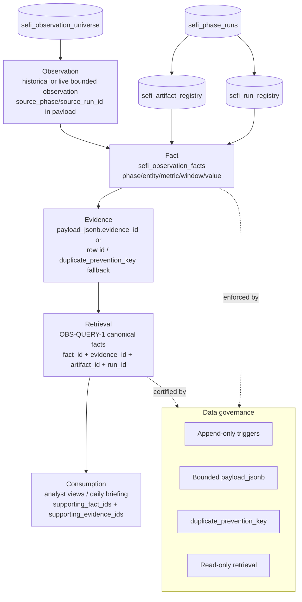

The SEFI data model centers on observation facts and lineage. The major table for DB-2 retrieval is `sefi_observation_facts`. This table represents persisted observation facts with source phase identity, entity identity, metric identity, observation window, metric value, bounded payload, artifact and run lineage, Evidence Reference-related identifiers where exposed, and duplicate-prevention identity. It is the source of truth for OBS-QUERY fact retrieval.

Parent lineage is represented through `sefi_artifact_registry`, `sefi_run_registry`, and `sefi_phase_runs` where documented. These registries provide artifact and run context for fact rows and emission paths. Historical data-model elements include `sefi_hist_observations`, `sefi_window_metrics`, `sefi_sector_morphology`, and `sefi_symbol_metrics`, which support historical observation, window, morphology, and symbol-level concepts. Live universe control is represented through `sefi_observation_universe`, which can provide validated source-universe control for OPS-LIVE-1 with documented configuration fallback.

The fact relationship model is straightforward: observations are normalized into fact candidates; candidates that pass gates become persisted DB-2 facts; facts can be retrieved by OBS-QUERY; retrieved facts can be grouped, compared, validated, and presented. Accumulation relationships are append-oriented and duplicate-aware. Retrieval relationships are read-only and bounded by supported filters, canonical fact envelopes, Evidence Reference envelopes, and governance certifications.

Lifecycle state definitions are essential to the data model. Local artifacts and local fixtures are not equivalent to persisted facts. Fact-like rows and DB-2 fact candidates are not equivalent to persisted DB-2 facts. Structural-state snapshots are not DB-2 facts unless the source pack explicitly documents such persistence, and the architecture correction for OPS-LIVE-3 says they are local snapshots/reports, not fact emission. Presentation items are downstream views and never become source-of-truth facts by virtue of being displayed.

**Table 17. Major entities and roles.**

| Entity/table | Role | Source-of-truth status |

| --- | --- | --- |

| `sefi_observation_facts` | Append-oriented persisted observation facts for DB-2. | Source of truth for OBS-QUERY fact retrieval. |

| `sefi_artifact_registry` | Artifact lineage for governed emission paths. | Lineage support, not a replacement for DB-2 facts. |

| `sefi_run_registry` | Run lineage for governed emission paths. | Lineage support. |

| `sefi_phase_runs` | Phase/run relationship context. | Lineage context. |

| `sefi_hist_observations` | Historical observation support. | Historical context as documented. |

| `sefi_window_metrics` | Window-level historical metrics. | Historical context. |

| `sefi_sector_morphology` | Sector morphology support. | Historical morphology context. |

| `sefi_symbol_metrics` | Symbol-level metrics. | Historical/symbol context. |

| `sefi_observation_universe` | Validated live observation universe. | Universe control for OPS-LIVE. |

### 15.1 Data-model review considerations

The data model should be reviewed through lineage, state, and retrieval questions. Lineage questions ask whether the relevant phase, artifact, run, entity, metric, window, payload, and Evidence Reference identifiers are preserved. State questions ask whether the object is a local artifact, fixture, fact-like row, candidate, persisted fact, structural snapshot, retrieval result, or presentation item. Retrieval questions ask whether OBS-QUERY is reading from `sefi_observation_facts` or an explicit controlled fixture and whether the requested filters are supported.

The distinction between fact relationships and accumulation relationships is important. Fact relationships connect individual observations to normalized persisted rows and Evidence References. Accumulation relationships explain how repeated facts can be appended, deduplicated, grouped, and reviewed over time. Retrieval relationships explain how facts become canonical envelopes and consumption views. Collapsing these relationships would make it unclear whether a downstream view is describing a single observation, an accumulated structure, or a presentation summary.

The source pack's lifecycle state definitions also prevent category errors. A structural-state snapshot may summarize many facts, but it does not become a DB-2 fact under OPS-LIVE-3 semantics. A local historical artifact may contain rich context, but it does not become a persisted DB-2 fact unless a governed emission path writes a row. A presentation item may be useful and accurate, but it does not become source-of-truth evidence. These distinctions are foundational to the data model.

Operational constraints include bounded payload fields, duplicate-prevention identity, optional parent registry rows, source-universe control, supported retrieval filters, and controlled validation fixtures. These constraints should be documented alongside data-model diagrams because they explain not only what entities exist but also how they are allowed to participate in the architecture.

# 16. Architecture Boundaries

Architecture boundaries define what SEFI is responsible for and what it explicitly does not do. SEFI is responsible for bounded observation capture, observation normalization, governed fact candidate construction, DB-2 fact persistence where gates pass, historical intelligence over completed local artifacts, controlled live ingestion and accumulation, read-only live structural snapshots, retrieval-only query, comparison over existing facts, validation scorecards, Quality Gates, and presentation-only analyst views.

SEFI is not responsible for forecasting market behavior, predicting future outcomes, recommending trades, recommending portfolio allocations, issuing market-action instructions, creating facts in query or presentation layers, calling providers from DB-2 emission or OBS-QUERY retrieval, running schema migrations from query or presentation layers, treating every artifact as source of truth, or silently synthesizing unsupported fields. These non-responsibilities are architecture boundaries, not editorial preferences.

Retrieval boundaries are particularly important. OBS-QUERY retrieves facts from DB-2 or controlled fixtures. It can filter by supported fields and must report unsupported filters rather than infer them. It can group, compare, and format existing facts. It cannot write to DB-2, create fact rows, make provider calls, migrate schemas, or generate new intelligence outside the evidence base. Consumption Products inherit these boundaries and add the constraint that presentation items remain presentation-only.

Intelligence boundaries define the meaning of SEFI intelligence. The architecture can describe persistence, recurrence, stability, morphology, ecology, taxonomy weighting, Narrative Evolution, regime transition mapping, health, coverage, dominance, weakening, change, and transitions where supported by evidence. It cannot convert those descriptions into future claims or prescribed action. Governance boundaries enforce this distinction through disabled-action guarantees, traceability fields, validation scorecards, and Quality Gates.

**Table 18. Responsibility and non-responsibility matrix.**

| Category | Responsible for | Not responsible for |

| --- | --- | --- |

| Observation | Bounded historical/live signal capture and normalization. | Unbounded raw artifact use in query/presentation. |

| Fact | Governed candidate construction and DB-2 persistence when gates pass. | Fact creation in OBS-QUERY or Consumption Products. |

| Historical intelligence | Persistence, recurrence, stability, morphology, ecology, taxonomy, Narrative Evolution, ecosystem synthesis. | Forecasting, trading, recommendations. |

| Live intelligence | Controlled ingestion, accumulation, read-only structural snapshots. | Uncontrolled provider access or OPS-LIVE-3 fact emission. |

| Retrieval | Read-only facts, typed questions, comparison, validation. | Writes, migrations, provider calls, unsupported synthetic fields. |

| Consumption | Presentation-only analyst views with evidence and Quality Gates. | New source-of-truth facts, decisions, recommendations. |

### 16.1 Boundary enforcement scenarios

Several common scenarios illustrate how the boundaries should behave. If a live source returns a new field that is not part of the normalized fact row, the system should not expose that field through OBS-QUERY as though it were supported. It should either remain in bounded payload context where allowed or be omitted from supported filters until a governed schema and documentation update exists. This protects retrieval from source drift.

If a historical artifact contains a compelling narrative pattern but lacks a fact-like row, candidate, persisted fact, or Evidence Reference relationship, the consumption layer should not present it as a supported Story Evolution claim. It may remain a local artifact for historical processing, but analyst-facing presentation requires evidence relationships and Quality Gate eligibility.

If an analyst asks a query that requires sector, subsector, or minimum confidence filters and those fields are not exposed in the OBS-QUERY-1 schema, the correct response is an unsupported-filter explanation. The query layer should not infer the filter from payload text or unrelated artifacts. This behavior preserves deterministic retrieval.

If OPS-LIVE-3 produces a useful health snapshot, the snapshot can inform local structural context but should not be written to DB-2 as an observation fact. If a durable structural-state table is ever introduced, it would require explicit source-pack and schema documentation. Draft 1 cannot imply such persistence.

If a consumption product highlights an investigation candidate, the output should be framed as a candidate for analyst review. It should not say that the analyst should take a market action. This distinction preserves the no-recommendation guarantee while still allowing the system to organize evidence for human review.

### 16.2 Boundary rationale across the end-to-end path

The architecture boundaries exist because each transition changes the level of authority. Observation capture creates a bounded signal, but it does not create source-of-truth status. Fact emission can create a DB-2 candidate, but it does not create a persisted fact unless governed write gates pass. DB-2 persistence creates retrievable fact authority, but it does not create a recommendation. OBS-QUERY retrieval creates query results and comparison views, but it does not create new facts. Consumption creates presentation items, but it does not create new evidence.

This end-to-end boundary model is the main defense against capability creep. A system that collapses these transitions can easily drift into unsupported synthesis. For example, if a query result were allowed to become a fact, unsupported comparisons could contaminate the source-of-truth layer. If a presentation item were allowed to become a recommendation, analyst-facing readability could become unauthorized action guidance. If a local artifact were automatically treated as a persisted fact, retrieval authority would become unclear.

The boundaries also support accountability. When a reviewer sees an output, the reviewer can ask which boundary produced it and which boundary constrained it. A fact row should be checked against emission controls. A query answer should be checked against retrieval controls. A briefing card should be checked against presentation controls. A structural-state claim should be checked against historical or live context and against no-prediction language.

# 17. Architecture Review Findings

The architecture audit findings are incorporated into Draft 2 as controlling clarifications. These findings were necessary because several architectural relationships could be misread if described only as a linear pipeline or if terminology implied infrastructure that the source pack did not document. The corrections preserve the Draft 1 architecture while improving reviewability.

### 17.1 DB-2 directionality correction

The first finding is the DB-2 directionality correction. DB-2 must not be described as a single linear stage that always precedes Historical Intelligence. Historical layers can produce local fact-like rows and DB-2 fact candidates before persistence. DB-2 then stores persisted observation facts that OBS-QUERY and comparison layers retrieve, and some historical retrieval paths can consume persisted DB-2 facts.

This correction was necessary because a one-way diagram can imply that Historical Intelligence depends entirely on DB-2 as an upstream prerequisite. That would misrepresent the source pack. The correct relationship is producer/consumer and non-linear: historical layers contribute candidates and context; DB-2 supplies persisted facts for retrieval; retrieval and comparison layers consume those persisted facts under governance.

### 17.2 OPS-LIVE-3 correction

The second finding is the OPS-LIVE-3 correction. OPS-LIVE-3 performs read-only live structural-state snapshotting over accumulated facts and live context. It does not emit DB-2 facts. OPS-LIVE-2 is the live accumulation layer that can emit DB-2 fact candidates and persist them only when explicit write gates pass.

This correction was necessary because diagram semantics could otherwise imply that live structural-state snapshots are written to DB-2 as facts. That would weaken the separation between live fact accumulation and live structural-state synthesis. Draft 2 preserves the corrected boundary: OPS-LIVE-3 is read-only, and any description of live persistence must remain tied to OPS-LIVE-2 or documented DB-2 emission paths.

### 17.3 Source-of-truth clarification

The third finding is the source-of-truth clarification. `sefi_observation_facts` is the source of truth for OBS-QUERY fact retrieval and downstream query-derived consumption. This status is scoped to persisted DB-2 observation facts. It does not make every local artifact, controlled fixture, generated report, markdown output, presentation card, quality summary, or fact candidate a source of truth.

This correction was necessary because source-of-truth language can easily become too broad. SEFI uses local artifacts and fixtures where documented, and historical layers can produce local fact-like rows. Those objects remain important, but they do not automatically become persisted DB-2 facts. The clarified scope lets reviewers understand which object has authority in which boundary.

### 17.4 Evidence Reference clarification

The fourth finding is the Evidence Reference clarification. Draft 2 uses Evidence Reference when the architecture describes identifiers or references to supporting evidence and no universal evidence table is documented. This avoids implying that SEFI has a separate canonical evidence repository beyond the documented facts, artifacts, runs, payloads, and references.

This correction was necessary because the term evidence can be read as either a conceptual support object or a specific table. The source pack supports traceability through facts, Evidence References, artifacts, runs, phases, and payload context. Draft 2 therefore treats Evidence Reference as the preferred term unless a concrete table is explicitly documented.

### 17.5 Lifecycle-state clarification

The fifth finding is the lifecycle-state clarification. Draft 2 distinguishes Local Artifact, Local Fixture, Fact-Like Row, DB-2 Fact Candidate, Persisted DB-2 Fact, and Presentation Item. These states are not interchangeable. Each has a different role, authority, and governance boundary.

This correction was necessary because many architecture errors arise from lifecycle compression. A local artifact can support historical processing, but it is not automatically a persisted fact. A controlled fixture can support validation or fallback, but it is not the production source of truth. A fact-like row or candidate may be eligible for persistence, but it is not authoritative until persisted. A presentation item can display evidence, but it cannot become evidence itself.

### 17.6 Findings as Governance Controls

The architecture review findings are not merely editorial corrections. Each finding functions as a governance control. DB-2 directionality protects the producer/consumer model. OPS-LIVE-3 read-only semantics protect the live accumulation boundary. Source-of-truth scoping protects retrieval authority. Evidence Reference terminology protects infrastructure accuracy. Lifecycle-state separation protects object authority.

Treating findings as controls helps future readers understand why the corrections appear throughout the whitepaper. They are repeated where relevant because each subsystem can otherwise be misread. DB-2 needs the directionality correction. Historical Intelligence needs the same correction from the other side. OBS-QUERY needs source-of-truth scope. Consumption Products need lifecycle-state separation. Governance needs all of them.

### 17.7 Findings and Whitepaper Draft 2 Changes

Draft 2 incorporates the DB-2 directionality finding by using non-linear language in the System Evolution, DB-2, Historical Intelligence, OBS-QUERY, Governance, and Limitations sections. This ensures that readers do not infer a simple one-way data path where the source pack describes a more nuanced producer/consumer relationship.

Draft 2 incorporates the OPS-LIVE-3 finding by preserving the distinction between OPS-LIVE-2 live fact accumulation and OPS-LIVE-3 read-only structural-state snapshotting. This distinction appears in design philosophy, system evolution, live architecture discussion, OBS-QUERY comparison rationale, governance, and limitations.

Draft 2 incorporates source-of-truth clarification by scoping DB-2 authority to OBS-QUERY fact retrieval and downstream query-derived consumption. It avoids treating local artifacts, fixtures, fact-like rows, candidates, reports, and presentation cards as equivalent to persisted facts.

Draft 2 incorporates the Evidence Reference clarification by using Evidence Reference for identifiers that support drill-down and traceability where no universal evidence table is documented. This keeps explainability accurate without inventing a new repository.

Draft 2 incorporates lifecycle-state clarification by repeatedly distinguishing Local Artifact, Local Fixture, Fact-Like Row, DB-2 Fact Candidate, Persisted DB-2 Fact, Query Result, and Presentation Item. This supports architecture review because each state has a different boundary and authority.

**Table 19. Architecture review findings incorporated in Draft 2.**

| Finding | Draft 2 treatment | Why it matters |
| --- | --- | --- |
| DB-2 directionality | Uses non-linear producer/consumer language for Historical Intelligence and DB-2. | Prevents a false one-way architecture interpretation. |
| OPS-LIVE-3 semantics | States OPS-LIVE-3 is read-only and does not emit facts. | Preserves live accumulation vs snapshotting boundary. |
| Source of truth | Scopes `sefi_observation_facts` to OBS-QUERY fact retrieval. | Prevents local artifacts or presentation cards from being overstated. |
| Evidence Reference | Uses Evidence Reference where no evidence table is documented. | Avoids implying unsupported infrastructure. |
| Lifecycle states | Separates artifacts, fixtures, fact-like rows, candidates, persisted facts, and presentation items. | Makes authority and governance boundaries reviewable. |

# 18. Limitations and Known Constraints

This section uses only architecture audit findings and documented source-pack ambiguities. It does not invent limitations or speculate about hidden implementation constraints. The architecture audit rates the source pack as medium-high for professional whitepaper and technical architecture review readiness, high for internship documentation, and medium for onboarding documentation. The remaining constraints are documentation and boundary-clarity constraints rather than new feature requirements.

The first known constraint is DB-2 and Historical Intelligence directionality. The source pack corrects overly linear descriptions by explaining that Historical Intelligence can produce local fact-like rows and DB-2 candidates before persistence, while DB-2 stores persisted facts that retrieval and some historical paths may consume. Any diagram or prose that implies a simple one-way pipe must be annotated or corrected.

The second constraint is OPS-LIVE-3 persistence semantics. OPS-LIVE-3 must be understood as read-only structural-state snapshotting. It reads accumulated DB-2 facts and produces local snapshot/report outputs, but it does not emit DB-2 facts. Any diagram that suggests OPS-LIVE-3 writes structural snapshots to DB-2 is incorrect under the architecture audit correction.

The third constraint is evidence terminology. The source pack prefers Evidence Reference language where identifiers and supporting references are tracked but no universal evidence table is documented. The fourth constraint is source-of-truth scoping. `sefi_observation_facts` is the source of truth for OBS-QUERY fact retrieval, while local artifacts and fixtures must be described only as documented inputs or validation contexts. The fifth constraint is certification field specificity: OBS-QUERY and consumption outputs have governance certification field families and disabled-action guarantees, but field-level variation may remain phase-specific.

Additional audit findings include the need for a canonical producer/consumer matrix, a stricter distinction between conceptual capabilities and implementation subsystem names, field-level contracts from HIST-FACT/HIST-INTEL to DB-2 and OBS-QUERY, a field-level contract for OBS-QUERY governance certifications, a structural-state snapshot persistence rule, a distinction between OBS-QUERY-5 validation and runtime query flow, and a terminology note for legacy DB-1 references versus the current DB-2 architecture.

**Table 19. Known constraints from architecture audit.**

| Constraint | Required caveat |

| --- | --- |

| DB-2/Historical ordering | Use non-linear producer/consumer language; do not imply DB-2 precedes all historical intelligence. |

| OPS-LIVE-3 semantics | State that OPS-LIVE-3 is read-only and does not emit facts. |

| Evidence terminology | Prefer Evidence Reference unless a concrete evidence table is documented. |

| Source-of-truth scoping | Limit DB-2 source-of-truth status to OBS-QUERY fact retrieval. |

| Governance certification fields | Describe field families and disabled-action guarantees without inventing phase-specific fields. |

| Lifecycle states | Separate local artifact, fixture, fact-like row, candidate, persisted fact, and presentation item. |

# 19. Future Evolution Opportunities

Future evolution opportunities must remain compatible with the source pack and must not become speculative roadmaps. The architecture audit identifies documentation improvements and the executive source notes identify compatible directions such as richer retrieval, expanded historical accumulation, additional longitudinal analysis, and future graph analytics. These opportunities are architectural extensions of existing evidence relationships, not promises of future product capability.

Richer retrieval would mean improving retrieval expressiveness while preserving OBS-QUERY boundaries. It could include clearer supported-filter contracts, stronger typed-question mapping, better Evidence Reference drill-down, and more explicit unsupported-filter reporting. Such improvement would not permit provider calls, writes, schema migrations, fact creation, predictions, recommendations, or market actions in the query layer.

Expanded historical accumulation would mean strengthening the documented path from completed local artifacts through HIST-LONG, HIST-FACT, HIST-INTEL, governed candidates, and persisted facts. The audit's field-level contract recommendations align with this opportunity. Additional longitudinal analysis would remain focused on persistence, recurrence, stability, morphology, ecology, drift, and structural evolution over retained evidence. Future graph analytics, if pursued, would need to operate over governed facts, Evidence References, lineage, and documented relationships without weakening source-of-truth or retrieval-only boundaries.

These opportunities should be framed as compatible evolution areas rather than commitments. They should also be evaluated against the same controls that govern the current architecture: deterministic behavior, lineage preservation, bounded payloads, explicit write gates, retrieval-only query, presentation-only consumption, no prediction, no recommendation, and no market action.

**Table 20. Compatible future evolution areas.**

| Opportunity | Compatible interpretation | Boundary that must remain |

| --- | --- | --- |

| Richer retrieval | More precise filters, typed questions, drill-down, and unsupported-filter reporting. | OBS-QUERY remains retrieval-only. |

| Expanded historical accumulation | Clearer candidate-to-persistence contracts and historical handoffs. | Local candidates remain distinct from persisted facts. |

| Additional longitudinal analysis | More evidence-backed persistence, recurrence, stability, morphology, ecology, and drift analysis. | Descriptive only; no forecasting. |

| Future graph analytics | Graph relationships over governed facts, evidence references, and lineage. | No weakening of source-of-truth scope or governance guarantees. |

# 20. Conclusion

SEFI is a governed, fact-native architecture for turning bounded historical and live observations into traceable facts, structural context, retrieval-only intelligence, and presentation-only analyst views. Its value lies in architecture discipline: observation capture is separated from fact persistence; persistence is separated from retrieval; retrieval is separated from presentation; comparison is separated from prediction; and analyst consumption is separated from recommendation or market action.

The source-pack architecture is strongest where it preserves lineage and constrains behavior. DB-2 provides an append-oriented observation-fact read model. Historical Intelligence supplies longitudinal persistence, recurrence, stability, morphology, ecology, taxonomy, Narrative Evolution, and ecosystem synthesis over completed artifacts and facts. OPS-LIVE supplies controlled live ingestion, governed live fact accumulation, and read-only structural-state snapshotting. OBS-QUERY retrieves and compares existing facts. Consumption Products present those facts in bounded analyst surfaces. Governance is cross-cutting and deterministic.

The most important Draft 1 caveats are the architecture audit corrections: DB-2 and Historical Intelligence have a non-linear producer/consumer relationship; OPS-LIVE-3 is read-only and does not emit facts; Evidence Reference is the preferred term where no universal evidence table exists; DB-2 source-of-truth status is scoped to OBS-QUERY fact retrieval; and presentation items are not source-of-truth facts. With those caveats preserved, the source pack is ready to support a professional technical whitepaper that communicates SEFI's architecture without overstating capability or weakening governance.

# Appendix A — Terminology Standard

This appendix preserves the canonical terminology basis used by Draft 1. The rules below control term usage throughout the whitepaper and resolve conflicts in favor of the source-pack terminology standard.

# 12 — Terminology Standard

## Purpose

This document defines canonical terminology for the SEFI source pack. It standardizes terms without adding unsupported architecture.

## Canonical Terms

| Term | Canonical definition | Approved abbreviations | Prohibited synonyms | Related terms |
|---|---|---|---|---|
| Observation | A bounded historical or live source signal captured before normalization into the DB-2 observation-fact shape. | Obs, source observation | raw prediction, signal recommendation, trade signal | Observation Fact, Evidence Reference, OPS-LIVE-1, HIST-LONG |
| Observation Fact | A normalized DB-2 row or fact-like row representing an observation with phase, entity, metric, value, window, payload, artifact, run, and duplicate-prevention lineage. | Fact, obs fact, DB-2 fact when persisted | generated insight, narrative fact, prediction fact | DB-2, Fact Lineage, Evidence Reference |
| Evidence Reference | Source support associated with a fact or view item, currently represented as payload-level or canonicalized Evidence Reference identifiers, row IDs, duplicate-prevention keys, or supporting Evidence Reference identifier lists. | Evidence ref, Evidence Reference identifier | evidence table, proof table, source proof | Observation Fact, Fact Lineage, Story Detail |
| Fact Lineage | Identifiers and metadata binding a fact to producing phase, artifact, run, source payload, entity, metric, window, and duplicate-prevention identity. | Lineage, fact trace | provenance-free fact, anonymous finding | artifact_id, run_id, phase_id, duplicate_prevention_key |
| Structural State | A bounded classification of current or historical system condition derived from existing facts, such as live health classes, pressure dimensions, coverage summaries, or historical structural classifications. | State, structural snapshot when snapshot-specific | forecast state, trading state, recommendation state | OPS-LIVE-3, Historical Intelligence, Stability |
| Persistence | The degree to which a structure or signal remains present across historical windows or repeated fact sets. | Persistent structure | prediction durability, guaranteed continuation | Recurrence, Stability, Historical Intelligence |
| Recurrence | Reappearance or repeated presence of a structure, pattern, classification, or story across historical windows or fact sets. | Recurred structure | forecast return, cyclic guarantee | Persistence, Story Evolution, OBS-QUERY |
| Stability | Classification of whether observed structures remain steady, strengthen, weaken, drift, or destabilize across windows or comparisons. | Stability class | price stability prediction, risk forecast | Structural State, drift, historical/live comparison |
| Morphology | The shape or internal structure of sectors, subsectors, groups, or ecosystems, including coherent, fragmented, broad, fragile, dominant, or contrastive patterns. | Morphology class | topology prediction, market shape forecast | Ecology, Historical Intelligence, sector morphology |
| Ecology | Multi-window and cross-sectional context of market-structure observations, including window metrics, concentration, coverage, sector/subsector structure, and ecosystem characterization. | Market ecology, historical ecology | environment forecast, macro prediction | Morphology, Persistence, HIST-LONG |
| Historical Intelligence | The local, observational-only stack that converts completed historical ecology artifacts and fact rows into bounded evidence, structural findings, taxonomy weighting, Narrative Evolution, and ecosystem synthesis. | Hist Intel, HI | historical forecast, backtest recommendation | HIST-LONG, HIST-FACT, HIST-INTEL, DB-2 |
| Live Intelligence | The controlled live observation capability that ingests bounded current observations, accumulates them as DB-2 facts, and produces live structural-state snapshots. | Live Intel | live trading signal, real-time recommendation | OPS-LIVE, OPS-LIVE-1/2/3, Structural State |
| Queryable Intelligence | Existing facts and structural context exposed through retrieval-only OBS-QUERY interfaces as bounded questions, comparisons, Validation Scorecard outputs, and consumption views. | Queryable intel | generated intelligence, synthetic recommendation | OBS-QUERY, DB-2, Consumption Products |
| Story | A deterministic presentation grouping or item derived from existing OBS-QUERY or Historical Intelligence artifacts, usually keyed by identifier, title, lifecycle, archetype, source, or classification fields. | Story item | generated narrative, investment thesis | Story Evolution, Daily Briefing, Story Detail |
| Story Evolution | A deterministic classification of how a story changes across available story history, limited to observed directions such as rising, stable, falling, reappearing, or unknown. | Evolution, story movement | forecast trajectory, expected trend | Story, Why Now, Consumption Products |
| Investigation Candidate | A ranked analyst-review item derived from existing comparison, query, or briefing artifacts, carrying priority, type, rationale, review questions, and Evidence References. | Candidate, review candidate | trade idea, recommendation, action item | Investigation Queue, Why Now, Evidence |
| Why Now | A deterministic context phrase explaining why an existing story or candidate appears in the current presentation, based on story history, priority movement, confidence movement, first appearance, reappearance, persistence, or insufficient history. | Why-now context | catalyst prediction, timing recommendation | Story, Investigation Candidate, Daily Briefing |
| Quality Gate | A deterministic presentation filter that suppresses noisy, duplicate, low-value, evidence-only, internal, or overflowing display items without mutating source facts or artifacts. | Display quality gate | validation scorecard, data quality migration, fact filter | Consumption Products, Daily Briefing, Governance |
| DB-2 | The current SEFI fact-native observation-fact read model centered on `sefi_observation_facts`, with append-oriented bounded facts and lineage used by OBS-QUERY. | DB2, DB-2 read model | DB-1 when referring to current OBS-QUERY source of truth, warehouse, narrative store | Observation Fact, Fact Lineage, OBS-QUERY |
| OBS-QUERY | The retrieval-only interface over DB-2 observation facts that selects, groups, compares, validates, and prepares existing facts for consumption without creating facts or predictions. | OQ, OBS-QUERY-1/2/3/4/5 | query generator, prediction engine, recommendation engine | DB-2, Queryable Intelligence, Consumption Products |

## Terminology Conflicts Found

| Conflict | Where it appears | Risk | Preferred term |
|---|---|---|---|
| Evidence vs evidence table | Core concepts, data model notes, data model diagram | Readers may assume a dedicated DB-2 evidence table exists. | Use **Evidence Reference** when referring to payload-level/canonicalized Evidence Reference identifiers; reserve **Evidence** for the conceptual support layer. |
| DB-1 vs DB-2 | DB-2 and data-model notes | Legacy migration comments can conflict with current architectural naming. | Use **DB-2** for the current observation-fact read model; mention DB-1 only as legacy terminology in comments/migrations. |
| Live Intelligence vs OPS-LIVE | Executive overview, system evolution, core concepts, OPS-LIVE notes | Capability and subsystem can be conflated. | Use **OPS-LIVE** for the subsystem and **Live Intelligence** for the capability/output category. |
| Queryable Intelligence vs OBS-QUERY | Executive overview, system evolution, core concepts, OBS-QUERY notes | Capability and implementation interface can be conflated. | Use **OBS-QUERY** for the subsystem/interface and **Queryable Intelligence** for the fact-backed capability. |
| Story Evolution vs Narrative Evolution | Historical Intelligence and Consumption Products | Historical narrative/regime outputs may be confused with presentation story history. | Use **Narrative Evolution** for HIST-INTEL historical outputs and **Story Evolution** for consumption-layer presentation changes. |
| Quality Gate vs validation | Consumption Products and Governance | Presentation suppression can be confused with OBS-QUERY-5 validation. | Use **Quality Gate** only for presentation filtering; use **Validation Scorecard** for OBS-QUERY-5. |
| Fact-like row vs persisted DB-2 fact | Historical Intelligence, OBS-QUERY, data model | Local fixtures or expanded historical rows may be mistaken for persisted rows. | Use **fact-like row** for local/unpersisted rows and **persisted DB-2 observation fact** for rows in `sefi_observation_facts`. |
| Source of truth vs local artifacts | DB-2, Consumption Products, Governance | Direct artifact consumption may appear to bypass DB-2 source-of-truth claims. | Use **DB-2 source of truth for OBS-QUERY fact retrieval**; call local artifacts **governed presentation inputs** when used by Consumption Products. |
| Structural State vs Structural Intelligence | System evolution, core concepts, OPS-LIVE notes | State output and broader architecture concept can blur. | Use **Structural State** for bounded classifications/snapshots and **Structural Intelligence** for the broader interpretive layer over facts. |
| Observation vs operational observation | Core concepts and OPS-LIVE notes | OPS-LIVE operational observations may be confused with normalized facts. | Use **Observation** or **operational observation** before OPS-LIVE-2; use **Observation Fact** only after normalization into fact shape. |

## Preferred Term Rules

1. Use **Observation** for bounded pre-normalization signals.
2. Use **Observation Fact** for normalized fact-shaped records; qualify as **persisted DB-2 observation fact** only when stored in `sefi_observation_facts`.
3. Use **Evidence Reference** for identifiers carried in payloads, canonicalization, row IDs, duplicate keys, or supporting ID lists.
4. Use **DB-2** for the current observation-fact read model.
5. Use **OBS-QUERY** for the retrieval-only subsystem.
6. Use **Queryable Intelligence** only for the capability produced by retrieval over existing facts.
7. Use **OPS-LIVE** for implementation phases; use **Live Intelligence** for the architectural capability.
8. Use **Quality Gate** only for consumption-layer display filtering.
9. Use **Validation Scorecard** for OBS-QUERY-5 validation outputs.
10. Use **Story** and **Story Evolution** only for deterministic presentation groupings, not for unsupported generated narratives.

# Appendix B — Lifecycle States

Lifecycle states define which artifacts are durable source-of-truth facts and which are local, candidate, validation, structural, or presentation states. These distinctions implement the source-of-truth and retrieval-only boundaries described in the body of the whitepaper.

**Table 21. Lifecycle state appendix.**

| State | Definition | Boundary |

| --- | --- | --- |

| Local Artifact | Governed local historical artifact or documented input. | Can support historical processing; not automatically a DB-2 fact. |

| Local Fixture | Controlled validation fixture. | Validation context only unless explicitly documented otherwise. |

| Fact-Like Row | Local row shaped like an observation fact. | Candidate context; not persisted source of truth. |

| DB-2 Fact Candidate | Validated row shape prepared for governed emission. | Requires gates before persistence. |

| Persisted DB-2 Fact | Row stored in `sefi_observation_facts`. | Source of truth for OBS-QUERY fact retrieval. |

| Structural-State Snapshot | Read-only synthesis, especially OPS-LIVE-3 local snapshot/report. | Not DB-2 fact emission. |

| Presentation Item | Analyst-facing card, briefing item, queue item, story view, or Why Now explanation. | Presentation-only; never source-of-truth by display alone. |

### B.1 Lifecycle transition controls

The transition from Local Artifact to Fact-Like Row is governed by historical processing. A completed local ecology artifact may contain observations, structural patterns, or narrative context, but it is not automatically a fact. Historical processing must identify the relevant observation boundaries, normalize the material into a fact-like shape, and preserve references to the artifact and source phase. This transition is especially relevant for HIST-LONG and HIST-FACT phases because they bridge historical artifact review and fact-native representation.

The transition from Fact-Like Row to DB-2 Fact Candidate is governed by row-shape validation. A candidate must be capable of carrying the fields required for deterministic emission: phase identity, entity identity, metric identity, window information where applicable, metric value, bounded payload, artifact and run lineage, and duplicate-prevention context. The candidate may be well-formed and still not be persisted if the emission gate is closed. This distinction protects the architecture from treating preparation as durability.

The transition from DB-2 Fact Candidate to Persisted DB-2 Fact is governed by the write boundary. Dry-run is the safe default. Writes require explicit enablement, non-dry execution, valid context, valid row fields, bounded payloads, duplicate-prevention keys, and a supplied database client. This is the point at which a candidate becomes part of the append-oriented observation-fact store and can be used as the source of truth for OBS-QUERY fact retrieval.

The transition from Persisted DB-2 Fact to Historical or Live Intelligence is governed by retrieval and interpretation boundaries. Historical Intelligence can retrieve persisted facts as evidence, and OPS-LIVE-3 can read accumulated facts to synthesize local structural-state snapshots. In both cases, the components add context over retained facts; they do not rewrite fact history or create facts unless a separate governed emission path is explicitly documented.

The transition from Retrieval Result to Presentation Item is governed by consumption boundaries. OBS-QUERY can produce consumption view structures, and Consumption Products can format those structures into Daily Briefing, Story Evolution, Investigation Queue, Why Now, and Quality Gate views. These views remain presentation-only. They may be archived or reviewed as outputs, but the architecture does not treat display as fact creation.

### B.2 Lifecycle anti-patterns avoided

The lifecycle avoids several anti-patterns. The first is artifact-as-fact: treating a historical artifact as a persisted observation fact without normalization and emission. The second is candidate-as-source-of-truth: treating a well-formed row as durable before it passes write gates. The third is snapshot-as-fact: treating a read-only structural-state snapshot, especially from OPS-LIVE-3, as DB-2 fact emission. The fourth is presentation-as-evidence: treating a briefing card, story view, or queue item as if it were the underlying evidence. The fifth is retrieval-as-generation: allowing a query layer to fabricate unsupported fields or generate new facts.

Avoiding these anti-patterns is central to SEFI's governance posture. Each anti-pattern would weaken a different boundary: source-of-truth scoping, DB-2 persistence, OPS-LIVE-3 semantics, consumption presentation, or retrieval-only guarantees. By naming the lifecycle states explicitly, the architecture gives reviewers a vocabulary for identifying and rejecting these boundary violations.

# Appendix C — Architecture Diagrams

**Figure 12. End-to-End Architecture.** Source-pack Mermaid diagram preserved for reviewer reference.

**Figure 13. DB-2 Lifecycle.** Source-pack Mermaid diagram preserved for reviewer reference.

**Figure 14. Historical Intelligence Flow.** Source-pack Mermaid diagram preserved for reviewer reference.

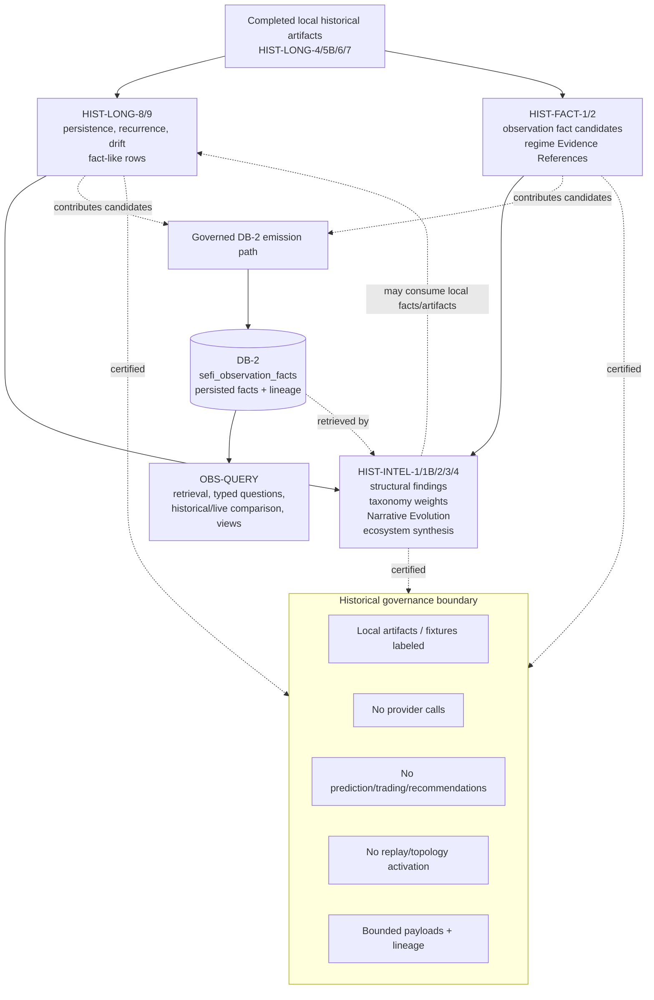

**Figure 15. OPS-LIVE Flow.** Source-pack Mermaid diagram preserved for reviewer reference.

**Figure 16. OBS-QUERY Flow.** Source-pack Mermaid diagram preserved for reviewer reference.

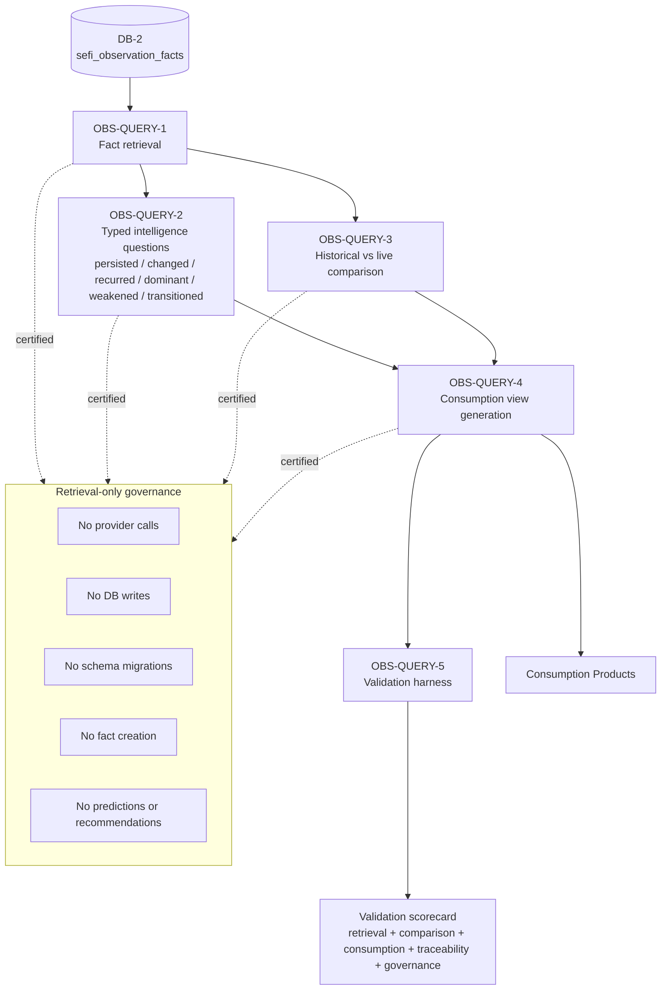

**Figure 17. Intelligence Lifecycle.** Source-pack Mermaid diagram preserved for reviewer reference.

**Figure 18. Consumption Architecture.** Source-pack Mermaid diagram preserved for reviewer reference.

**Figure 19. Data Model Relationships.** Source-pack Mermaid diagram preserved for reviewer reference.

**Figure 20. Governance Boundary Map.** Source-pack Mermaid diagram preserved for reviewer reference.

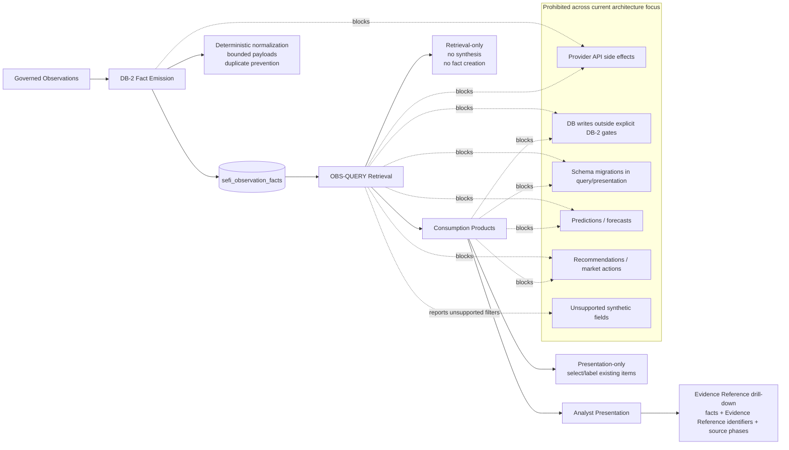

### C.1 Diagram interpretation notes

The end-to-end diagram is a high-level orientation figure and should be interpreted together with the architecture audit corrections. It shows DB-2 as the central persisted fact store and shows Historical Intelligence, OPS-LIVE, OBS-QUERY, and Consumption Products around it. It should not be read as proof that every historical intelligence output is downstream of DB-2. Historical layers can also contribute local fact-like rows and candidates before persistence.

The DB-2 lifecycle diagram should be read as the authoritative persistence lifecycle for observation facts. Its key controls are bounded observation capture, row construction, lineage binding, emission gates, append-oriented accumulation, and read-only retrieval. Any implementation or documentation that bypasses those controls would be inconsistent with the source-pack governance model.

The Historical Intelligence diagram should be read as a stack with non-linear handoffs. Completed local artifacts feed HIST-LONG and HIST-FACT layers. HIST-LONG contributes persistence, recurrence, and drift context. HIST-FACT contributes observation fact candidates and Evidence References. HIST-INTEL synthesizes structural findings, taxonomy weights, Narrative Evolution, and ecosystem intelligence. Governed emission can persist candidates to DB-2, and DB-2 can later be retrieved by OBS-QUERY and documented historical paths.

The OPS-LIVE diagram should be read with special attention to OPS-LIVE-3. OPS-LIVE-1 feeds bounded live observations to OPS-LIVE-2. OPS-LIVE-2 is the live fact accumulation and DB-2 emission layer when write gates pass. DB-2 then feeds OPS-LIVE-3 for read-only structural-state snapshotting. The dashed or local snapshot relationship from OPS-LIVE-3 to downstream consumers is not DB-2 fact emission.

The OBS-QUERY diagram is the clearest expression of retrieval-only governance. DB-2 feeds OBS-QUERY-1 retrieval. OBS-QUERY-2 and OBS-QUERY-3 create typed questions and historical/live comparisons over retrieved facts. OBS-QUERY-4 creates consumption view structures. OBS-QUERY-5 validates retrieval, comparison, consumption, traceability, and governance. None of these steps authorizes writes, provider calls, schema migrations, fact creation, prediction, recommendation, or market action.

The Intelligence Lifecycle diagram connects states rather than implementation files. It shows Observation, Fact, DB-2 Fact Candidate, Persisted DB-2 Fact, Historical Context, Live Context, Structural State, Query, and Analyst Consumption. The dashed relationship from historical context back to candidate creation is important because it visually preserves the corrected non-linear relationship between Historical Intelligence and DB-2.

The Consumption Architecture diagram should be interpreted as an evidence presentation diagram. It does not grant consumption products authority to create facts or make decisions. Its purpose is to show how Daily Briefing, Story Evolution, Investigation Queue, Why Now, and Quality Gate views depend on OBS-QUERY and historical evidence relationships.

The Data Model Relationships diagram should be used to reason about entity roles, not to infer undocumented schema behavior. Major entities include observation facts, artifact and run registries, historical observation and metric tables, morphology and symbol metrics, source-universe control, retrieval, and consumption. Where a relationship is not explicitly documented by the source pack, Draft 1 does not infer additional behavior.

The Governance Boundary Map diagram should be read as cross-cutting. Governance is not isolated in one subsystem. It appears in emission gates, live controls, historical artifact boundaries, retrieval certifications, validation scorecards, Quality Gates, and presentation constraints. The diagram's prohibited behaviors are architectural restrictions.

# Appendix D — Governance Certification Fields

The source pack identifies governance certification fields and guarantee families rather than a single universal schema for every phase. Draft 1 therefore documents the shared field families without inventing phase-specific fields. Where an implementation emits a narrower or wider certification object, the field family should be interpreted according to its documented phase context.

**Table 22. Governance certification field families.**

| Field family | Purpose | Expected guarantee |

| --- | --- | --- |

| Source-of-truth declaration | Identifies the source used for fact retrieval or validation. | OBS-QUERY fact retrieval uses `sefi_observation_facts`; fixtures are explicit validation contexts. |

| Disabled provider calls | Certifies retrieval/presentation does not call external providers. | No provider calls in DB-2 fact emission, OBS-QUERY retrieval, or consumption presentation where documented. |

| Disabled writes | Certifies query/presentation does not write. | No DB writes in OBS-QUERY or Consumption Products. |

| Disabled schema migrations | Certifies query/presentation cannot modify schema. | No migrations from retrieval or presentation layers. |

| Disabled fact creation | Certifies no new facts are created by query/presentation. | Facts must come from DB-2 or controlled fixtures. |

| No prediction | Certifies outputs are descriptive and evidence-backed. | No forecasting or future market claims. |

| No recommendation/market action | Certifies outputs are not instructions or recommendations. | No trading, portfolio, or market-action directives. |

| Traceability fields | Preserves facts, Evidence References, artifacts, runs, phases, payloads, and validation status. | Analyst and reviewer drill-down remains possible. |

| Unsupported/insufficient states | Documents limits rather than synthesizing answers. | Unsupported filters and insufficient evidence are explicit. |

### D.1 Certification interpretation by layer

For DB-2 fact emission, certification centers on whether a row is eligible to become a persisted fact. Relevant guarantees include explicit enablement, dry-run status, context completeness, row validity, payload bounds, duplicate-prevention correctness, parent lineage where applicable, and database-client presence. A failed certification at this boundary means no durable fact should be written.

For OPS-LIVE-1, certification centers on live ingestion controls. The live universe must be bounded, source selection must be controlled, fetcher or provider access must be gated, and outputs must remain bounded observations. OPS-LIVE-1 certification does not certify DB-2 persistence; it certifies the controlled live observation boundary.

For OPS-LIVE-2, certification centers on live accumulation and DB-2 emission. The component must normalize live observations, preserve source phase and source run context, build valid fact candidates, optionally emit parent lineage rows, and obey the explicit write gate. OPS-LIVE-2 is the live layer where fact persistence may occur, but only when all gates pass.

For OPS-LIVE-3, certification centers on read-only behavior. The component may read accumulated facts and produce local structural-state snapshots with health classes, coverage, and source digest information. Certification should explicitly state that OPS-LIVE-3 does not emit DB-2 facts. This field family protects the corrected persistence semantics.

For Historical Intelligence, certification centers on completed local artifact scope, no provider calls, bounded payloads, no replay/topology activation unless documented, lineage preservation, and no prediction, trading, or recommendation behavior. HIST-LONG, HIST-FACT, and HIST-INTEL phases have different responsibilities, but they share the same conservative governance posture.

For OBS-QUERY, certification centers on retrieval-only behavior. Required guarantees include source-of-truth declaration, disabled provider calls, disabled writes, disabled schema migrations, disabled fact creation, supported-filter behavior, unsupported-filter reporting, traceability preservation, and no prediction, recommendation, or market action. OBS-QUERY-5 validates these guarantees through the Validation Scorecard.

For Consumption Products, certification centers on presentation-only behavior. Products may format Daily Briefing, Story Evolution, Investigation Queue, Why Now, and Quality Gate views from existing evidence. They may not create facts, call providers, write to DB-2, alter schemas, predict future behavior, recommend trades, or issue market-action instructions. Quality Gates are part of this certification because they determine whether a view is eligible, insufficient, unsupported, or caveated.

### D.2 Certification evidence expectations

A certification should be reviewable. It should identify the layer, the source of truth or fixture context, the disabled actions, the traceability fields preserved, and any unsupported or insufficient states. A certification that merely states “passed” without exposing these dimensions would be weaker than the source-pack governance model. The value of certification is not only pass/fail status but also the ability to understand why a boundary was respected.

Certification evidence should also remain scoped. A DB-2 emission certification does not certify consumption-language quality. An OBS-QUERY retrieval certification does not certify that a presentation item is rhetorically clear. A Consumption Product certification does not certify that a new DB-2 fact was created. Each certification belongs to the boundary it evaluates.

Where field-level variation exists, the whitepaper uses field families rather than invented universal fields. This is intentional. The architecture audit identifies field-level certification contracts as an improvement opportunity. Draft 1 therefore documents the stable guarantee families and avoids fabricating implementation-specific certification schemas.

## Deliverable Quality Check

**Table 23. Draft 1 quality checks.**

| Check | Result |

| --- | --- |

| Terminology consistency | Uses terminology standard and Evidence Reference preference. |

| Governance consistency | Preserves deterministic, retrieval-only, no-prediction, no-recommendation, and evidence-traceability guarantees. |

| Architecture consistency | Uses source-pack subsystem responsibilities and corrected non-linear relationships. |

| DB-2 directionality correctness | States Historical Intelligence can produce candidates before DB-2 persistence and can also consume persisted facts. |

| OPS-LIVE-3 semantics correctness | States OPS-LIVE-3 is read-only and does not emit DB-2 facts. |

| Retrieval-only boundary correctness | States OBS-QUERY has no provider calls, writes, schema migrations, fact creation, prediction, recommendation, or market action. |

| Source-of-truth boundary correctness | Scopes `sefi_observation_facts` to OBS-QUERY fact retrieval. |

