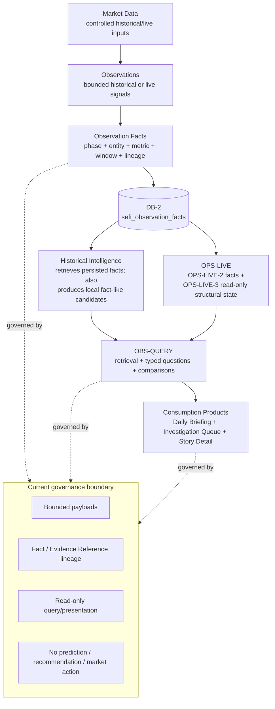
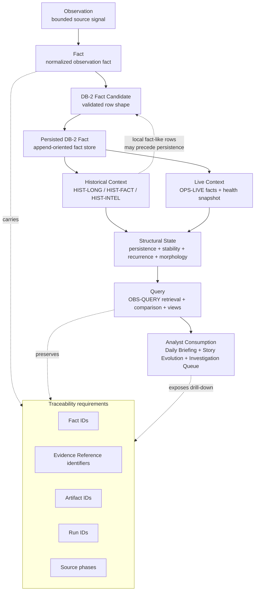
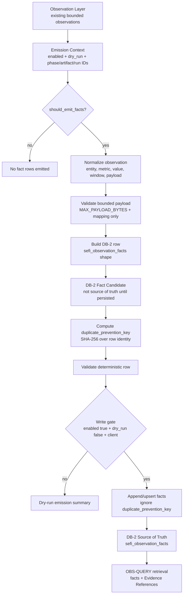
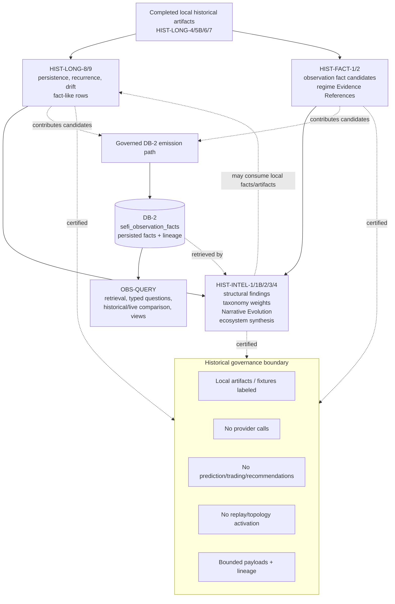
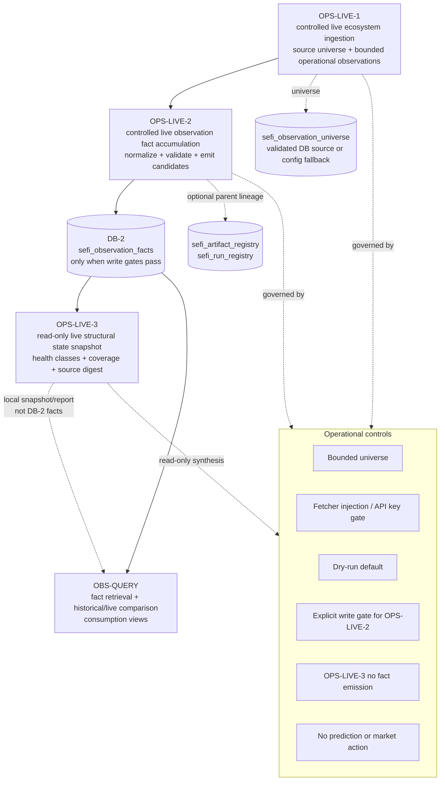
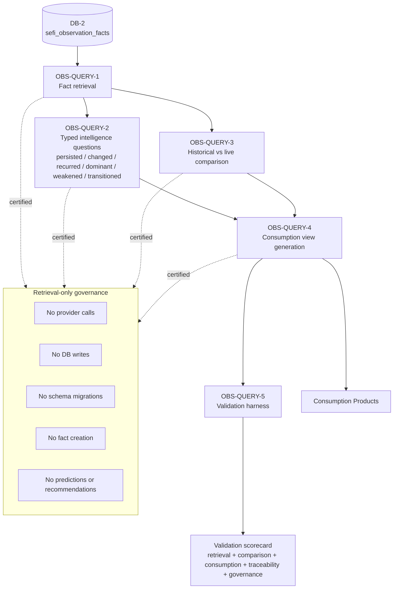
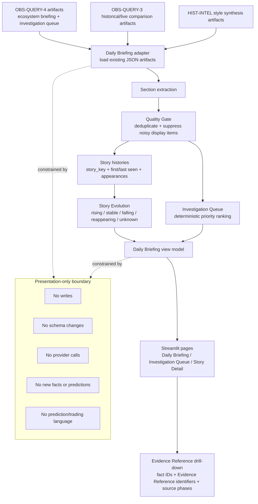
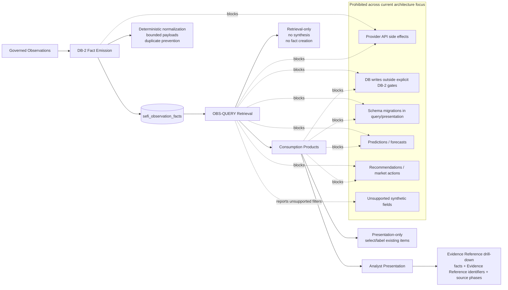
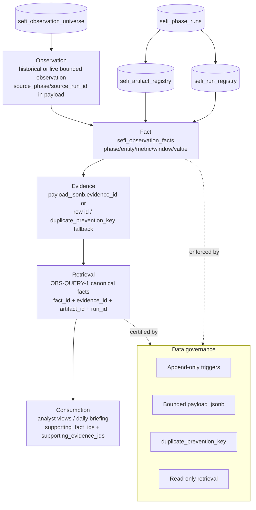

---

title: "SEFI Technical Whitepaper v1.0"

subtitle: "Draft 1 — Source-Pack-Derived Technical Architecture"

date: "2026-05-30"

status: "Draft 1"

source: "SEFI-SOURCE-PACK-v1.1"

---

# SEFI Technical Whitepaper v1.0

**Draft 1 — Source-Pack-Derived Technical Architecture**

**Prepared from:** SEFI-SOURCE-PACK-v1.1  
**Prepared on:** 2026-05-30  
**Document status:** Draft 1  
**Authoritative source rule:** The source pack is the sole architectural source of truth for this whitepaper.

## Revision History

**Table 1. Revision history.**

| Version | Date | Description | Source basis |

| --- | --- | --- | --- |

| Draft 1 | 2026-05-30 | Initial technical whitepaper generated from the completed source pack. | SEFI-SOURCE-PACK-v1.1 |

## Table of Contents

- [1. Executive Summary](#1-executive-summary)
- [2. Introduction](#2-introduction)
- [3. Design Philosophy](#3-design-philosophy)
- [4. System Evolution](#4-system-evolution)
- [5. Core Concepts](#5-core-concepts)
- [6. End-to-End Architecture](#6-end-to-end-architecture)
- [7. Observation Layer](#7-observation-layer)
- [8. DB-2 Architecture](#8-db-2-architecture)
- [9. Historical Intelligence Architecture](#9-historical-intelligence-architecture)
- [10. OPS-LIVE Architecture](#10-ops-live-architecture)
- [11. Structural State Modeling](#11-structural-state-modeling)
- [11A. Intelligence Lifecycle](#11a-intelligence-lifecycle)
- [12. OBS-QUERY Architecture](#12-obs-query-architecture)
- [13. Consumption Products](#13-consumption-products)
- [14. Governance Framework](#14-governance-framework)
- [15. Data Model](#15-data-model)
- [16. Architecture Boundaries](#16-architecture-boundaries)
- [17. Limitations and Known Constraints](#17-limitations-and-known-constraints)
- [18. Future Evolution Opportunities](#18-future-evolution-opportunities)
- [19. Conclusion](#19-conclusion)
- [Appendix A — Terminology Standard](#appendix-a-terminology-standard)
- [Appendix B — Lifecycle States](#appendix-b-lifecycle-states)
- [Appendix C — Architecture Diagrams](#appendix-c-architecture-diagrams)
- [Appendix D — Governance Certification Fields](#appendix-d-governance-certification-fields)

# 1. Executive Summary

SEFI is a fact-native market-intelligence architecture for converting bounded historical and live observations into traceable observation facts, structural context, queryable intelligence, and presentation-only analyst views. The architecture exists to make market-structure observations reviewable, comparable, and consumable without converting them into forecasts, trading instructions, or opaque generated narratives. In Draft 1 of this whitepaper, every architectural description is derived from SEFI-SOURCE-PACK-v1.1, with the architecture audit corrections treated as controlling evidence where the source pack identifies ambiguity or prior diagram risk.

The system is organized around six major subsystems. Historical Intelligence processes completed local ecology artifacts and produces fact-like rows, historical structural findings, Narrative Evolution signals, taxonomy weighting, persistence and drift assessments, and ecosystem synthesis. OPS-LIVE provides controlled live observation ingestion, governed live observation fact accumulation, and read-only structural-state snapshotting. DB-2 is the append-oriented observation-fact read model centered on `sefi_observation_facts`. OBS-QUERY is a retrieval-only interface over DB-2 facts and controlled fixtures. Consumption Products adapt retrieved facts and historical intelligence artifacts into analyst-facing views such as Daily Briefing, Story Evolution, Investigation Queue, Story Detail, Why Now, and Quality Gate surfaces. Governance is embedded across emission, retrieval, comparison, validation, and presentation boundaries.

The architectural principle that unifies these subsystems is separation of responsibilities. Observation capture is separate from fact persistence. Fact persistence is separate from intelligence retrieval. Historical/live comparison is separate from prediction. Analyst presentation is separate from new intelligence generation. This separation allows SEFI to preserve evidence while reducing the risk that downstream views become unsupported recommendation engines or unreviewable generated prose.

The common lineage contract is also essential. Facts and derived views retain source phase identity, artifact and run references where available, entity and metric identity, observation windows, bounded payload fields, Evidence Reference identifiers, and duplicate-prevention keys. This lineage is not an optional metadata convenience; it is the mechanism that makes downstream review, comparison, audit, and analyst drill-down possible without changing the meaning of the original observation.

**Figure 1. SEFI end-to-end architecture.** The current high-level flow from controlled inputs to observations, observation facts, DB-2, retrieval, and consumption products.

**Table 2. Major subsystem responsibilities.**

| Subsystem | Architectural responsibility | Governance posture |

| --- | --- | --- |

| Historical Intelligence | Processes completed local historical artifacts into persistence, recurrence, stability, morphology, ecology, structural findings, taxonomy weighting, Narrative Evolution, and ecosystem synthesis. | No provider calls, no prediction/trading/recommendation behavior, bounded payloads, labeled local artifacts and fixtures. |

| OPS-LIVE | Controls live ecosystem ingestion, accumulation of live observation facts, and read-only structural-state snapshotting. | Bounded universe, fetcher injection/API-key gates, dry-run default, explicit OPS-LIVE-2 write gate, OPS-LIVE-3 no fact emission. |

| DB-2 | Stores append-oriented observation facts and lineage in `sefi_observation_facts`; supplies canonical facts to retrieval layers. | Writes require enabled non-dry context, valid row shape, bounded payloads, duplicate-prevention keys, and a database client. |

| OBS-QUERY | Retrieves, groups, compares, validates, and formats existing facts for bounded intelligence questions. | Retrieval-only; no provider calls, writes, schema migrations, fact creation, prediction, recommendations, or market action. |

| Consumption Products | Present retrieved facts and historical intelligence artifacts as analyst-consumable views. | Presentation-only; unsupported or insufficient data produces explicit bounded states. |

Across this section, the architectural boundary is intentionally conservative. The system may preserve, retrieve, group, compare, or present evidence-bearing observations, but the source pack does not authorize forecasts, predictions, trading instructions, portfolio recommendations, market-action directives, provider calls in retrieval layers, schema migrations in query or presentation layers, or unbounded generated narrative synthesis. When data is missing, unsupported, or outside the governed shape, the appropriate behavior is a bounded response, an unsupported-filter explanation, a dry-run summary, or an insufficient-data state rather than synthetic completion.

# 2. Introduction

SEFI addresses a recurring architecture problem in evidence-oriented market analysis: raw observations and historical artifacts are difficult to audit, compare, and present safely unless they are normalized into stable facts with clear lineage. A raw artifact may contain valuable context, but without a governed fact boundary it is hard to determine which entity, metric, window, source phase, run, or artifact supports a later analyst-facing claim. The source-pack architecture therefore treats observation facts as the stable unit of review and retrieval.

The whitepaper is intended for research directors, technical reviewers, SUSS supervisors, senior engineers, architecture review panels, hiring managers, technical interviewers, and future contributors. It uses professional architecture language rather than promotional language. It does not claim forecasting, predictive, trading, portfolio, or recommendation capability. Where the source pack describes intelligence, the term refers to structured interpretation over retained facts and governed artifacts, not unsupported generation or autonomous decision-making.

The scope is documentation, not implementation. This whitepaper does not redesign architecture, propose schema changes, modify governance, or infer behavior from implementation code or historical reports. It explains the source-pack architecture, including the architecture audit corrections for DB-2 directionality, OPS-LIVE-3 persistence semantics, historical intelligence ordering, retrieval-only boundaries, and source-of-truth scoping.

**Table 3. Document scope controls.**

| Control | Applied interpretation |

| --- | --- |

| Authoritative source | SEFI-SOURCE-PACK-v1.1 is the sole source for architectural descriptions. |

| Conflict handling | Source-pack content wins; architecture audit corrections win where corrections are documented. |

| Repository inspection | Limited to source-pack documents, terminology standards, governance standards, architecture audits, and referenced diagram sources. |

| Non-goals | No implementation changes, no schema changes, no feature development, no governance changes, and no architecture rediscovery from tests or code. |

The remainder of the whitepaper progresses from design philosophy and system evolution to layer-by-layer architecture, lifecycle states, retrieval behavior, consumption products, governance framework, data model, boundaries, limitations, compatible future opportunities, and appendices. The appendices preserve the canonical terminology standard, lifecycle states, architecture diagrams, and governance certification field families so that reviewers can trace the narrative back to the source-pack controls.

# 3. Design Philosophy

SEFI's design philosophy is fact-native, deterministic, governance-first, explainable, and retrieval-oriented. Fact-native design means that durable intelligence is anchored in observation facts rather than in generated prose. Deterministic design means that transformations, sorting, ranking, duplicate prevention, validation fixtures, source-universe controls, payload caps, and section caps favor repeatable behavior. Governance-first design means that the prohibited behaviors are encoded into layer boundaries instead of being left to a final editorial review. Explainability means that each view can expose supporting facts, Evidence Reference identifiers, source phases, artifacts, and runs. Retrieval-over-generation means that query and presentation layers arrange existing evidence rather than creating new facts.

The fact-native principle is especially important because the architecture contains both historical and live layers. Historical components can classify persistence, recurrence, stability, morphology, ecology, drift, taxonomy weight, and structural evolution. Live components can ingest bounded observations, accumulate governed fact rows, and synthesize read-only health or structural-state snapshots. These capabilities are useful only when tied to fact and evidence references. SEFI therefore treats a useful intelligence output as one that can answer which observation facts support it, which source phases and runs are attached, and which governance boundary prevents it from becoming prediction or recommendation.

Determinism is not limited to database writes. It appears in dry-run defaults, explicit write gates, bounded payload size, duplicate prevention, fixture validation, retrieval limits, supported-filter checks, canonical row envelopes, deterministic ordering, Quality Gate filters, and validation scorecards. This approach recognizes that intelligence systems fail not only through incorrect calculations but also through uncontrolled widening of scope, inconsistent payloads, unsupported filters, and implicit synthesis.

Across this section, the architectural boundary is intentionally conservative. The system may preserve, retrieve, group, compare, or present evidence-bearing observations, but the source pack does not authorize forecasts, predictions, trading instructions, portfolio recommendations, market-action directives, provider calls in retrieval layers, schema migrations in query or presentation layers, or unbounded generated narrative synthesis. When data is missing, unsupported, or outside the governed shape, the appropriate behavior is a bounded response, an unsupported-filter explanation, a dry-run summary, or an insufficient-data state rather than synthetic completion.

**Table 4. Design principles and architectural implications.**

| Principle | Implication |

| --- | --- |

| Fact-native intelligence | Observation facts and Evidence Reference identifiers are the durable basis for retrieval, comparison, and presentation. |

| Deterministic architecture | Bounded inputs, stable keys, explicit gates, canonical envelopes, and repeatable ordering constrain system behavior. |

| Governance-first design | Layer boundaries prohibit provider calls, writes, schema migrations, predictions, recommendations, and market actions where not authorized. |

| Explainability | Consumption views preserve drill-down to facts, evidence references, artifacts, runs, source phases, and validation posture. |

| Retrieval-over-generation | OBS-QUERY and Consumption Products retrieve and arrange existing facts rather than generating new intelligence or facts. |

### 3.1 Operational consequences of the design philosophy

The operational consequence of fact-native design is that the system must preserve intermediate accountability even when a downstream view is concise. A Daily Briefing item, for example, can be short, but the architecture requires the item to remain connected to facts, Evidence Reference identifiers, source phases, and validation posture. This prevents a compact analyst view from becoming a detached narrative. The same principle applies to typed OBS-QUERY questions: an answer about a persisted, changed, recurred, dominant, weakened, or transitioned structure is meaningful only when it can be traced to the retrieved observations that support the answer.

The operational consequence of deterministic architecture is that ambiguity is resolved through explicit states rather than through synthesis. A missing field, unsupported filter, disabled write gate, absent database client, oversized payload, dry-run mode, or insufficient fact set does not authorize a model or presentation layer to fill in the gap. The bounded response may be less complete than a speculative answer, but it is reviewable. This is why deterministic behavior is treated as a governance mechanism rather than merely a software-engineering preference.

The operational consequence of governance-first design is that the architecture is easier to review. Reviewers can inspect where writes are allowed, where reads are read-only, where provider calls are blocked, where schema migrations are prohibited, and where presentation remains presentation-only. The system's non-responsibilities are therefore as important as its responsibilities. A technical reviewer should be able to determine not only what SEFI produces but also what SEFI refuses to produce.

The operational consequence of retrieval-over-generation is that the intelligence layer behaves as an evidence access and comparison layer. This does not make the system passive; retrieval can still group, compare, validate, and present complex structures. However, the complexity remains anchored in existing facts and documented artifacts. The architecture's value comes from preserving relationships among observations, facts, lineage, structural context, and analyst consumption rather than from generating unsupported prose.

# 4. System Evolution

The source pack describes SEFI as an evolution from bounded observations toward fact persistence, historical intelligence, live intelligence, structural intelligence, queryable intelligence, and consumption products. This evolution should not be read as a single linear implementation pipeline. The architecture audit explicitly corrects the over-simple interpretation that DB-2 always precedes all Historical Intelligence. Historical layers can produce local fact-like rows and DB-2 fact candidates before persistence, while DB-2 later stores persisted observation facts that OBS-QUERY, comparison layers, and some historical retrieval paths can consume.

The first architectural phase is the observation layer. Observations are bounded source signals captured from controlled historical or live inputs. Their role is to preserve what was observed without granting the observation durable fact status until normalization, validation, lineage binding, and emission gates are satisfied. The second phase is the fact layer, where observations are normalized into observation facts with phase, entity, metric, window, payload, lineage, and duplicate-prevention fields. The third phase is Historical Intelligence, where completed local ecology artifacts are used to evaluate persistence, recurrence, drift, stability, morphology, taxonomy weighting, Narrative Evolution, and ecosystem synthesis.

The fourth phase is Live Intelligence through OPS-LIVE. OPS-LIVE-1 controls live ecosystem ingestion over a bounded universe. OPS-LIVE-2 performs live observation fact accumulation and can emit DB-2 facts only when write gates pass. OPS-LIVE-3 performs read-only live structural-state snapshotting over accumulated facts and does not create DB-2 facts. The fifth phase is Structural Intelligence, where historical and live evidence can be characterized in terms of ecosystem state, structural state, persistence, stability, recurrence, morphology, and ecology. The sixth phase is Queryable Intelligence through OBS-QUERY. The final phase is Consumption Products, where retrieved facts and artifacts are converted into presentation-only analyst surfaces.

The emergence of DB-2 is therefore best understood as the emergence of an append-oriented observation-fact read model, not as the replacement of all local historical artifacts. DB-2 is authoritative for OBS-QUERY fact retrieval, while governed local artifacts and fixtures remain documented inputs or fallbacks where the source pack explicitly allows them. This distinction prevents source-of-truth language from becoming overly broad.

**Figure 2. SEFI intelligence lifecycle.** The corrected lifecycle shows observation, fact candidate, persisted fact, historical context, live context, structural state, query, and analyst consumption.

**Table 5. Evolutionary layers.**

| Layer | Transition enabled | Architectural correction |

| --- | --- | --- |

| Observation | Bounded historical or live source signals become candidates for normalization. | Observation alone is not durable source-of-truth status. |

| Fact | Normalized rows bind entity, metric, window, payload, source phase, artifact, run, and duplicate key. | Fact candidates are distinct from persisted DB-2 facts. |

| Historical Intelligence | Completed artifacts produce persistence, recurrence, drift, taxonomy, Narrative Evolution, and ecosystem synthesis. | Historical Intelligence both contributes to and can retrieve from DB-2. |

| Live Intelligence | OPS-LIVE handles controlled ingestion, accumulation, and structural snapshots. | OPS-LIVE-3 is read-only and does not emit facts. |

| Query Layer | OBS-QUERY retrieves and compares existing facts. | Retrieval-only; no creation of new facts or intelligence. |

| Consumption Products | Analyst views present retrieved evidence. | Presentation-only and bounded by Quality Gates. |

### 4.1 Phase-by-phase architectural rationale

The observation phase exists because neither historical artifacts nor live source payloads should be treated as durable facts without normalization. Historical artifacts may contain structured ecology information, but they are completed local artifacts with their own governance context. Live payloads may be timely, but they are constrained by universe selection, fetcher behavior, and source availability. The observation phase gives both paths a common conceptual entry point: bounded source signals that can be normalized without erasing provenance.

The fact phase exists because downstream review requires a stable unit of comparison. Without observation facts, retrieval would have to reason directly over heterogeneous artifacts, live payloads, reports, or presentation objects. That would make auditability fragile and would blur source-of-truth boundaries. The fact phase creates a normalized row shape, including phase, entity, metric, window, payload, artifact, run, and duplicate-prevention identity, so that retrieval can operate over bounded evidence rather than uncontrolled source documents.

Historical Intelligence emerged because single observations do not fully describe structural context. Persistence, recurrence, stability, morphology, ecology, drift, and regime transition are longitudinal or comparative concepts. The historical stack therefore accumulates completed local evidence across windows, groups, and taxonomy structures. Its role is not to predict what will happen next but to characterize what has persisted, changed, recurred, drifted, stabilized, weakened, dominated, or transitioned in the retained evidence base.

Live Intelligence emerged because the architecture also needs controlled handling of current observations. OPS-LIVE separates live ingestion from live fact accumulation and separates both from structural-state snapshotting. This separation is a governance control: OPS-LIVE-1 can bound the live universe, OPS-LIVE-2 can enforce write gates, and OPS-LIVE-3 can synthesize read-only snapshots without turning those snapshots into DB-2 facts.

The query and consumption phases emerged because analysts need bounded access to facts and structural context. OBS-QUERY turns persisted facts into retrievable and comparable evidence surfaces. Consumption Products then translate those surfaces into analyst-facing formats. The architecture remains conservative at the end of the lifecycle because the risk of unsupported claims is highest when information is summarized for human consumption.

# 5. Core Concepts

The terminology standard defines the canonical vocabulary used throughout this whitepaper. The core conceptual unit is the Observation, a bounded source signal captured from historical or live inputs. Observations are normalized into Observation Facts only after they are shaped into governed rows with entity, metric, window, payload, and lineage fields. Evidence is referred to as an Evidence Reference where the architecture tracks identifiers and supporting references rather than a separately documented universal evidence table. Fact Lineage is the set of identifiers and metadata that keeps facts connected to the source phase, artifact, run, entity, metric, window, payload, and duplicate-prevention context.

Structural State is a characterization of the system's observed condition using persistence, stability, recurrence, morphology, ecology, health class, coverage, source digest, and related source-pack concepts. Persistence refers to a structure continuing across windows or observations. Stability concerns the consistency of structural behavior across windows or comparable contexts. Recurrence identifies repeated appearance of a signal or structure. Morphology describes the shape or form of observed market/ecology structure. Ecology describes the surrounding structural environment in which entities, sectors, groups, taxonomy classes, or signals appear.

Historical Intelligence is the source-pack name for analysis over completed local ecology artifacts and fact-like or persisted facts. Live Intelligence is implemented through the OPS-LIVE subsystem. Queryable Intelligence is implemented through OBS-QUERY. Story and Story Evolution refer to analyst-consumable narrative structures and changes over time, but those terms must not be interpreted as generated forecasts. Investigation Candidate and Why Now are consumption-layer structures that explain why an existing evidence-backed item is surfaced for review. Quality Gate refers to validation and filtering logic that keeps presentation bounded and evidence-bearing.

**Table 6. Canonical concept mapping.**

| Concept | Canonical interpretation | Boundary |

| --- | --- | --- |

| Observation | Bounded source signal from historical or live inputs. | Not yet a persisted fact. |

| Observation Fact | Normalized fact row with lineage suitable for DB-2 persistence or retrieval. | Must preserve source and duplicate-prevention context. |

| Evidence Reference | Identifier or reference attached to supporting evidence. | Do not imply a universal evidence table unless documented. |

| Structural State | Observed condition characterized by persistence, stability, recurrence, morphology, ecology, health, and coverage concepts. | Descriptive, not predictive. |

| Queryable Intelligence | Retrieval and comparison over existing DB-2 facts or controlled fixtures. | No writes, provider calls, fact creation, prediction, recommendation, or market action. |

Across this section, the architectural boundary is intentionally conservative. The system may preserve, retrieve, group, compare, or present evidence-bearing observations, but the source pack does not authorize forecasts, predictions, trading instructions, portfolio recommendations, market-action directives, provider calls in retrieval layers, schema migrations in query or presentation layers, or unbounded generated narrative synthesis. When data is missing, unsupported, or outside the governed shape, the appropriate behavior is a bounded response, an unsupported-filter explanation, a dry-run summary, or an insufficient-data state rather than synthetic completion.

### 5.1 Term usage controls

The source pack distinguishes conceptual terms from subsystem names. “Live Intelligence” is a capability area, while OPS-LIVE is the subsystem family that implements live ingestion, live fact accumulation, and live structural-state snapshotting. “Queryable Intelligence” is a capability area, while OBS-QUERY is the subsystem family that implements retrieval, typed questions, historical/live comparison, consumption view generation, and validation. “Story” and “Narrative Evolution” are related but should not be collapsed into a single term: a story is an analyst-consumable structure, while Narrative Evolution is the historical-intelligence mapping of changes in narrative or regime structure over retained evidence.

The source pack also requires care around evidence language. The preferred term is Evidence Reference when the architecture is referring to identifiers, references, or supporting evidence links rather than a separately documented evidence table. This matters because a reviewer should not infer a universal evidence database from terminology alone. Evidence References are part of traceability, and traceability depends on how facts, artifacts, runs, phases, and payloads are carried through the system.

The term “source of truth” is similarly scoped. Persisted rows in `sefi_observation_facts` are the source of truth for OBS-QUERY fact retrieval. That does not mean all historical artifacts, fixtures, reports, cards, or snapshots become source-of-truth records. The whitepaper therefore uses source-of-truth language only where the source pack permits it and uses lifecycle-state language elsewhere.

Finally, the intelligence terms in SEFI are descriptive and evidence-oriented. Historical Intelligence, Live Intelligence, Structural State, Queryable Intelligence, Story Evolution, Why Now, and Investigation Candidate do not imply prediction, recommendation, or autonomous decision-making. They describe how retained evidence is normalized, accumulated, compared, validated, and presented for analyst review.

# 6. End-to-End Architecture

**Figure 3. End-to-end architecture.** The full system boundary from controlled inputs to presentation-only consumption products.

The end-to-end architecture begins with controlled historical and live inputs. These inputs become bounded observations only when they are captured within the relevant historical or live layer controls. Observations then become observation facts through normalization, validation, lineage binding, payload bounding, metric validation, and duplicate-prevention key construction. Persisted facts enter DB-2, specifically `sefi_observation_facts`, where they can be retrieved by OBS-QUERY and used by downstream comparison and presentation views.

Historical Intelligence and OPS-LIVE occupy complementary positions in the architecture. Historical Intelligence processes completed local artifacts, produces local fact-like rows and candidates, contributes to governed DB-2 emission paths, and can consume persisted DB-2 facts where retrieval is documented. OPS-LIVE processes controlled live observations: OPS-LIVE-1 produces bounded observations, OPS-LIVE-2 normalizes and accumulates fact rows with explicit write gates, and OPS-LIVE-3 reads accumulated facts to synthesize local read-only structural-state snapshots. Both historical and live paths contribute context to structural-state modeling, but neither grants query or presentation layers permission to predict or recommend.

OBS-QUERY is downstream of DB-2 for fact retrieval. It supports typed intelligence questions such as persisted, changed, recurred, dominant, weakened, and transitioned structures, plus historical/live comparisons and validation scorecards. Consumption Products sit downstream of OBS-QUERY and historical intelligence artifacts. They generate analyst-facing presentations such as Daily Briefing and Story Evolution by arranging existing evidence and applying Quality Gates. They do not create new facts, modify schemas, or call providers.

The common lineage contract is also essential. Facts and derived views retain source phase identity, artifact and run references where available, entity and metric identity, observation windows, bounded payload fields, Evidence Reference identifiers, and duplicate-prevention keys. This lineage is not an optional metadata convenience; it is the mechanism that makes downstream review, comparison, audit, and analyst drill-down possible without changing the meaning of the original observation.

**Table 7. End-to-end dependencies.**

| Stage | Upstream dependencies | Downstream dependencies |

| --- | --- | --- |

| Observations | Controlled historical/live inputs and source-universe constraints. | Fact normalization and candidate emission. |

| Observation Facts | Bounded observations, phase/run/artifact context, entity/metric/window fields. | DB-2 persistence, retrieval envelopes, Evidence References. |

| DB-2 | Governed fact emission paths and optional parent registries. | OBS-QUERY, comparison layers, consumption products, historical retrieval paths. |

| Structural State | Historical and live fact/context inputs. | Queryable comparisons and presentation views. |

| OBS-QUERY | Persisted DB-2 facts or controlled fixtures. | Validation scorecards and consumption views. |

| Consumption Products | OBS-QUERY views and documented historical intelligence artifacts. | Analyst review surfaces only. |

### 6.1 Producer and consumer interpretation

The end-to-end architecture should be read as a producer/consumer network rather than a rigid linear chain. Historical components can produce candidates and consume persisted facts. Live components can produce observations, emit facts through OPS-LIVE-2, and consume accumulated facts through OPS-LIVE-3. DB-2 consumes governed fact rows and produces retrievable fact envelopes. OBS-QUERY consumes persisted facts and produces retrieval, comparison, validation, and consumption-view structures. Consumption Products consume those structures and produce presentation items.

This interpretation preserves the DB-2 directionality correction. If the system were described as a simple sequence in which all historical intelligence appears only after DB-2, it would contradict the source pack. Conversely, if local historical artifacts were described as equivalent to persisted DB-2 facts, it would weaken the source-of-truth boundary. The correct architecture is more precise: local historical artifacts and fact-like rows can contribute candidates; persisted DB-2 facts are the durable retrieval source for OBS-QUERY; historical layers may also retrieve persisted facts where documented.

The end-to-end flow also preserves the OPS-LIVE-3 correction. OPS-LIVE-3 is downstream of accumulated facts because it reads those facts to synthesize a live structural-state snapshot. It is not upstream of DB-2 as a fact emitter. Its local snapshot/report can inform downstream views, but the snapshot remains separate from append-oriented observation facts. This keeps the fact model and structural-state model from collapsing into one another.

The consumption end of the architecture is deliberately narrow. A presentation item can make evidence easier to read, but it cannot improve the evidence by assertion. If a Daily Briefing item or Investigation Queue entry cannot expose a supporting fact or documented artifact relationship, the appropriate response is a Quality Gate or caveat rather than unsupported prose.

# 7. Observation Layer

The observation layer is the system's controlled boundary for capturing source signals before they become facts. In the source-pack model, observations may be historical or live. Historical observations originate from completed local ecology artifacts and historical processing phases. Live observations originate from OPS-LIVE-1 controlled ingestion over a bounded source universe. In both cases, an observation is not the same as a persisted DB-2 fact. It is a bounded signal that must pass through normalization and governance before it can be accumulated as an observation fact.

Observation normalization converts source-layer signals into a stable shape. The architecture expects entity fields, metric fields, window information where applicable, observed-at or source-phase context for live observations, payload metadata, and parent artifact/run lineage where available. Normalization is responsible for resolving the source signal into a form that can be validated, bounded, assigned lineage, and checked for duplicate-prevention identity. The observation boundary protects the rest of the system from raw or unbounded artifacts.

Observational guarantees are deliberately limited. The architecture can guarantee that accepted observations are bounded, shaped, and carried forward with source context. It does not guarantee that every raw source item becomes a persisted fact, nor that an observation can be used for unsupported filters or presentation claims. If an observation lacks required fields, exceeds payload bounds, or lacks the required context for emission, the fail-closed posture requires no write or an explicit insufficient/unsupported state.

The observation layer's upstream dependencies are controlled source inputs, completed historical artifacts, live source-universe selection, fetcher injection or API-key gates where relevant, and explicit phase/run/artifact context. Its downstream dependencies are fact row construction, DB-2 candidate emission, historical persistence classification, live accumulation, and structural-state synthesis. Because these downstream layers rely on observation integrity, observation boundaries are a governance boundary, not merely an ingestion convenience.

**Table 8. Observation boundary responsibilities.**

| Responsibility | Rationale | Constraint |

| --- | --- | --- |

| Capture bounded signals | Preserves source evidence without granting durable fact status prematurely. | No unbounded raw artifact consumption in query/presentation. |

| Normalize observation fields | Enables consistent fact candidate construction. | Required fields must be present before emission. |

| Preserve source context | Supports auditability and downstream drill-down. | Phase, artifact, run, entity, metric, window, and payload context remain relevant. |

| Fail closed on invalid inputs | Prevents unsupported synthesis. | Missing or invalid fields yield no write or bounded insufficient-data state. |

### 7.1 Observation normalization detail

Observation normalization has two complementary responsibilities: it preserves the source signal and constrains the signal into a shape that downstream systems can validate. Preserving the source signal means retaining enough source context for audit: phase identity, run context, artifact lineage, observed-at context for live observations, entity identity, metric identity, window information, and payload metadata. Constraining the signal means preventing unbounded or ambiguous inputs from leaking into DB-2, OBS-QUERY, or Consumption Products.

The normalization boundary also protects terminology. A raw signal may mention an entity, sector, taxonomy, metric, or structure in source-specific language. The normalized observation must represent the fields in a form that the fact emitter, retrieval adapter, and typed query components can understand. Where the schema does not expose a field, downstream retrieval must not pretend the field exists. This is why unsupported filters are a governance behavior rather than a minor interface inconvenience.

Historical observations and live observations differ in origin but share the same governance need. Historical observations are tied to completed local artifacts and historical processing phases. Live observations are tied to controlled ingestion and source-universe constraints. Both require bounded payloads and lineage before they can become fact candidates. Neither path should bypass the distinction between observation, fact-like row, fact candidate, persisted fact, and presentation item.

Observation boundaries are also operational constraints. If an upstream source expands, changes shape, or provides incomplete metadata, the observation layer should absorb that change by validating and bounding the signal. It should not allow a changed source to silently alter DB-2 semantics, retrieval semantics, or presentation language. This is especially important for a fact-native architecture because downstream trust depends on the consistency of upstream normalization.

# 8. DB-2 Architecture

**Figure 4. DB-2 fact lifecycle.** The fact lifecycle from observation capture through emission gates, accumulation, retrieval, and downstream use.

DB-2 is the repository's fact-native read model for SEFI observations. Its central table is `sefi_observation_facts`, an append-oriented store of bounded observation facts emitted from governed phases and later retrieved by OBS-QUERY and consumption products. DB-2 is not a single linear stage before all Historical Intelligence. The architecture audit correction is explicit: historical layers can produce local fact-like rows and DB-2 fact candidates before persistence, while DB-2 stores persisted observation facts that OBS-QUERY and comparison layers retrieve.

The DB-2 input contract includes a gated emission context with enablement status, dry-run status, phase identity, artifact identity, and run identity. It also includes metric observations with entity, metric, optional window, value, and bounded payload. OPS-LIVE-2 contributes bounded live observations containing observed-at, source phase, source run, entity fields, metric fields, and payload metadata. Parent registry metadata can be emitted for artifact and run lineage when governed live fact rows exist.

The observation-fact lifecycle contains seven source-pack steps. First, upstream live or historical components capture bounded observations. Second, an emission context is constructed and must include explicit enablement and identity fields. Third, observations are normalized into DB-2 row shape, including deterministic payload ordering and numeric or null metric validation. Fourth, artifact, run, phase, payload source fields, and duplicate-prevention keys bind rows to execution lineage. Fifth, the emission gate enforces dry-run as the safe default and requires explicit enablement, non-dry execution, and an injected database client for writes. Sixth, rows accumulate append-orientedly with duplicate-prevention conflict handling. Seventh, downstream layers retrieve bounded rows and expose canonical facts plus Evidence References.

DB-2's source-of-truth role is scoped. `sefi_observation_facts` is the source of truth for OBS-QUERY fact retrieval and downstream query-derived consumption. That statement does not make every local artifact, fixture, presentation card, markdown report, or generated output a source of truth. Governed local artifacts can be documented inputs or fallbacks, and local fact-like rows can contribute candidates, but persisted DB-2 facts are the durable retrieval boundary for OBS-QUERY.

Fact emission is deterministic and fail-closed. Context without `enabled=True`, missing required context fields, invalid required row fields, nonnumeric metric values where a numeric or null value is required, nonmapping payloads, oversized payloads, or incorrect duplicate-prevention keys cannot silently write durable facts. OPS-LIVE-2 reinforces the same semantics by capping local input rows, normalizing bounded observations, creating parent artifact/run registry rows only when fact rows exist, and writing only when `enabled` is true, `dry_run` is false, and a client is supplied.

**Table 9. DB-2 source-of-truth boundaries.**

| Boundary | In scope | Out of scope |

| --- | --- | --- |

| Persisted fact scope | Rows in `sefi_observation_facts` plus lineage fields, duplicate-prevention keys, and optional governed parent registry rows. | Local fact-like rows, reports, presentation cards, quality summaries, unsupported synthetic fields. |

| Retrieval scope | Canonical facts and Evidence Reference envelopes retrieved by OBS-QUERY. | Provider calls, new fact creation, schema migrations, recommendations, predictions. |

| Directionality scope | Historical and live layers can contribute candidates; DB-2 supplies persisted retrieval facts. | A simplified one-way sequence where DB-2 must precede all historical intelligence. |

The common lineage contract is also essential. Facts and derived views retain source phase identity, artifact and run references where available, entity and metric identity, observation windows, bounded payload fields, Evidence Reference identifiers, and duplicate-prevention keys. This lineage is not an optional metadata convenience; it is the mechanism that makes downstream review, comparison, audit, and analyst drill-down possible without changing the meaning of the original observation.

### 8.1 DB-2 operational responsibilities

DB-2 has a narrow but central responsibility: retain governed observation facts in a form that can be retrieved without reinterpretation. The fact emitter and accumulation paths validate context, normalize strings, bound payloads, compute duplicate-prevention keys, validate rows, and either dry-run or insert/upsert according to the emission gate. This means DB-2 is not an intelligence generator. It is the fact persistence and read model that enables intelligence layers to remain evidence-backed.

The append-oriented nature of DB-2 is important. Accumulation does not overwrite the conceptual history of observations; it allows repeated observations to coexist while duplicate-prevention behavior supports idempotence. Duplicate prevention is not merely a database optimization. It is a governance control that reduces accidental duplicate accumulation while preserving the ability to review repeated, recurring, or persistent structures over time.

DB-2 retrieval produces canonical envelopes. OBS-QUERY-1 retrieves selected columns, maps them into fact and Evidence Reference structures, applies supported filters, and reports unsupported filters. The canonical envelope is the handoff contract between persistence and query. It allows typed questions and consumption views to operate over consistent evidence rather than over heterogeneous database rows or local artifacts.

The source-of-truth boundary should guide all review of DB-2. A persisted row in `sefi_observation_facts` can support OBS-QUERY fact retrieval. A local fact-like row can support historical processing but should not be treated as a persisted fact. A structural-state snapshot can support live context but should not be treated as fact emission. A presentation item can support analyst reading but should not be treated as a source record. These distinctions keep DB-2 central without overstating its scope.

DB-2 governance also provides failure semantics. When writes are disabled, dry-run is active, a database client is absent, context fields are missing, row fields are invalid, payloads are oversized, or duplicate keys are incorrect, the system should not emit facts. This fail-closed behavior is one of the strongest governance features in the architecture because it prevents partial or invalid evidence from becoming durable retrieval material.

# 9. Historical Intelligence Architecture

**Figure 5. Historical intelligence stack.** The corrected non-linear relationship among completed local artifacts, HIST-LONG, HIST-FACT, HIST-INTEL, governed DB-2 emission, and OBS-QUERY retrieval.

Historical Intelligence converts completed local ecology artifacts into fact/evidence rows, structural findings, Narrative Evolution signals, taxonomy weighting, and ecosystem synthesis. The historical stack is not a monolith. HIST-LONG components assess multi-window ecology, temporal delta sensitivity, cross-sectional differentiation, intra-group contrast, cross-window persistence, and persistence evolution or stability drift. HIST-FACT components expand historical observation fact candidates and regime Evidence References. HIST-INTEL components produce historical structural findings, fact-native historical findings, taxonomy-weighted intelligence, Narrative Evolution and regime transition mapping, and ecosystem intelligence synthesis.

HIST-LONG-4 performs real multi-window ecology review. HIST-LONG-5B classifies temporal delta sensitivity. HIST-LONG-6 differentiates cross-sectional ecology. HIST-LONG-7 evaluates intra-group structural contrast. HIST-LONG-8 identifies cross-window persistence structural stability. HIST-LONG-9 evaluates persistence evolution and stability drift. Together, these layers provide the historical evidence base for persistence, recurrence, stability, morphology, ecology, and longitudinal accumulation.

HIST-FACT-1 and HIST-FACT-2 bridge historical artifacts toward fact-native representation. HIST-FACT-1 expands historical observation fact candidates. HIST-FACT-2 expands historical regime evidence using Evidence Reference identifiers. These phases are important because they preserve a distinction between local fact-like rows or candidates and persisted DB-2 facts. They can contribute to a governed DB-2 emission path, but the candidate state is not identical to persisted source-of-truth status.

HIST-INTEL layers organize historical evidence into higher-level structural descriptions. HIST-INTEL-1 produces historical structural findings. HIST-INTEL-1B emphasizes fact-native historical findings. HIST-INTEL-2 applies taxonomy-weighted intelligence. HIST-INTEL-3 maps Narrative Evolution and regime transitions. HIST-INTEL-4 synthesizes ecosystem intelligence. These outputs are intelligence in the source-pack sense: structured interpretation over retained facts and artifacts, not forecasting or recommendation behavior.

Historical Intelligence contributes to DB-2 by creating candidates and fact-like rows suitable for governed emission where documented. It contributes to OBS-QUERY by supplying historical context, taxonomy, persistence, drift, recurrence, stability, and morphology fields that can be retrieved, grouped, or compared where available. It may also consume persisted DB-2 facts. The architecture audit correction is that historical layers and DB-2 have a producer/consumer relationship rather than a simple one-way flow.

**Table 10. Historical Intelligence layer map.**

| Layer family | Components | Primary contribution |

| --- | --- | --- |

| HIST-LONG | HIST-LONG-4, 5B, 6, 7, 8, 9 | Multi-window ecology, temporal sensitivity, differentiation, contrast, persistence, recurrence, stability drift, longitudinal accumulation. |

| HIST-FACT | HIST-FACT-1, HIST-FACT-2 | Historical observation fact candidates and regime Evidence References. |

| HIST-INTEL | HIST-INTEL-1, 1B, 2, 3, 4 | Structural findings, fact-native findings, taxonomy weighting, Narrative Evolution, regime transitions, ecosystem synthesis. |

Across this section, the architectural boundary is intentionally conservative. The system may preserve, retrieve, group, compare, or present evidence-bearing observations, but the source pack does not authorize forecasts, predictions, trading instructions, portfolio recommendations, market-action directives, provider calls in retrieval layers, schema migrations in query or presentation layers, or unbounded generated narrative synthesis. When data is missing, unsupported, or outside the governed shape, the appropriate behavior is a bounded response, an unsupported-filter explanation, a dry-run summary, or an insufficient-data state rather than synthetic completion.

### 9.1 Historical accumulation responsibilities

Historical accumulation is responsible for retaining structure across time without treating time-series persistence as prediction. The HIST-LONG components review completed local ecology artifacts across windows and groups, identify deltas and contrasts, and characterize persistence and stability drift. Their value is cumulative: a single window can show a condition, but multiple windows can show whether that condition persisted, recurred, weakened, drifted, or changed morphology.

HIST-FACT responsibilities are closer to the fact boundary. They translate historical evidence into fact-like rows, candidates, and Evidence References. This creates a disciplined bridge between local historical artifacts and DB-2. The bridge is necessary because historical artifacts may be rich but are not automatically normalized fact rows. By creating candidates with lineage, historical layers make later persistence and retrieval possible without erasing the distinction between local and persisted states.

HIST-INTEL responsibilities are structural. These components organize fact-like and persisted evidence into findings, taxonomy weights, Narrative Evolution mappings, regime transition context, and ecosystem synthesis. The term “intelligence” in this layer refers to evidence-oriented interpretation over retained material. It does not authorize generation of future claims, trading recommendations, or market-action instructions.

The historical-to-OBS-QUERY handoff depends on retained fields. Persistence, recurrence, stability, morphology, ecology, taxonomy, drift, and regime-transition context must be represented in a way that retrieval and comparison can use. Where a field is not exposed through the retrieval schema, OBS-QUERY must not infer it. The audit recommendation for field-level contracts reflects this dependency and remains a known documentation improvement area.

Historical governance is conservative because historical artifacts can be tempting sources for broad narrative claims. The correct architecture keeps those claims bounded: completed artifacts are labeled, provider calls are absent, replay/topology activation is not introduced, payloads remain bounded, and prediction/trading/recommendation behavior remains prohibited.

# 10. OPS-LIVE Architecture

**Figure 6. OPS-LIVE architecture.** The live architecture from controlled ingestion to governed fact accumulation, DB-2, read-only structural-state snapshotting, and OBS-QUERY handoff.

OPS-LIVE provides the live side of SEFI's architecture. It is divided into OPS-LIVE-1, OPS-LIVE-2, and OPS-LIVE-3. OPS-LIVE-1 performs controlled live ecosystem ingestion over a bounded source universe. OPS-LIVE-2 performs controlled live observation fact accumulation by normalizing bounded live observations, validating them, and emitting candidates to DB-2 only when gates pass. OPS-LIVE-3 reads accumulated facts and produces a live structural-state snapshot. The architecture correction is critical: OPS-LIVE-3 does not emit DB-2 facts and does not persist structural-state snapshots as DB-2 facts.

OPS-LIVE-1's architectural purpose is to obtain bounded operational observations from a controlled universe. Its source universe can be validated from `sefi_observation_universe` or use a configuration fallback where documented. Operational controls include universe bounds, fetcher injection, API-key gating, and no market-action behavior. The output of OPS-LIVE-1 is bounded observation material suitable for OPS-LIVE-2 normalization, not direct durable intelligence.

OPS-LIVE-2's purpose is fact accumulation. It normalizes live observations into DB-2 fact row shape, builds payload metadata, binds source phase and source run context, optionally emits parent artifact/run registry rows, and applies the DB-2 write gate. Dry-run is the safe default. Durable writes require explicit enablement, non-dry execution, a supplied database client, valid context, valid row fields, bounded payloads, and duplicate-prevention keys. This protects DB-2 from uncontrolled live writes.

OPS-LIVE-3's purpose is structural-state synthesis. It reads accumulated facts and produces a bounded local snapshot/report with health classes, coverage, and source digest information. The snapshot is useful for downstream context and consumption, but its persistence semantics are corrected: it is a local snapshot/report, not DB-2 fact emission. This distinction preserves DB-2 as an observation-fact store and avoids treating every structural summary as a persisted observation fact.

OPS-LIVE hands off to OBS-QUERY through DB-2 facts and controlled local structural context. Daily observation and queryable intelligence surfaces can use OPS-LIVE facts and snapshots, but only within retrieval and presentation boundaries. The live layer therefore supports timely structural characterization without becoming a prediction engine or a recommendation system.

**Table 11. OPS-LIVE controls.**

| Control | Applied layer | Governance effect |

| --- | --- | --- |

| Bounded universe | OPS-LIVE-1 | Constrains live ingestion scope. |

| Fetcher injection / API-key gate | OPS-LIVE-1 | Prevents uncontrolled provider interaction. |

| Dry-run default | OPS-LIVE-2 | Prevents accidental writes. |

| Explicit write gate | OPS-LIVE-2 | Requires enabled, non-dry execution and database client. |

| No fact emission | OPS-LIVE-3 | Keeps structural snapshots separate from DB-2 facts. |

| No prediction or market action | All OPS-LIVE layers | Preserves descriptive live intelligence boundary. |

### 10.1 Live accumulation responsibilities

OPS-LIVE-1 is responsible for controlling what enters the live path. The bounded universe, validated database source or configuration fallback, fetcher injection, and API-key gate are not incidental implementation details. They ensure that live ingestion remains scoped and reviewable. Without this layer, live data could widen unexpectedly and undermine deterministic behavior.

OPS-LIVE-2 is responsible for turning bounded live observations into governed fact candidates and, when gates pass, persisted DB-2 facts. This layer carries the strongest write responsibility in the live architecture. It must preserve observed-at context, source phase, source run, entity and metric fields, payload metadata, and parent lineage. It must also enforce dry-run default behavior and explicit write enablement. The live accumulation layer is therefore both a data transformation layer and a governance enforcement layer.

OPS-LIVE-3 is responsible for structural synthesis over accumulated facts. It can evaluate health classes, coverage, and source digest information and produce local snapshots or reports. The key architectural correction is that OPS-LIVE-3 does not write structural snapshots as DB-2 facts. This correction keeps the fact store focused on observation facts and keeps structural state as a read-only synthesis product.

The live-to-consumption handoff should be understood through two channels. First, live facts persisted by OPS-LIVE-2 can be retrieved through OBS-QUERY. Second, OPS-LIVE-3 snapshots can provide local structural context where documented. Neither channel authorizes live prediction or recommendation. A live observation may be recent, but recency does not convert description into forecast.

Operationally, OPS-LIVE is constrained by bounded payloads, source-universe control, dry-run behavior, explicit write gates, database-client presence, no provider calls in downstream retrieval, and no market-action outputs. These constraints allow live evidence to enter the architecture while preserving the same reviewability expected from historical evidence.

# 11. Structural State Modeling

Structural State Modeling describes how SEFI characterizes the observed condition of an ecosystem without claiming predictive or recommendation capability. Structural state is assembled from evidence-bearing historical and live context: persisted facts, local fact-like rows where documented, historical persistence and drift analyses, recurrence and stability classifications, morphology assessments, ecology synthesis, live health classes, coverage, and source digests.

Ecosystem state is the broader context in which individual observations, entities, sectors, groups, taxonomy classes, and signals appear. Structural state is the observed condition of that ecosystem expressed through the canonical dimensions of persistence, stability, recurrence, morphology, and ecology. Persistence asks whether a structure remains present across windows or observations. Stability asks whether the behavior remains consistent across comparable contexts. Recurrence asks whether a signal or structure appears repeatedly. Morphology describes the observed shape of the structure. Ecology describes the surrounding environment and relationships among the observed elements.

The architectural role of structural state is to make accumulated observations comparable. Without structural state, the system could retrieve individual facts but would struggle to explain why a group of facts represents a persistent, weakening, dominant, recurring, changed, or transitioned structure. With structural state, OBS-QUERY can support typed intelligence questions and Consumption Products can surface Daily Briefing, Story Evolution, Investigation Queue, Why Now, and Quality Gate views with evidence context.

The operational constraint is that structural state remains descriptive. It may characterize health, coverage, persistence, recurrence, stability, morphology, ecology, transitions, weakening, dominance, and change where those terms are supported by source-pack evidence. It must not become a forecast of future market behavior, a trading instruction, a portfolio recommendation, or an autonomous decision. Structural-state outputs must preserve supporting facts, Evidence References, artifacts, runs, and source phases where available.

**Table 12. Structural-state dimensions.**

| Dimension | Meaning in SEFI | Governance constraint |

| --- | --- | --- |

| Persistence | Continued presence of a structure across windows or observations. | Descriptive continuity only. |

| Stability | Consistency of structural behavior across windows or comparable contexts. | No extrapolation into forecasts. |

| Recurrence | Repeated appearance of a signal or structure. | No assertion of future recurrence unless documented evidence supports a bounded statement. |

| Morphology | Observed shape or form of market/ecology structure. | Must remain tied to observations and facts. |

| Ecology | Surrounding structural environment of entities, groups, sectors, taxonomy, and signals. | No unsupported causal or recommendation claims. |

### 11.1 Structural-state review considerations

A reviewer should evaluate structural-state outputs by asking which evidence dimensions are present and which are absent. If persistence is claimed, the supporting windows or repeated observations should be identifiable. If recurrence is claimed, the repeated structures should be traceable. If stability is claimed, the comparable contexts should be clear. If morphology is described, the shape or form of the structure should be tied to retained facts or historical artifacts. If ecology is described, the surrounding group, sector, taxonomy, or ecosystem context should be visible.

Structural state should not be evaluated as a predictive model because the source pack does not define it as one. Its purpose is characterization, not forecasting. This distinction affects language. “Persisted across the reviewed windows” is consistent with the architecture when supported by evidence. “Will persist” is not supported. “Dominant in the retrieved evidence set” may be supported. “Should be acted upon” is not supported.

Structural state also imposes dependency requirements on upstream layers. The observation layer must capture bounded signals. DB-2 must preserve facts and lineage. Historical layers must compute longitudinal context over completed artifacts. Live layers must accumulate facts and synthesize snapshots without writing structural facts. OBS-QUERY must retrieve and compare without inventing fields. Consumption Products must present structural state with Quality Gates and traceability.

The operational limitation is that structural state is only as complete as the retained evidence and exposed fields allow. Where the source pack identifies unsupported filters or missing field-level contracts, the whitepaper preserves that caveat. The architecture's answer to incomplete structural context is not speculation; it is explicit limitation language and bounded consumption behavior.

# 11A. Intelligence Lifecycle

**Figure 7. Intelligence lifecycle.** The dedicated lifecycle from observation to fact, accumulation, historical and live context, retrieval, and consumption products.

The SEFI intelligence lifecycle proceeds from Observation to Fact to Accumulation to Historical Intelligence to Live Intelligence to Retrieval to Consumption Products. The lifecycle is not a single irreversible queue; it is a governed set of states and handoffs. Historical layers may produce fact-like rows and candidates before DB-2 persistence. DB-2 may later supply persisted facts to historical retrieval and OBS-QUERY. Live layers may accumulate facts through OPS-LIVE-2 and synthesize read-only snapshots through OPS-LIVE-3. Consumption Products present what retrieval and historical artifacts already support.

Observation is the bounded source-signal state. Fact is the normalized row-shaped state with phase, entity, metric, window, payload, lineage, and duplicate-prevention context. Accumulation is the append-oriented persistence or candidate aggregation process that allows repeated observations to be reviewed without losing lineage. Historical Intelligence adds persistence, recurrence, stability, morphology, ecology, drift, taxonomy, Narrative Evolution, and ecosystem interpretation. Live Intelligence adds controlled ingestion, live accumulation, and read-only structural-state snapshotting. Retrieval exposes facts and comparisons through OBS-QUERY. Consumption Products translate retrieved evidence into analyst-facing presentations.

The lifecycle has several important state distinctions. A Local Artifact is a governed historical artifact or source-pack-documented input. A Local Fixture is a controlled validation or testing input, not production truth. A Fact-Like Row is a local row that resembles a fact but is not yet a persisted DB-2 fact. A DB-2 Fact Candidate is a validated row shape that may be emitted if gates pass. A Persisted DB-2 Fact is a durable row in `sefi_observation_facts`. A Presentation Item is a downstream analyst-facing representation and does not become a new fact.

**Table 13. Lifecycle states.**

| State | Description | May be source of OBS-QUERY fact retrieval? |

| --- | --- | --- |

| Observation | Bounded source signal from historical or live input. | No. |

| Fact-like row | Local row shaped like a fact in historical processing. | No, unless persisted or explicitly fixture-controlled. |

| DB-2 fact candidate | Validated row shape prepared for governed emission. | No, not until persisted. |

| Persisted DB-2 fact | Append-oriented row in `sefi_observation_facts`. | Yes. |

| Structural-state snapshot | Read-only local synthesis over facts/context. | No, not as a DB-2 fact. |

| Presentation item | Daily Briefing, Story Evolution, Investigation Queue, Why Now, or related view. | No, it is presentation-only. |

The common lineage contract is also essential. Facts and derived views retain source phase identity, artifact and run references where available, entity and metric identity, observation windows, bounded payload fields, Evidence Reference identifiers, and duplicate-prevention keys. This lineage is not an optional metadata convenience; it is the mechanism that makes downstream review, comparison, audit, and analyst drill-down possible without changing the meaning of the original observation.

### 11A.1 Lifecycle governance implications

Each lifecycle transition carries a governance implication. Observation to Fact requires normalization and validation. Fact to Accumulation requires explicit emission context and duplicate-prevention identity. Accumulation to Historical Intelligence requires preservation of windows, artifacts, runs, and structural dimensions. Accumulation to Live Intelligence requires source-universe control, live metadata, and write gates. Historical and Live Intelligence to Retrieval requires canonical fact and Evidence Reference envelopes. Retrieval to Consumption Products requires presentation-only formatting and Quality Gates.

The lifecycle also makes clear why presentation items cannot become facts by display. A Daily Briefing item may summarize facts, but it has not passed through observation capture, fact row construction, emission gates, duplicate-key validation, and DB-2 persistence. Treating it as a fact would reverse the architecture. The same is true for Story Evolution and Investigation Queue entries. They are useful because they expose evidence relationships, not because they create new evidence.

The lifecycle supports audit because it creates checkpoints. Reviewers can ask whether an item is an observation, a fact-like row, a candidate, a persisted fact, a structural snapshot, a retrieval result, or a presentation item. Each answer carries different permissions and constraints. This state clarity is especially important when historical and DB-2 directionality is non-linear: a historical component may contribute candidates and later consume persisted facts, but the lifecycle state still determines what the object is allowed to mean.

The lifecycle also supports future evolution. Additional retrieval, longitudinal analysis, or graph analytics can be introduced only if they respect state transitions and boundaries. A graph over facts and Evidence References, for example, would remain compatible if it operates over governed relationships and does not grant presentation items source-of-truth status or turn structural descriptions into predictions.

# 12. OBS-QUERY Architecture

**Figure 8. OBS-QUERY architecture.** The retrieval-only architecture from DB-2 fact retrieval through typed questions, comparison, consumption view generation, validation, and consumption products.

OBS-QUERY is the retrieval-only query architecture over DB-2 facts and controlled fixtures. It is organized into five components. OBS-QUERY-1 retrieves facts. OBS-QUERY-2 answers typed intelligence questions such as persisted, changed, recurred, dominant, weakened, and transitioned structures. OBS-QUERY-3 performs historical versus live comparison. OBS-QUERY-4 generates consumption views. OBS-QUERY-5 provides a validation harness and Validation Scorecard covering retrieval, comparison, consumption, traceability, and governance.

OBS-QUERY-1 reads selected DB-2 columns from `sefi_observation_facts` and canonicalizes returned rows into fact and Evidence Reference envelopes. Supported filters include snapshot date, symbol, source layer, taxonomy, Evidence Reference identifier, and limit. Unsupported filters such as sector, subsector, and minimum confidence must be reported as unsupported where the OBS-QUERY-1 schema does not expose those columns. This explicit unsupported-filter behavior is an important retrieval boundary because it prevents the query layer from fabricating fields.

OBS-QUERY-2 converts retrieved facts into bounded answers to typed intelligence questions. The architecture permits grouping and comparison of existing facts around concepts such as persisted, changed, recurred, dominant, weakened, and transitioned structures. It does not permit creation of new facts, provider calls, predictions, recommendations, or market actions. OBS-QUERY-3 compares historical and live context using retrieved evidence. Its role is comparison, not forecasting.

OBS-QUERY-4 adapts retrieval and comparison outputs into consumption view structures. It remains a query-derived view generator, not a presentation layer with authority to write, migrate schemas, or invent unsupported fields. OBS-QUERY-5 validates retrieval behavior, comparison behavior, consumption view generation, traceability, and governance. It is part of certification and quality assurance; it should not be confused with runtime creation of new intelligence.

**Table 14. OBS-QUERY governance certification boundaries.**

| Boundary | Guarantee |

| --- | --- |

| Provider calls | Disabled for OBS-QUERY retrieval and consumption view generation. |

| Database writes | Disabled; OBS-QUERY is read-only. |

| Schema migrations | Disabled in query and presentation flow. |

| Fact creation | Disabled; retrieved facts and controlled fixtures only. |

| Prediction/recommendation/market action | Disabled. |

| Source of truth | `sefi_observation_facts` for OBS-QUERY fact retrieval; controlled fixtures only where validation context is explicit. |

Across this section, the architectural boundary is intentionally conservative. The system may preserve, retrieve, group, compare, or present evidence-bearing observations, but the source pack does not authorize forecasts, predictions, trading instructions, portfolio recommendations, market-action directives, provider calls in retrieval layers, schema migrations in query or presentation layers, or unbounded generated narrative synthesis. When data is missing, unsupported, or outside the governed shape, the appropriate behavior is a bounded response, an unsupported-filter explanation, a dry-run summary, or an insufficient-data state rather than synthetic completion.

### 12.1 Query responsibilities by component

OBS-QUERY-1 has the narrowest and most foundational responsibility: retrieve facts and produce canonical fact and Evidence Reference envelopes. Its correctness depends on the DB-2 schema, supported filters, row canonicalization, and traceability fields. It is the point at which source-of-truth scoping becomes operational. If a fact is not in `sefi_observation_facts` or a controlled fixture context, OBS-QUERY-1 should not treat it as a retrieved production fact.

OBS-QUERY-2 adds typed question logic. It can ask whether structures persisted, changed, recurred, became dominant, weakened, or transitioned. These questions are valuable because they map analyst needs to evidence-backed retrieval. They remain bounded because the answers are assembled from existing facts. The component does not become a reasoning engine with authority to generate unsupported conclusions.

OBS-QUERY-3 compares historical and live context. The comparison boundary is subtle: comparison can identify differences between retained historical evidence and current live observations or snapshots, but it cannot extrapolate a future state. The correct language is comparative and descriptive. It can say what differs in the retrieved evidence; it cannot say what the market will do.

OBS-QUERY-4 generates consumption view structures. This component is where query results begin to look like analyst products, so its governance posture must remain explicit. It formats and arranges evidence; it does not write database rows, migrate schema, call providers, create facts, or recommend action. OBS-QUERY-5 validates these behaviors through a scorecard covering retrieval, comparison, consumption, traceability, and governance.

OBS-QUERY's operational constraints include supported filters, result limits, canonicalization, validation fixtures, source-of-truth declarations, disabled-action certifications, and unsupported-filter reporting. These constraints should be visible in technical review because they are the mechanism by which a retrieval interface remains safe for analyst consumption.

# 13. Consumption Products

**Figure 9. Consumption architecture.** The consumption layer adapts OBS-QUERY and historical intelligence outputs into presentation-only analyst views.

Consumption Products are presentation-only analyst surfaces that adapt existing OBS-QUERY and historical-intelligence artifacts. The source pack identifies Daily Briefing, Story Evolution, Investigation Queue, Why Now, and Quality Gate components. Related consumption views can include Story Detail where supported by the source-pack architecture. These products exist to make retrieved evidence consumable by analysts without creating new facts or unsupported generated intelligence.

Daily Briefing presents bounded evidence-backed summaries from retrieved facts and structural context. Story Evolution presents how an evidence-backed story or narrative structure changes over time, using retained historical context and Evidence Reference identifiers rather than predictions. Investigation Queue surfaces investigation candidates for analyst review. Why Now explains the evidence-backed reason an item is surfaced at the current consumption point. Quality Gates constrain what enters the presentation layer and document unsupported, insufficient, or invalid states.

The generation path for these products is retrieval-centered. OBS-QUERY retrieves and groups facts, compares historical and live context, and generates consumption view structures. Consumption Products format those structures for analyst use. Historical-intelligence artifacts may also be used where documented, especially for narrative evolution and ecosystem synthesis. The key boundary is that formatting and presentation do not alter source-of-truth status: a card, briefing item, queue item, story view, or Why Now explanation is a presentation item, not a DB-2 fact.

Evidence relationships remain visible. Consumption Products should expose supporting fact IDs, Evidence Reference identifiers, source phases, artifact IDs, run IDs, and validation or Quality Gate status where available. This supports analyst review and auditability. If the supporting evidence is insufficient or a filter is unsupported, the consumption layer must make that limitation visible instead of filling the gap with synthetic claims.

**Table 15. Consumption products and boundaries.**

| Product | Purpose | Boundary |

| --- | --- | --- |

| Daily Briefing | Present bounded evidence-backed daily analyst summary. | Presentation-only; no new facts or recommendations. |

| Story Evolution | Show evidence-backed changes in story/narrative structure over time. | No forecast or unsupported causal narrative. |

| Investigation Queue | Surface investigation candidates for analyst review. | Candidate for review, not an instruction or decision. |

| Why Now | Explain why existing evidence caused an item to surface. | Evidence relationship only; no prediction. |

| Quality Gates | Filter and validate presentation eligibility. | Unsupported or insufficient data remains explicit. |

### 13.1 Consumption review considerations

Consumption Products should be reviewed as interfaces, not as intelligence authorities. Their function is to make retrieved evidence usable by analysts. The Daily Briefing should make evidence concise without losing traceability. Story Evolution should show changes in story structure without converting the change into a forecast. Investigation Queue should identify candidates for human review without becoming a recommendation. Why Now should explain evidence-backed surfacing logic without implying future outcomes. Quality Gates should make eligibility, insufficiency, and unsupported states explicit.

The upstream dependencies for consumption are therefore strict. Consumption depends on OBS-QUERY retrieval and comparison outputs, historical intelligence artifacts where documented, live structural snapshots where documented, fact IDs, Evidence Reference identifiers, artifact and run lineage, and Quality Gate status. It does not depend on provider calls, generated external knowledge, schema modifications, or market-action engines.

The downstream dependency is analyst interpretation. The architecture supports analyst review by providing presentation surfaces, but it does not automate the analyst's decision. This is a critical distinction for hiring managers, supervisors, and technical reviewers: the system can organize evidence professionally while preserving a human review boundary. It does not claim to decide what the analyst should do.

Operationally, consumption products need clear caveats where evidence is insufficient. A sparse evidence set should produce an insufficient-data state. An unsupported filter should be reported. A missing Evidence Reference should limit the confidence of presentation. A Quality Gate failure should suppress or qualify a view. These behaviors are not failures of the consumption layer; they are correct expressions of governance.

# 14. Governance Framework

**Figure 10. Governance boundary map.** Cross-cutting governance boundaries and prohibited behaviors across fact emission, retrieval, comparison, validation, and presentation.

SEFI governance is embedded in architecture. It is not a final review step applied after arbitrary generation. The source pack supports deterministic guarantees, evidence traceability, retrieval-only guarantees, auditability, explainability, no-prediction guarantees, and no-recommendation guarantees. These guarantees are distributed across fact emission, live ingestion, historical processing, DB-2 persistence, OBS-QUERY retrieval, validation, and consumption presentation.

Deterministic governance begins at emission. DB-2 writes require explicit enablement, non-dry execution, valid context, bounded payloads, duplicate-prevention keys, valid row fields, and a supplied database client. OPS-LIVE-2 inherits this posture. OBS-QUERY is read-only and must not perform database writes, schema migrations, provider calls, or fact creation. Consumption Products are presentation-only and must not introduce unsupported synthetic fields, recommendations, predictions, or market-action language.

Evidence traceability is the principal review mechanism. The architecture preserves supporting fact IDs, Evidence Reference identifiers, source phases, artifact IDs, run IDs, entity and metric fields, windows, payloads, and validation metadata. This makes it possible for a reviewer to move from an analyst-facing view back to the facts and source context that support it. Explainability is therefore structural: it results from preserving traceable relationships, not from attaching a post hoc natural-language explanation.

The no-prediction and no-recommendation guarantees must be interpreted narrowly and consistently. SEFI may describe persistence, recurrence, stability, morphology, ecology, drift, health, dominance, weakening, transition, and structural state where supported by evidence. It may not translate those descriptions into forecasts, trading decisions, portfolio recommendations, future market claims, autonomous actions, or instructions to buy, sell, hold, allocate, or prioritize capital. Investigation candidates are review prompts, not recommendations.

**Table 16. Governance guarantee matrix.**

| Guarantee | Mechanism | Affected layers |

| --- | --- | --- |

| Determinism | Payload bounds, sorting/ranking, duplicate keys, dry-run default, fixture validation, Quality Gates. | DB-2, OPS-LIVE, OBS-QUERY, Consumption. |

| Evidence traceability | Fact IDs, Evidence References, artifacts, runs, phases, entity/metric/window fields. | All layers after observation normalization. |

| Retrieval-only query | Read-only retrieval, unsupported-filter reporting, no fact creation. | OBS-QUERY and consumption view generation. |

| Auditability | Canonical envelopes, validation scorecards, governance certification fields. | DB-2, OBS-QUERY-5, Consumption. |

| No prediction | Boundary language and disabled actions. | Historical, live, query, consumption. |

| No recommendation | No market-action or portfolio instruction surfaces. | Query and presentation layers. |

Across this section, the architectural boundary is intentionally conservative. The system may preserve, retrieve, group, compare, or present evidence-bearing observations, but the source pack does not authorize forecasts, predictions, trading instructions, portfolio recommendations, market-action directives, provider calls in retrieval layers, schema migrations in query or presentation layers, or unbounded generated narrative synthesis. When data is missing, unsupported, or outside the governed shape, the appropriate behavior is a bounded response, an unsupported-filter explanation, a dry-run summary, or an insufficient-data state rather than synthetic completion.

### 14.1 Governance ownership by boundary

Fact emission governance is owned by the components that construct and emit rows. They validate context, payloads, row fields, duplicate keys, dry-run state, write enablement, and database-client presence. This boundary prevents invalid or unauthorized observations from becoming durable facts. It is the main write-side control in the architecture.

Retrieval governance is owned by OBS-QUERY. It declares source-of-truth scope, applies supported filters, reports unsupported filters, canonicalizes facts, preserves Evidence References, and certifies disabled actions. This boundary prevents the read side from becoming a write side or a generation side. It also gives reviewers a concrete place to inspect retrieval-only guarantees.

Presentation governance is owned by Consumption Products and Quality Gates. It ensures that analyst views are evidence-backed, bounded, traceable, and caveated. It also ensures that presentation views do not inherit authority they do not possess. A card or briefing item can present a fact; it cannot become a fact.

Cross-cutting governance is expressed through deterministic design, traceability, no-prediction language, no-recommendation language, and auditability. These controls should be consistent across subsystem documentation. Where phase-specific certification fields differ, the shared guarantee families remain stable: source-of-truth declaration, disabled provider calls, disabled writes, disabled migrations, disabled fact creation, no prediction, no recommendation, no market action, traceability, and unsupported/insufficient states.

This ownership model is useful for architecture review because it identifies where to look when a boundary is questioned. If the issue is an invalid fact row, review the emission boundary. If the issue is an unsupported filter, review OBS-QUERY. If the issue is an unsupported presentation claim, review Consumption Products and Quality Gates. If the issue is a future-looking statement, review governance language across all layers.

# 15. Data Model

**Figure 11. Data model relationships.** Conceptual relationships among observation facts, artifact and run registries, historical tables, live universe, retrieval, and consumption.

The SEFI data model centers on observation facts and lineage. The major table for DB-2 retrieval is `sefi_observation_facts`. This table represents persisted observation facts with source phase identity, entity identity, metric identity, observation window, metric value, bounded payload, artifact and run lineage, Evidence Reference-related identifiers where exposed, and duplicate-prevention identity. It is the source of truth for OBS-QUERY fact retrieval.

Parent lineage is represented through `sefi_artifact_registry`, `sefi_run_registry`, and `sefi_phase_runs` where documented. These registries provide artifact and run context for fact rows and emission paths. Historical data-model elements include `sefi_hist_observations`, `sefi_window_metrics`, `sefi_sector_morphology`, and `sefi_symbol_metrics`, which support historical observation, window, morphology, and symbol-level concepts. Live universe control is represented through `sefi_observation_universe`, which can provide validated source-universe control for OPS-LIVE-1 with documented configuration fallback.

The fact relationship model is straightforward: observations are normalized into fact candidates; candidates that pass gates become persisted DB-2 facts; facts can be retrieved by OBS-QUERY; retrieved facts can be grouped, compared, validated, and presented. Accumulation relationships are append-oriented and duplicate-aware. Retrieval relationships are read-only and bounded by supported filters, canonical fact envelopes, Evidence Reference envelopes, and governance certifications.

Lifecycle state definitions are essential to the data model. Local artifacts and local fixtures are not equivalent to persisted facts. Fact-like rows and DB-2 fact candidates are not equivalent to persisted DB-2 facts. Structural-state snapshots are not DB-2 facts unless the source pack explicitly documents such persistence, and the architecture correction for OPS-LIVE-3 says they are local snapshots/reports, not fact emission. Presentation items are downstream views and never become source-of-truth facts by virtue of being displayed.

**Table 17. Major entities and roles.**

| Entity/table | Role | Source-of-truth status |

| --- | --- | --- |

| `sefi_observation_facts` | Append-oriented persisted observation facts for DB-2. | Source of truth for OBS-QUERY fact retrieval. |

| `sefi_artifact_registry` | Artifact lineage for governed emission paths. | Lineage support, not a replacement for DB-2 facts. |

| `sefi_run_registry` | Run lineage for governed emission paths. | Lineage support. |

| `sefi_phase_runs` | Phase/run relationship context. | Lineage context. |

| `sefi_hist_observations` | Historical observation support. | Historical context as documented. |

| `sefi_window_metrics` | Window-level historical metrics. | Historical context. |

| `sefi_sector_morphology` | Sector morphology support. | Historical morphology context. |

| `sefi_symbol_metrics` | Symbol-level metrics. | Historical/symbol context. |

| `sefi_observation_universe` | Validated live observation universe. | Universe control for OPS-LIVE. |

### 15.1 Data-model review considerations

The data model should be reviewed through lineage, state, and retrieval questions. Lineage questions ask whether the relevant phase, artifact, run, entity, metric, window, payload, and Evidence Reference identifiers are preserved. State questions ask whether the object is a local artifact, fixture, fact-like row, candidate, persisted fact, structural snapshot, retrieval result, or presentation item. Retrieval questions ask whether OBS-QUERY is reading from `sefi_observation_facts` or an explicit controlled fixture and whether the requested filters are supported.

The distinction between fact relationships and accumulation relationships is important. Fact relationships connect individual observations to normalized persisted rows and Evidence References. Accumulation relationships explain how repeated facts can be appended, deduplicated, grouped, and reviewed over time. Retrieval relationships explain how facts become canonical envelopes and consumption views. Collapsing these relationships would make it unclear whether a downstream view is describing a single observation, an accumulated structure, or a presentation summary.

The source pack's lifecycle state definitions also prevent category errors. A structural-state snapshot may summarize many facts, but it does not become a DB-2 fact under OPS-LIVE-3 semantics. A local historical artifact may contain rich context, but it does not become a persisted DB-2 fact unless a governed emission path writes a row. A presentation item may be useful and accurate, but it does not become source-of-truth evidence. These distinctions are foundational to the data model.

Operational constraints include bounded payload fields, duplicate-prevention identity, optional parent registry rows, source-universe control, supported retrieval filters, and controlled validation fixtures. These constraints should be documented alongside data-model diagrams because they explain not only what entities exist but also how they are allowed to participate in the architecture.

# 16. Architecture Boundaries

Architecture boundaries define what SEFI is responsible for and what it explicitly does not do. SEFI is responsible for bounded observation capture, observation normalization, governed fact candidate construction, DB-2 fact persistence where gates pass, historical intelligence over completed local artifacts, controlled live ingestion and accumulation, read-only live structural snapshots, retrieval-only query, comparison over existing facts, validation scorecards, Quality Gates, and presentation-only analyst views.

SEFI is not responsible for forecasting market behavior, predicting future outcomes, recommending trades, recommending portfolio allocations, issuing market-action instructions, creating facts in query or presentation layers, calling providers from DB-2 emission or OBS-QUERY retrieval, running schema migrations from query or presentation layers, treating every artifact as source of truth, or silently synthesizing unsupported fields. These non-responsibilities are architecture boundaries, not editorial preferences.

Retrieval boundaries are particularly important. OBS-QUERY retrieves facts from DB-2 or controlled fixtures. It can filter by supported fields and must report unsupported filters rather than infer them. It can group, compare, and format existing facts. It cannot write to DB-2, create fact rows, make provider calls, migrate schemas, or generate new intelligence outside the evidence base. Consumption Products inherit these boundaries and add the constraint that presentation items remain presentation-only.

Intelligence boundaries define the meaning of SEFI intelligence. The architecture can describe persistence, recurrence, stability, morphology, ecology, taxonomy weighting, Narrative Evolution, regime transition mapping, health, coverage, dominance, weakening, change, and transitions where supported by evidence. It cannot convert those descriptions into future claims or prescribed action. Governance boundaries enforce this distinction through disabled-action guarantees, traceability fields, validation scorecards, and Quality Gates.

**Table 18. Responsibility and non-responsibility matrix.**

| Category | Responsible for | Not responsible for |

| --- | --- | --- |

| Observation | Bounded historical/live signal capture and normalization. | Unbounded raw artifact use in query/presentation. |

| Fact | Governed candidate construction and DB-2 persistence when gates pass. | Fact creation in OBS-QUERY or Consumption Products. |

| Historical intelligence | Persistence, recurrence, stability, morphology, ecology, taxonomy, Narrative Evolution, ecosystem synthesis. | Forecasting, trading, recommendations. |

| Live intelligence | Controlled ingestion, accumulation, read-only structural snapshots. | Uncontrolled provider access or OPS-LIVE-3 fact emission. |

| Retrieval | Read-only facts, typed questions, comparison, validation. | Writes, migrations, provider calls, unsupported synthetic fields. |

| Consumption | Presentation-only analyst views with evidence and Quality Gates. | New source-of-truth facts, decisions, recommendations. |

### 16.1 Boundary enforcement scenarios

Several common scenarios illustrate how the boundaries should behave. If a live source returns a new field that is not part of the normalized fact row, the system should not expose that field through OBS-QUERY as though it were supported. It should either remain in bounded payload context where allowed or be omitted from supported filters until a governed schema and documentation update exists. This protects retrieval from source drift.

If a historical artifact contains a compelling narrative pattern but lacks a fact-like row, candidate, persisted fact, or Evidence Reference relationship, the consumption layer should not present it as a supported Story Evolution claim. It may remain a local artifact for historical processing, but analyst-facing presentation requires evidence relationships and Quality Gate eligibility.

If an analyst asks a query that requires sector, subsector, or minimum confidence filters and those fields are not exposed in the OBS-QUERY-1 schema, the correct response is an unsupported-filter explanation. The query layer should not infer the filter from payload text or unrelated artifacts. This behavior preserves deterministic retrieval.

If OPS-LIVE-3 produces a useful health snapshot, the snapshot can inform local structural context but should not be written to DB-2 as an observation fact. If a durable structural-state table is ever introduced, it would require explicit source-pack and schema documentation. Draft 1 cannot imply such persistence.

If a consumption product highlights an investigation candidate, the output should be framed as a candidate for analyst review. It should not say that the analyst should take a market action. This distinction preserves the no-recommendation guarantee while still allowing the system to organize evidence for human review.

# 17. Limitations and Known Constraints

This section uses only architecture audit findings and documented source-pack ambiguities. It does not invent limitations or speculate about hidden implementation constraints. The architecture audit rates the source pack as medium-high for professional whitepaper and technical architecture review readiness, high for internship documentation, and medium for onboarding documentation. The remaining constraints are documentation and boundary-clarity constraints rather than new feature requirements.

The first known constraint is DB-2 and Historical Intelligence directionality. The source pack corrects overly linear descriptions by explaining that Historical Intelligence can produce local fact-like rows and DB-2 candidates before persistence, while DB-2 stores persisted facts that retrieval and some historical paths may consume. Any diagram or prose that implies a simple one-way pipe must be annotated or corrected.

The second constraint is OPS-LIVE-3 persistence semantics. OPS-LIVE-3 must be understood as read-only structural-state snapshotting. It reads accumulated DB-2 facts and produces local snapshot/report outputs, but it does not emit DB-2 facts. Any diagram that suggests OPS-LIVE-3 writes structural snapshots to DB-2 is incorrect under the architecture audit correction.

The third constraint is evidence terminology. The source pack prefers Evidence Reference language where identifiers and supporting references are tracked but no universal evidence table is documented. The fourth constraint is source-of-truth scoping. `sefi_observation_facts` is the source of truth for OBS-QUERY fact retrieval, while local artifacts and fixtures must be described only as documented inputs or validation contexts. The fifth constraint is certification field specificity: OBS-QUERY and consumption outputs have governance certification field families and disabled-action guarantees, but field-level variation may remain phase-specific.

Additional audit findings include the need for a canonical producer/consumer matrix, a stricter distinction between conceptual capabilities and implementation subsystem names, field-level contracts from HIST-FACT/HIST-INTEL to DB-2 and OBS-QUERY, a field-level contract for OBS-QUERY governance certifications, a structural-state snapshot persistence rule, a distinction between OBS-QUERY-5 validation and runtime query flow, and a terminology note for legacy DB-1 references versus the current DB-2 architecture.

**Table 19. Known constraints from architecture audit.**

| Constraint | Required caveat |

| --- | --- |

| DB-2/Historical ordering | Use non-linear producer/consumer language; do not imply DB-2 precedes all historical intelligence. |

| OPS-LIVE-3 semantics | State that OPS-LIVE-3 is read-only and does not emit facts. |

| Evidence terminology | Prefer Evidence Reference unless a concrete evidence table is documented. |

| Source-of-truth scoping | Limit DB-2 source-of-truth status to OBS-QUERY fact retrieval. |

| Governance certification fields | Describe field families and disabled-action guarantees without inventing phase-specific fields. |

| Lifecycle states | Separate local artifact, fixture, fact-like row, candidate, persisted fact, and presentation item. |

# 18. Future Evolution Opportunities

Future evolution opportunities must remain compatible with the source pack and must not become speculative roadmaps. The architecture audit identifies documentation improvements and the executive source notes identify compatible directions such as richer retrieval, expanded historical accumulation, additional longitudinal analysis, and future graph analytics. These opportunities are architectural extensions of existing evidence relationships, not promises of future product capability.

Richer retrieval would mean improving retrieval expressiveness while preserving OBS-QUERY boundaries. It could include clearer supported-filter contracts, stronger typed-question mapping, better Evidence Reference drill-down, and more explicit unsupported-filter reporting. Such improvement would not permit provider calls, writes, schema migrations, fact creation, predictions, recommendations, or market actions in the query layer.

Expanded historical accumulation would mean strengthening the documented path from completed local artifacts through HIST-LONG, HIST-FACT, HIST-INTEL, governed candidates, and persisted facts. The audit's field-level contract recommendations align with this opportunity. Additional longitudinal analysis would remain focused on persistence, recurrence, stability, morphology, ecology, drift, and structural evolution over retained evidence. Future graph analytics, if pursued, would need to operate over governed facts, Evidence References, lineage, and documented relationships without weakening source-of-truth or retrieval-only boundaries.

These opportunities should be framed as compatible evolution areas rather than commitments. They should also be evaluated against the same controls that govern the current architecture: deterministic behavior, lineage preservation, bounded payloads, explicit write gates, retrieval-only query, presentation-only consumption, no prediction, no recommendation, and no market action.

**Table 20. Compatible future evolution areas.**

| Opportunity | Compatible interpretation | Boundary that must remain |

| --- | --- | --- |

| Richer retrieval | More precise filters, typed questions, drill-down, and unsupported-filter reporting. | OBS-QUERY remains retrieval-only. |

| Expanded historical accumulation | Clearer candidate-to-persistence contracts and historical handoffs. | Local candidates remain distinct from persisted facts. |

| Additional longitudinal analysis | More evidence-backed persistence, recurrence, stability, morphology, ecology, and drift analysis. | Descriptive only; no forecasting. |

| Future graph analytics | Graph relationships over governed facts, evidence references, and lineage. | No weakening of source-of-truth scope or governance guarantees. |

# 19. Conclusion

SEFI is a governed, fact-native architecture for turning bounded historical and live observations into traceable facts, structural context, retrieval-only intelligence, and presentation-only analyst views. Its value lies in architecture discipline: observation capture is separated from fact persistence; persistence is separated from retrieval; retrieval is separated from presentation; comparison is separated from prediction; and analyst consumption is separated from recommendation or market action.

The source-pack architecture is strongest where it preserves lineage and constrains behavior. DB-2 provides an append-oriented observation-fact read model. Historical Intelligence supplies longitudinal persistence, recurrence, stability, morphology, ecology, taxonomy, Narrative Evolution, and ecosystem synthesis over completed artifacts and facts. OPS-LIVE supplies controlled live ingestion, governed live fact accumulation, and read-only structural-state snapshotting. OBS-QUERY retrieves and compares existing facts. Consumption Products present those facts in bounded analyst surfaces. Governance is cross-cutting and deterministic.

The most important Draft 1 caveats are the architecture audit corrections: DB-2 and Historical Intelligence have a non-linear producer/consumer relationship; OPS-LIVE-3 is read-only and does not emit facts; Evidence Reference is the preferred term where no universal evidence table exists; DB-2 source-of-truth status is scoped to OBS-QUERY fact retrieval; and presentation items are not source-of-truth facts. With those caveats preserved, the source pack is ready to support a professional technical whitepaper that communicates SEFI's architecture without overstating capability or weakening governance.

# Appendix A — Terminology Standard

This appendix preserves the canonical terminology basis used by Draft 1. The rules below control term usage throughout the whitepaper and resolve conflicts in favor of the source-pack terminology standard.

# 12 — Terminology Standard

## Purpose

This document defines canonical terminology for the SEFI source pack. It standardizes terms without adding unsupported architecture.

## Canonical Terms

| Term | Canonical definition | Approved abbreviations | Prohibited synonyms | Related terms |
|---|---|---|---|---|
| Observation | A bounded historical or live source signal captured before normalization into the DB-2 observation-fact shape. | Obs, source observation | raw prediction, signal recommendation, trade signal | Observation Fact, Evidence Reference, OPS-LIVE-1, HIST-LONG |
| Observation Fact | A normalized DB-2 row or fact-like row representing an observation with phase, entity, metric, value, window, payload, artifact, run, and duplicate-prevention lineage. | Fact, obs fact, DB-2 fact when persisted | generated insight, narrative fact, prediction fact | DB-2, Fact Lineage, Evidence Reference |
| Evidence Reference | Source support associated with a fact or view item, currently represented as payload-level or canonicalized Evidence Reference identifiers, row IDs, duplicate-prevention keys, or supporting Evidence Reference identifier lists. | Evidence ref, Evidence Reference identifier | evidence table, proof table, source proof | Observation Fact, Fact Lineage, Story Detail |
| Fact Lineage | Identifiers and metadata binding a fact to producing phase, artifact, run, source payload, entity, metric, window, and duplicate-prevention identity. | Lineage, fact trace | provenance-free fact, anonymous finding | artifact_id, run_id, phase_id, duplicate_prevention_key |
| Structural State | A bounded classification of current or historical system condition derived from existing facts, such as live health classes, pressure dimensions, coverage summaries, or historical structural classifications. | State, structural snapshot when snapshot-specific | forecast state, trading state, recommendation state | OPS-LIVE-3, Historical Intelligence, Stability |
| Persistence | The degree to which a structure or signal remains present across historical windows or repeated fact sets. | Persistent structure | prediction durability, guaranteed continuation | Recurrence, Stability, Historical Intelligence |
| Recurrence | Reappearance or repeated presence of a structure, pattern, classification, or story across historical windows or fact sets. | Recurred structure | forecast return, cyclic guarantee | Persistence, Story Evolution, OBS-QUERY |
| Stability | Classification of whether observed structures remain steady, strengthen, weaken, drift, or destabilize across windows or comparisons. | Stability class | price stability prediction, risk forecast | Structural State, drift, historical/live comparison |
| Morphology | The shape or internal structure of sectors, subsectors, groups, or ecosystems, including coherent, fragmented, broad, fragile, dominant, or contrastive patterns. | Morphology class | topology prediction, market shape forecast | Ecology, Historical Intelligence, sector morphology |
| Ecology | Multi-window and cross-sectional context of market-structure observations, including window metrics, concentration, coverage, sector/subsector structure, and ecosystem characterization. | Market ecology, historical ecology | environment forecast, macro prediction | Morphology, Persistence, HIST-LONG |
| Historical Intelligence | The local, observational-only stack that converts completed historical ecology artifacts and fact rows into bounded evidence, structural findings, taxonomy weighting, Narrative Evolution, and ecosystem synthesis. | Hist Intel, HI | historical forecast, backtest recommendation | HIST-LONG, HIST-FACT, HIST-INTEL, DB-2 |
| Live Intelligence | The controlled live observation capability that ingests bounded current observations, accumulates them as DB-2 facts, and produces live structural-state snapshots. | Live Intel | live trading signal, real-time recommendation | OPS-LIVE, OPS-LIVE-1/2/3, Structural State |
| Queryable Intelligence | Existing facts and structural context exposed through retrieval-only OBS-QUERY interfaces as bounded questions, comparisons, Validation Scorecard outputs, and consumption views. | Queryable intel | generated intelligence, synthetic recommendation | OBS-QUERY, DB-2, Consumption Products |
| Story | A deterministic presentation grouping or item derived from existing OBS-QUERY or Historical Intelligence artifacts, usually keyed by identifier, title, lifecycle, archetype, source, or classification fields. | Story item | generated narrative, investment thesis | Story Evolution, Daily Briefing, Story Detail |
| Story Evolution | A deterministic classification of how a story changes across available story history, limited to observed directions such as rising, stable, falling, reappearing, or unknown. | Evolution, story movement | forecast trajectory, expected trend | Story, Why Now, Consumption Products |
| Investigation Candidate | A ranked analyst-review item derived from existing comparison, query, or briefing artifacts, carrying priority, type, rationale, review questions, and Evidence References. | Candidate, review candidate | trade idea, recommendation, action item | Investigation Queue, Why Now, Evidence |
| Why Now | A deterministic context phrase explaining why an existing story or candidate appears in the current presentation, based on story history, priority movement, confidence movement, first appearance, reappearance, persistence, or insufficient history. | Why-now context | catalyst prediction, timing recommendation | Story, Investigation Candidate, Daily Briefing |
| Quality Gate | A deterministic presentation filter that suppresses noisy, duplicate, low-value, evidence-only, internal, or overflowing display items without mutating source facts or artifacts. | Display quality gate | validation scorecard, data quality migration, fact filter | Consumption Products, Daily Briefing, Governance |
| DB-2 | The current SEFI fact-native observation-fact read model centered on `sefi_observation_facts`, with append-oriented bounded facts and lineage used by OBS-QUERY. | DB2, DB-2 read model | DB-1 when referring to current OBS-QUERY source of truth, warehouse, narrative store | Observation Fact, Fact Lineage, OBS-QUERY |
| OBS-QUERY | The retrieval-only interface over DB-2 observation facts that selects, groups, compares, validates, and prepares existing facts for consumption without creating facts or predictions. | OQ, OBS-QUERY-1/2/3/4/5 | query generator, prediction engine, recommendation engine | DB-2, Queryable Intelligence, Consumption Products |

## Terminology Conflicts Found

| Conflict | Where it appears | Risk | Preferred term |
|---|---|---|---|
| Evidence vs evidence table | Core concepts, data model notes, data model diagram | Readers may assume a dedicated DB-2 evidence table exists. | Use **Evidence Reference** when referring to payload-level/canonicalized Evidence Reference identifiers; reserve **Evidence** for the conceptual support layer. |
| DB-1 vs DB-2 | DB-2 and data-model notes | Legacy migration comments can conflict with current architectural naming. | Use **DB-2** for the current observation-fact read model; mention DB-1 only as legacy terminology in comments/migrations. |
| Live Intelligence vs OPS-LIVE | Executive overview, system evolution, core concepts, OPS-LIVE notes | Capability and subsystem can be conflated. | Use **OPS-LIVE** for the subsystem and **Live Intelligence** for the capability/output category. |
| Queryable Intelligence vs OBS-QUERY | Executive overview, system evolution, core concepts, OBS-QUERY notes | Capability and implementation interface can be conflated. | Use **OBS-QUERY** for the subsystem/interface and **Queryable Intelligence** for the fact-backed capability. |
| Story Evolution vs Narrative Evolution | Historical Intelligence and Consumption Products | Historical narrative/regime outputs may be confused with presentation story history. | Use **Narrative Evolution** for HIST-INTEL historical outputs and **Story Evolution** for consumption-layer presentation changes. |
| Quality Gate vs validation | Consumption Products and Governance | Presentation suppression can be confused with OBS-QUERY-5 validation. | Use **Quality Gate** only for presentation filtering; use **Validation Scorecard** for OBS-QUERY-5. |
| Fact-like row vs persisted DB-2 fact | Historical Intelligence, OBS-QUERY, data model | Local fixtures or expanded historical rows may be mistaken for persisted rows. | Use **fact-like row** for local/unpersisted rows and **persisted DB-2 observation fact** for rows in `sefi_observation_facts`. |
| Source of truth vs local artifacts | DB-2, Consumption Products, Governance | Direct artifact consumption may appear to bypass DB-2 source-of-truth claims. | Use **DB-2 source of truth for OBS-QUERY fact retrieval**; call local artifacts **governed presentation inputs** when used by Consumption Products. |
| Structural State vs Structural Intelligence | System evolution, core concepts, OPS-LIVE notes | State output and broader architecture concept can blur. | Use **Structural State** for bounded classifications/snapshots and **Structural Intelligence** for the broader interpretive layer over facts. |
| Observation vs operational observation | Core concepts and OPS-LIVE notes | OPS-LIVE operational observations may be confused with normalized facts. | Use **Observation** or **operational observation** before OPS-LIVE-2; use **Observation Fact** only after normalization into fact shape. |

## Preferred Term Rules

1. Use **Observation** for bounded pre-normalization signals.
2. Use **Observation Fact** for normalized fact-shaped records; qualify as **persisted DB-2 observation fact** only when stored in `sefi_observation_facts`.
3. Use **Evidence Reference** for identifiers carried in payloads, canonicalization, row IDs, duplicate keys, or supporting ID lists.
4. Use **DB-2** for the current observation-fact read model.
5. Use **OBS-QUERY** for the retrieval-only subsystem.
6. Use **Queryable Intelligence** only for the capability produced by retrieval over existing facts.
7. Use **OPS-LIVE** for implementation phases; use **Live Intelligence** for the architectural capability.
8. Use **Quality Gate** only for consumption-layer display filtering.
9. Use **Validation Scorecard** for OBS-QUERY-5 validation outputs.
10. Use **Story** and **Story Evolution** only for deterministic presentation groupings, not for unsupported generated narratives.

# Appendix B — Lifecycle States

Lifecycle states define which artifacts are durable source-of-truth facts and which are local, candidate, validation, structural, or presentation states. These distinctions implement the source-of-truth and retrieval-only boundaries described in the body of the whitepaper.

**Table 21. Lifecycle state appendix.**

| State | Definition | Boundary |

| --- | --- | --- |

| Local Artifact | Governed local historical artifact or documented input. | Can support historical processing; not automatically a DB-2 fact. |

| Local Fixture | Controlled validation fixture. | Validation context only unless explicitly documented otherwise. |

| Fact-Like Row | Local row shaped like an observation fact. | Candidate context; not persisted source of truth. |

| DB-2 Fact Candidate | Validated row shape prepared for governed emission. | Requires gates before persistence. |

| Persisted DB-2 Fact | Row stored in `sefi_observation_facts`. | Source of truth for OBS-QUERY fact retrieval. |

| Structural-State Snapshot | Read-only synthesis, especially OPS-LIVE-3 local snapshot/report. | Not DB-2 fact emission. |

| Presentation Item | Analyst-facing card, briefing item, queue item, story view, or Why Now explanation. | Presentation-only; never source-of-truth by display alone. |

### B.1 Lifecycle transition controls

The transition from Local Artifact to Fact-Like Row is governed by historical processing. A completed local ecology artifact may contain observations, structural patterns, or narrative context, but it is not automatically a fact. Historical processing must identify the relevant observation boundaries, normalize the material into a fact-like shape, and preserve references to the artifact and source phase. This transition is especially relevant for HIST-LONG and HIST-FACT phases because they bridge historical artifact review and fact-native representation.

The transition from Fact-Like Row to DB-2 Fact Candidate is governed by row-shape validation. A candidate must be capable of carrying the fields required for deterministic emission: phase identity, entity identity, metric identity, window information where applicable, metric value, bounded payload, artifact and run lineage, and duplicate-prevention context. The candidate may be well-formed and still not be persisted if the emission gate is closed. This distinction protects the architecture from treating preparation as durability.

The transition from DB-2 Fact Candidate to Persisted DB-2 Fact is governed by the write boundary. Dry-run is the safe default. Writes require explicit enablement, non-dry execution, valid context, valid row fields, bounded payloads, duplicate-prevention keys, and a supplied database client. This is the point at which a candidate becomes part of the append-oriented observation-fact store and can be used as the source of truth for OBS-QUERY fact retrieval.

The transition from Persisted DB-2 Fact to Historical or Live Intelligence is governed by retrieval and interpretation boundaries. Historical Intelligence can retrieve persisted facts as evidence, and OPS-LIVE-3 can read accumulated facts to synthesize local structural-state snapshots. In both cases, the components add context over retained facts; they do not rewrite fact history or create facts unless a separate governed emission path is explicitly documented.

The transition from Retrieval Result to Presentation Item is governed by consumption boundaries. OBS-QUERY can produce consumption view structures, and Consumption Products can format those structures into Daily Briefing, Story Evolution, Investigation Queue, Why Now, and Quality Gate views. These views remain presentation-only. They may be archived or reviewed as outputs, but the architecture does not treat display as fact creation.

### B.2 Lifecycle anti-patterns avoided

The lifecycle avoids several anti-patterns. The first is artifact-as-fact: treating a historical artifact as a persisted observation fact without normalization and emission. The second is candidate-as-source-of-truth: treating a well-formed row as durable before it passes write gates. The third is snapshot-as-fact: treating a read-only structural-state snapshot, especially from OPS-LIVE-3, as DB-2 fact emission. The fourth is presentation-as-evidence: treating a briefing card, story view, or queue item as if it were the underlying evidence. The fifth is retrieval-as-generation: allowing a query layer to fabricate unsupported fields or generate new facts.

Avoiding these anti-patterns is central to SEFI's governance posture. Each anti-pattern would weaken a different boundary: source-of-truth scoping, DB-2 persistence, OPS-LIVE-3 semantics, consumption presentation, or retrieval-only guarantees. By naming the lifecycle states explicitly, the architecture gives reviewers a vocabulary for identifying and rejecting these boundary violations.

# Appendix C — Architecture Diagrams

**Figure 12. End-to-End Architecture.** Source-pack Mermaid diagram preserved for reviewer reference.

**Figure 13. DB-2 Lifecycle.** Source-pack Mermaid diagram preserved for reviewer reference.

**Figure 14. Historical Intelligence Flow.** Source-pack Mermaid diagram preserved for reviewer reference.

**Figure 15. OPS-LIVE Flow.** Source-pack Mermaid diagram preserved for reviewer reference.

**Figure 16. OBS-QUERY Flow.** Source-pack Mermaid diagram preserved for reviewer reference.

**Figure 17. Intelligence Lifecycle.** Source-pack Mermaid diagram preserved for reviewer reference.

**Figure 18. Consumption Architecture.** Source-pack Mermaid diagram preserved for reviewer reference.

**Figure 19. Data Model Relationships.** Source-pack Mermaid diagram preserved for reviewer reference.

**Figure 20. Governance Boundary Map.** Source-pack Mermaid diagram preserved for reviewer reference.

### C.1 Diagram interpretation notes

The end-to-end diagram is a high-level orientation figure and should be interpreted together with the architecture audit corrections. It shows DB-2 as the central persisted fact store and shows Historical Intelligence, OPS-LIVE, OBS-QUERY, and Consumption Products around it. It should not be read as proof that every historical intelligence output is downstream of DB-2. Historical layers can also contribute local fact-like rows and candidates before persistence.

The DB-2 lifecycle diagram should be read as the authoritative persistence lifecycle for observation facts. Its key controls are bounded observation capture, row construction, lineage binding, emission gates, append-oriented accumulation, and read-only retrieval. Any implementation or documentation that bypasses those controls would be inconsistent with the source-pack governance model.

The Historical Intelligence diagram should be read as a stack with non-linear handoffs. Completed local artifacts feed HIST-LONG and HIST-FACT layers. HIST-LONG contributes persistence, recurrence, and drift context. HIST-FACT contributes observation fact candidates and Evidence References. HIST-INTEL synthesizes structural findings, taxonomy weights, Narrative Evolution, and ecosystem intelligence. Governed emission can persist candidates to DB-2, and DB-2 can later be retrieved by OBS-QUERY and documented historical paths.

The OPS-LIVE diagram should be read with special attention to OPS-LIVE-3. OPS-LIVE-1 feeds bounded live observations to OPS-LIVE-2. OPS-LIVE-2 is the live fact accumulation and DB-2 emission layer when write gates pass. DB-2 then feeds OPS-LIVE-3 for read-only structural-state snapshotting. The dashed or local snapshot relationship from OPS-LIVE-3 to downstream consumers is not DB-2 fact emission.

The OBS-QUERY diagram is the clearest expression of retrieval-only governance. DB-2 feeds OBS-QUERY-1 retrieval. OBS-QUERY-2 and OBS-QUERY-3 create typed questions and historical/live comparisons over retrieved facts. OBS-QUERY-4 creates consumption view structures. OBS-QUERY-5 validates retrieval, comparison, consumption, traceability, and governance. None of these steps authorizes writes, provider calls, schema migrations, fact creation, prediction, recommendation, or market action.

The Intelligence Lifecycle diagram connects states rather than implementation files. It shows Observation, Fact, DB-2 Fact Candidate, Persisted DB-2 Fact, Historical Context, Live Context, Structural State, Query, and Analyst Consumption. The dashed relationship from historical context back to candidate creation is important because it visually preserves the corrected non-linear relationship between Historical Intelligence and DB-2.

The Consumption Architecture diagram should be interpreted as an evidence presentation diagram. It does not grant consumption products authority to create facts or make decisions. Its purpose is to show how Daily Briefing, Story Evolution, Investigation Queue, Why Now, and Quality Gate views depend on OBS-QUERY and historical evidence relationships.

The Data Model Relationships diagram should be used to reason about entity roles, not to infer undocumented schema behavior. Major entities include observation facts, artifact and run registries, historical observation and metric tables, morphology and symbol metrics, source-universe control, retrieval, and consumption. Where a relationship is not explicitly documented by the source pack, Draft 1 does not infer additional behavior.

The Governance Boundary Map diagram should be read as cross-cutting. Governance is not isolated in one subsystem. It appears in emission gates, live controls, historical artifact boundaries, retrieval certifications, validation scorecards, Quality Gates, and presentation constraints. The diagram's prohibited behaviors are architectural restrictions.

# Appendix D — Governance Certification Fields

The source pack identifies governance certification fields and guarantee families rather than a single universal schema for every phase. Draft 1 therefore documents the shared field families without inventing phase-specific fields. Where an implementation emits a narrower or wider certification object, the field family should be interpreted according to its documented phase context.

**Table 22. Governance certification field families.**

| Field family | Purpose | Expected guarantee |

| --- | --- | --- |

| Source-of-truth declaration | Identifies the source used for fact retrieval or validation. | OBS-QUERY fact retrieval uses `sefi_observation_facts`; fixtures are explicit validation contexts. |

| Disabled provider calls | Certifies retrieval/presentation does not call external providers. | No provider calls in DB-2 fact emission, OBS-QUERY retrieval, or consumption presentation where documented. |

| Disabled writes | Certifies query/presentation does not write. | No DB writes in OBS-QUERY or Consumption Products. |

| Disabled schema migrations | Certifies query/presentation cannot modify schema. | No migrations from retrieval or presentation layers. |

| Disabled fact creation | Certifies no new facts are created by query/presentation. | Facts must come from DB-2 or controlled fixtures. |

| No prediction | Certifies outputs are descriptive and evidence-backed. | No forecasting or future market claims. |

| No recommendation/market action | Certifies outputs are not instructions or recommendations. | No trading, portfolio, or market-action directives. |

| Traceability fields | Preserves facts, Evidence References, artifacts, runs, phases, payloads, and validation status. | Analyst and reviewer drill-down remains possible. |

| Unsupported/insufficient states | Documents limits rather than synthesizing answers. | Unsupported filters and insufficient evidence are explicit. |

### D.1 Certification interpretation by layer

For DB-2 fact emission, certification centers on whether a row is eligible to become a persisted fact. Relevant guarantees include explicit enablement, dry-run status, context completeness, row validity, payload bounds, duplicate-prevention correctness, parent lineage where applicable, and database-client presence. A failed certification at this boundary means no durable fact should be written.

For OPS-LIVE-1, certification centers on live ingestion controls. The live universe must be bounded, source selection must be controlled, fetcher or provider access must be gated, and outputs must remain bounded observations. OPS-LIVE-1 certification does not certify DB-2 persistence; it certifies the controlled live observation boundary.

For OPS-LIVE-2, certification centers on live accumulation and DB-2 emission. The component must normalize live observations, preserve source phase and source run context, build valid fact candidates, optionally emit parent lineage rows, and obey the explicit write gate. OPS-LIVE-2 is the live layer where fact persistence may occur, but only when all gates pass.

For OPS-LIVE-3, certification centers on read-only behavior. The component may read accumulated facts and produce local structural-state snapshots with health classes, coverage, and source digest information. Certification should explicitly state that OPS-LIVE-3 does not emit DB-2 facts. This field family protects the corrected persistence semantics.

For Historical Intelligence, certification centers on completed local artifact scope, no provider calls, bounded payloads, no replay/topology activation unless documented, lineage preservation, and no prediction, trading, or recommendation behavior. HIST-LONG, HIST-FACT, and HIST-INTEL phases have different responsibilities, but they share the same conservative governance posture.

For OBS-QUERY, certification centers on retrieval-only behavior. Required guarantees include source-of-truth declaration, disabled provider calls, disabled writes, disabled schema migrations, disabled fact creation, supported-filter behavior, unsupported-filter reporting, traceability preservation, and no prediction, recommendation, or market action. OBS-QUERY-5 validates these guarantees through the Validation Scorecard.

For Consumption Products, certification centers on presentation-only behavior. Products may format Daily Briefing, Story Evolution, Investigation Queue, Why Now, and Quality Gate views from existing evidence. They may not create facts, call providers, write to DB-2, alter schemas, predict future behavior, recommend trades, or issue market-action instructions. Quality Gates are part of this certification because they determine whether a view is eligible, insufficient, unsupported, or caveated.

### D.2 Certification evidence expectations

A certification should be reviewable. It should identify the layer, the source of truth or fixture context, the disabled actions, the traceability fields preserved, and any unsupported or insufficient states. A certification that merely states “passed” without exposing these dimensions would be weaker than the source-pack governance model. The value of certification is not only pass/fail status but also the ability to understand why a boundary was respected.

Certification evidence should also remain scoped. A DB-2 emission certification does not certify consumption-language quality. An OBS-QUERY retrieval certification does not certify that a presentation item is rhetorically clear. A Consumption Product certification does not certify that a new DB-2 fact was created. Each certification belongs to the boundary it evaluates.

Where field-level variation exists, the whitepaper uses field families rather than invented universal fields. This is intentional. The architecture audit identifies field-level certification contracts as an improvement opportunity. Draft 1 therefore documents the stable guarantee families and avoids fabricating implementation-specific certification schemas.

## Deliverable Quality Check

**Table 23. Draft 1 quality checks.**

| Check | Result |

| --- | --- |

| Terminology consistency | Uses terminology standard and Evidence Reference preference. |

| Governance consistency | Preserves deterministic, retrieval-only, no-prediction, no-recommendation, and evidence-traceability guarantees. |

| Architecture consistency | Uses source-pack subsystem responsibilities and corrected non-linear relationships. |

| DB-2 directionality correctness | States Historical Intelligence can produce candidates before DB-2 persistence and can also consume persisted facts. |

| OPS-LIVE-3 semantics correctness | States OPS-LIVE-3 is read-only and does not emit DB-2 facts. |

| Retrieval-only boundary correctness | States OBS-QUERY has no provider calls, writes, schema migrations, fact creation, prediction, recommendation, or market action. |

| Source-of-truth boundary correctness | Scopes `sefi_observation_facts` to OBS-QUERY fact retrieval. |

