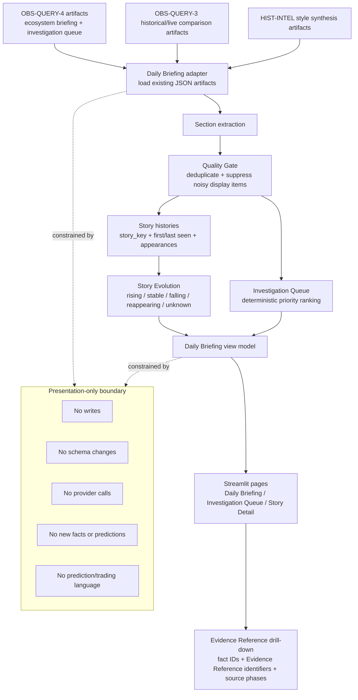

# Consumption Layer Architecture

```mermaid
flowchart TD
    OQ4[OBS-QUERY-4 artifacts\necosystem briefing + investigation queue] --> L[Daily Briefing adapter\nload existing JSON artifacts]
    OQ3[OBS-QUERY-3 historical/live comparison artifacts] --> L
    HI[HIST-INTEL style synthesis artifacts] --> L
    L --> S[Section extraction]
    S --> G[Quality Gate\ndeduplicate + suppress noisy display items]
    G --> H[Story histories\nstory_key + first/last seen + appearances]
    H --> E[Story Evolution\nrising / stable / falling / reappearing / unknown]
    G --> I[Investigation Queue\ndeterministic priority ranking]
    E --> D[Daily Briefing view model]
    I --> D
    D --> UI[Streamlit pages\nDaily Briefing / Investigation Queue / Story Detail]
    UI --> X[Evidence Reference drill-down\nfact IDs + Evidence Reference identifiers + source phases]

    subgraph PresentationBoundary[Presentation-only boundary]
        P1[No writes]
        P2[No schema changes]
        P3[No provider calls]
        P4[No new facts or predictions]
        P5[No prediction/trading language]
    end

    L -. constrained by .-> PresentationBoundary
    D -. constrained by .-> PresentationBoundary
```
