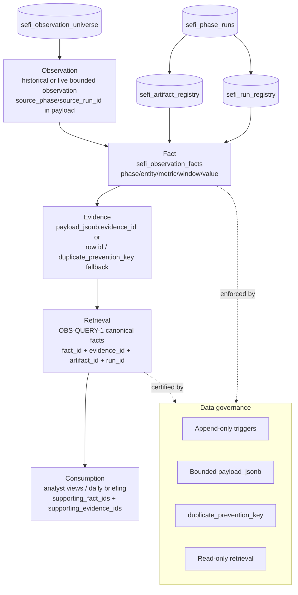

# Data Model Relationships

```mermaid
flowchart TD
    A[Observation\nhistorical or live bounded observation\nsource_phase/source_run_id in payload] --> B[Fact\nsefi_observation_facts\nphase/entity/metric/window/value]
    B --> C[Evidence\npayload_jsonb.evidence_id or\nrow id / duplicate_prevention_key fallback]
    C --> D[Retrieval\nOBS-QUERY-1 canonical facts\nfact_id + evidence_id + artifact_id + run_id]
    D --> E[Consumption\nanalyst views / daily briefing\nsupporting_fact_ids + supporting_evidence_ids]

    F[(sefi_artifact_registry)] --> B
    G[(sefi_run_registry)] --> B
    H[(sefi_phase_runs)] --> F
    H --> G
    I[(sefi_observation_universe)] --> A

    subgraph Governance[Data governance]
        J[Append-only triggers]
        K[Bounded payload_jsonb]
        L[duplicate_prevention_key]
        M[Read-only retrieval]
    end

    B -. enforced by .-> Governance
    D -. certified by .-> Governance
```
