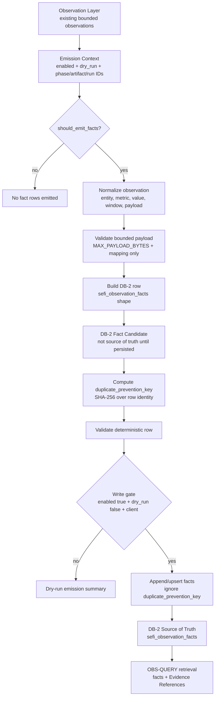

# DB-2 Fact Lifecycle

```mermaid
flowchart TD
    A[Observation Layer\nexisting bounded observations] --> B[Emission Context\nenabled + dry_run + phase/artifact/run IDs]
    B --> C{should_emit_facts?}
    C -- no --> D[No fact rows emitted]
    C -- yes --> E[Normalize observation\nentity, metric, value, window, payload]
    E --> F[Validate bounded payload\nMAX_PAYLOAD_BYTES + mapping only]
    F --> G[Build DB-2 row\nsefi_observation_facts shape]
    G --> Q[DB-2 Fact Candidate\nnot source of truth until persisted]
    Q --> H[Compute duplicate_prevention_key\nSHA-256 over row identity]
    H --> I[Validate deterministic row]
    I --> J{Write gate\nenabled true + dry_run false + client}
    J -- no --> K[Dry-run emission summary]
    J -- yes --> L[Append/upsert facts\nignore duplicate_prevention_key]
    L --> M[DB-2 Source of Truth\nsefi_observation_facts]
    M --> N[OBS-QUERY retrieval\nfacts + Evidence References]
```
