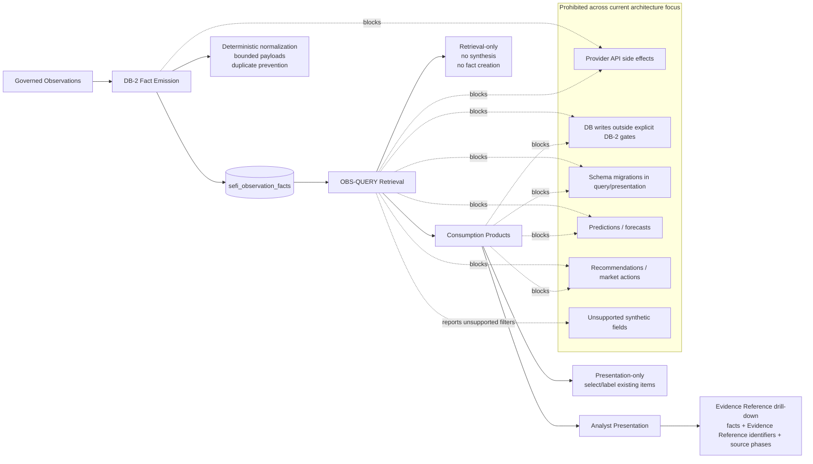

# Governance Boundary Map

```mermaid
flowchart LR
    A[Governed Observations] --> B[DB-2 Fact Emission]
    B --> C[(sefi_observation_facts)]
    C --> D[OBS-QUERY Retrieval]
    D --> E[Consumption Products]
    E --> F[Analyst Presentation]

    B --> B1[Deterministic normalization\nbounded payloads\nduplicate prevention]
    D --> D1[Retrieval-only\nno synthesis\nno fact creation]
    E --> E1[Presentation-only\nselect/label existing items]
    F --> F1[Evidence Reference drill-down\nfacts + Evidence Reference identifiers + source phases]

    subgraph Prohibited[Prohibited across current architecture focus]
        X1[Provider API side effects]
        X2[DB writes outside explicit DB-2 gates]
        X3[Schema migrations in query/presentation]
        X4[Predictions / forecasts]
        X5[Recommendations / market actions]
        X6[Unsupported synthetic fields]
    end

    B -. blocks .-> X1
    D -. blocks .-> X1
    D -. blocks .-> X2
    D -. blocks .-> X3
    D -. blocks .-> X4
    D -. blocks .-> X5
    E -. blocks .-> X2
    E -. blocks .-> X3
    E -. blocks .-> X4
    E -. blocks .-> X5
    D -. reports unsupported filters .-> X6
```
