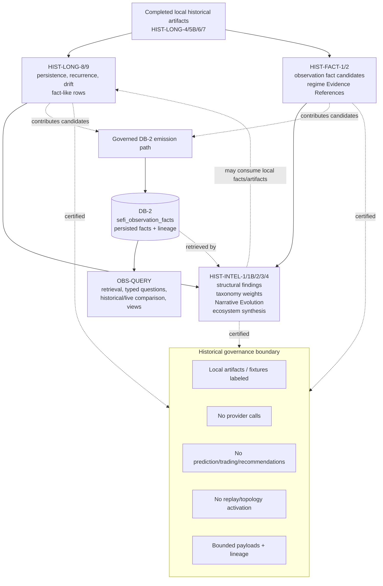

# Historical Intelligence Stack

```mermaid
flowchart TD
    A[Completed local historical artifacts\nHIST-LONG-4/5B/6/7] --> H8[HIST-LONG-8/9\npersistence, recurrence, drift\nfact-like rows]
    A --> HF[HIST-FACT-1/2\nobservation fact candidates\nregime Evidence References]
    H8 --> HI[HIST-INTEL-1/1B/2/3/4\nstructural findings\ntaxonomy weights\nNarrative Evolution\necosystem synthesis]
    HF --> HI
    H8 -. contributes candidates .-> E[Governed DB-2 emission path]
    HF -. contributes candidates .-> E
    HI -. may consume local facts/artifacts .-> H8
    E --> DB2[(DB-2\nsefi_observation_facts\npersisted facts + lineage)]
    DB2 --> OQ[OBS-QUERY\nretrieval, typed questions,\nhistorical/live comparison, views]
    DB2 -. retrieved by .-> HI

    subgraph Governance[Historical governance boundary]
        G1[Local artifacts / fixtures labeled]
        G2[No provider calls]
        G3[No prediction/trading/recommendations]
        G4[No replay/topology activation]
        G5[Bounded payloads + lineage]
    end

    H8 -. certified .-> Governance
    HF -. certified .-> Governance
    HI -. certified .-> Governance
```
