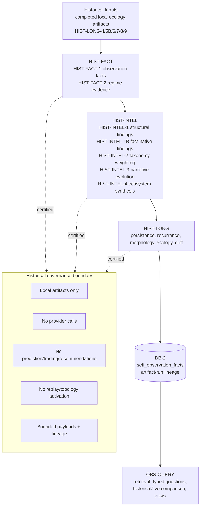

# Historical Intelligence Stack

```mermaid
flowchart TD
    A[Historical Inputs\ncompleted local ecology artifacts\nHIST-LONG-4/5B/6/7/8/9] --> B[HIST-FACT\nHIST-FACT-1 observation facts\nHIST-FACT-2 regime evidence]
    B --> C[HIST-INTEL\nHIST-INTEL-1 structural findings\nHIST-INTEL-1B fact-native findings\nHIST-INTEL-2 taxonomy weighting\nHIST-INTEL-3 narrative evolution\nHIST-INTEL-4 ecosystem synthesis]
    C --> D[HIST-LONG\npersistence, recurrence, morphology, ecology, drift]
    D --> E[(DB-2\nsefi_observation_facts\nartifact/run lineage)]
    E --> F[OBS-QUERY\nretrieval, typed questions,\nhistorical/live comparison, views]

    subgraph Governance[Historical governance boundary]
        G1[Local artifacts only]
        G2[No provider calls]
        G3[No prediction/trading/recommendations]
        G4[No replay/topology activation]
        G5[Bounded payloads + lineage]
    end

    B -. certified .-> Governance
    C -. certified .-> Governance
    D -. certified .-> Governance
```
