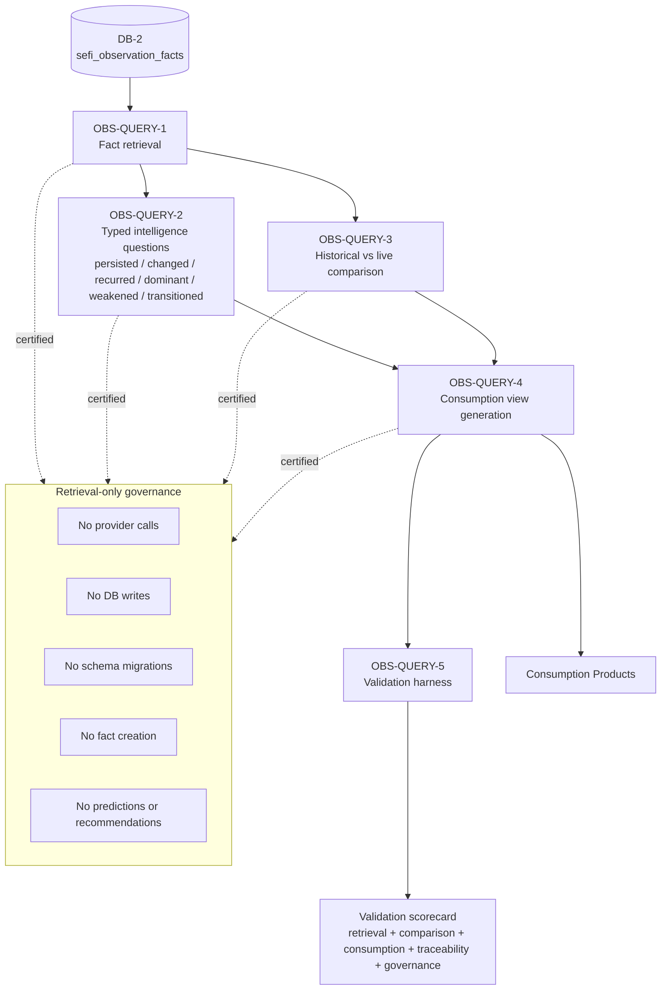

# OBS-QUERY Architecture

```mermaid
flowchart TD
    DB2[(DB-2\nsefi_observation_facts)] --> Q1[OBS-QUERY-1\nFact retrieval]
    Q1 --> Q2[OBS-QUERY-2\nTyped intelligence questions\npersisted / changed / recurred / dominant / weakened / transitioned]
    Q1 --> Q3[OBS-QUERY-3\nHistorical vs live comparison]
    Q2 --> Q4[OBS-QUERY-4\nConsumption view generation]
    Q3 --> Q4
    Q4 --> Q5[OBS-QUERY-5\nValidation harness]
    Q5 --> V[Validation scorecard\nretrieval + comparison + consumption + traceability + governance]
    Q4 --> C[Consumption Products]

    subgraph Boundaries[Retrieval-only governance]
        B1[No provider calls]
        B2[No DB writes]
        B3[No schema migrations]
        B4[No fact creation]
        B5[No predictions or recommendations]
    end

    Q1 -. certified .-> Boundaries
    Q2 -. certified .-> Boundaries
    Q3 -. certified .-> Boundaries
    Q4 -. certified .-> Boundaries
```
