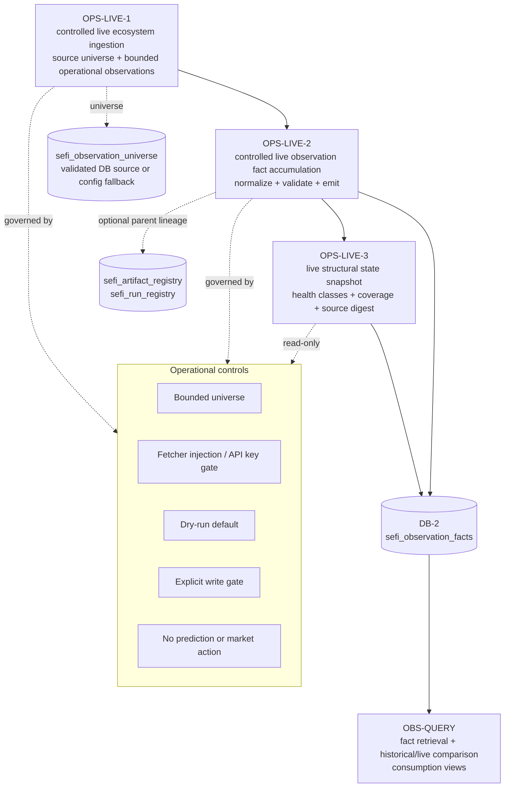

# OPS-LIVE Architecture

```mermaid
flowchart TD
    A[OPS-LIVE-1\ncontrolled live ecosystem ingestion\nsource universe + bounded operational observations] --> B[OPS-LIVE-2\ncontrolled live observation fact accumulation\nnormalize + validate + emit]
    B --> C[OPS-LIVE-3\nlive structural state snapshot\nhealth classes + coverage + source digest]
    C --> D[(DB-2\nsefi_observation_facts)]
    D --> E[OBS-QUERY\nfact retrieval + historical/live comparison\nconsumption views]

    A -. universe .-> U[(sefi_observation_universe\nvalidated DB source or config fallback)]
    B -. optional parent lineage .-> R[(sefi_artifact_registry\nsefi_run_registry)]
    B --> D

    subgraph Controls[Operational controls]
        C1[Bounded universe]
        C2[Fetcher injection / API key gate]
        C3[Dry-run default]
        C4[Explicit write gate]
        C5[No prediction or market action]
    end

    A -. governed by .-> Controls
    B -. governed by .-> Controls
    C -. read-only .-> Controls
```
