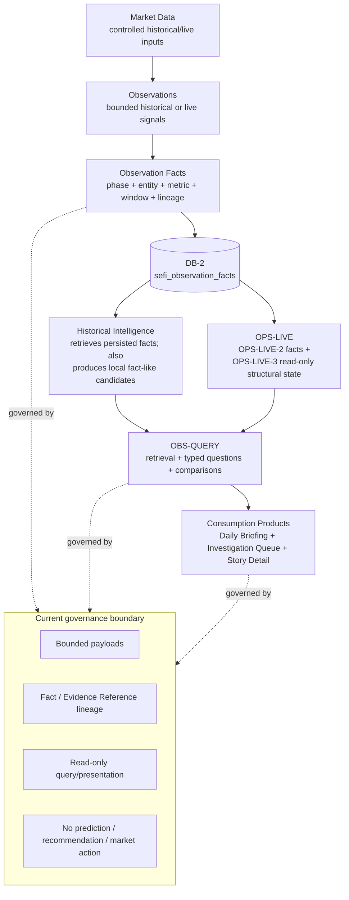

# SEFI End-to-End Architecture

```mermaid
flowchart TD
    A[Market Data
controlled historical/live inputs] --> B[Observations
bounded historical or live signals]
    B --> C[Observation Facts
phase + entity + metric + window + lineage]
    C --> D[(DB-2
sefi_observation_facts)]
    D --> E[Historical Intelligence
retrieves persisted facts; also
produces local fact-like candidates]
    D --> F[OPS-LIVE
OPS-LIVE-2 facts +
OPS-LIVE-3 read-only structural state]
    E --> G[OBS-QUERY
retrieval + typed questions + comparisons]
    F --> G
    G --> H[Consumption Products
Daily Briefing + Investigation Queue + Story Detail]

    subgraph Governance[Current governance boundary]
        I[Bounded payloads]
        J[Fact / Evidence Reference lineage]
        K[Read-only query/presentation]
        L[No prediction / recommendation / market action]
    end

    C -. governed by .-> Governance
    G -. governed by .-> Governance
    H -. governed by .-> Governance
```
