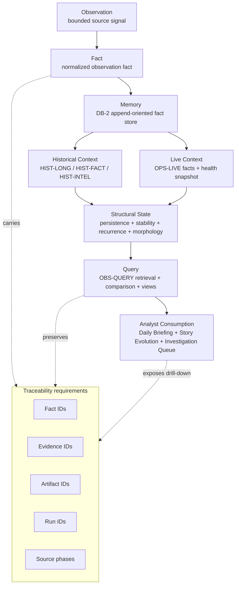

# SEFI Intelligence Lifecycle

```mermaid
flowchart TD
    A[Observation
bounded source signal] --> B[Fact
normalized observation fact]
    B --> C[Memory
DB-2 append-oriented fact store]
    C --> D[Historical Context
HIST-LONG / HIST-FACT / HIST-INTEL]
    C --> E[Live Context
OPS-LIVE facts + health snapshot]
    D --> F[Structural State
persistence + stability + recurrence + morphology]
    E --> F
    F --> G[Query
OBS-QUERY retrieval + comparison + views]
    G --> H[Analyst Consumption
Daily Briefing + Story Evolution + Investigation Queue]

    subgraph Traceability[Traceability requirements]
        T1[Fact IDs]
        T2[Evidence IDs]
        T3[Artifact IDs]
        T4[Run IDs]
        T5[Source phases]
    end

    B -. carries .-> Traceability
    G -. preserves .-> Traceability
    H -. exposes drill-down .-> Traceability
```
